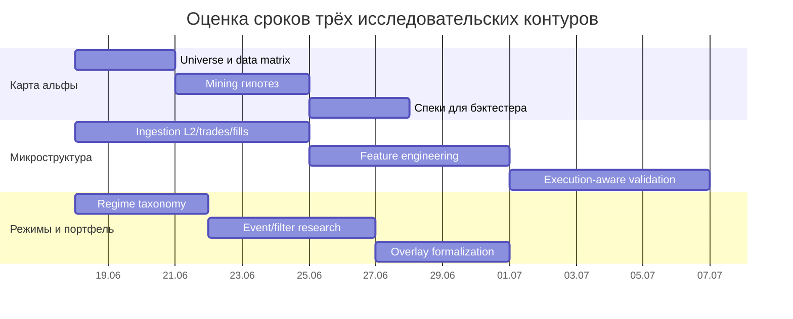

# V2 Adoption Conversation And Repo Package - 2026-06-20

Packet: `WPR106-389-v2-adoption-conversation-package`
Status: consolidated handoff/reference package

## Boundary And Use

This document packages the current conversation, the latest repo read, the two
user-provided source documents, user direction, and Codex recommendations for
adopting the v2 multi-venue Hyperliquid perpetual research roadmap.

This document is not implementation authorization by itself. A later scoped work
packet must still update canonical identity, contracts, active docs, source
code, tests, data, archive layouts, or command behavior.

All recommendations preserve the branch invariant:

```json
{
  "research_only": true,
  "observe_only": true,
  "promotion_ready": false,
  "candidate_evidence": false,
  "candidate_pack_eligible": false,
  "live_signal": false,
  "paper_signal": false,
  "sizing_instruction": false,
  "order_placement_instruction": false,
  "runtime_mode_change": false
}
```

No part of this package claims that any strategy is profitable, candidate-ready,
paper-ready, live-ready, sizing-ready, or promotion-ready.

## Source Labels

### User-Provided Source A

Path at time of analysis:
`C:/Users/papaa/Downloads/researchenginedeluxe_v2_multi_venue_perp_research_roadmap.md`

Repo copy created by WPR106-388:
`docs/RESEARCH_ENGINE_DELUXE_V2_MULTI_VENUE_PERP_RESEARCH_ROADMAP.md`

Label used below: `USER_SOURCE_A_V2_ROADMAP`.

### User-Provided Source B

Path at time of analysis:
`C:/Users/papaa/Downloads/repo_analysis_implementation_handoff (1).md`

Label used below: `USER_SOURCE_B_OLD_HANDOFF`.

### User Thoughts Captured From Conversation

Label used below: `USER_DIRECTION`.

### Codex Thoughts Captured From Conversation

Label used below: `CODEX_RECOMMENDATION`.

### Final Repo Read

Label used below: `REPO_READ_2026_06_20`.

## REPO_READ_2026_06_20

The final repo read for this package inspected:

- `docs/ACTIVE_INDEX.md`
- `docs/ORCHESTRATOR_STAGE_LEDGER.md`
- `docs/REPO_STRUCTURE_AND_DEPENDENCY_FUSE.md`
- `docs/KNOWN_ISSUES.md`
- `git status --short --branch`

Current observed repo state:

- Local branch is `main`, tracking `origin/main`.
- The working tree already contains the WPR106-388 docs-only changes:
  - modified `docs/ACTIVE_INDEX.md`;
  - new `docs/RESEARCH_ENGINE_DELUXE_V2_MULTI_VENUE_PERP_RESEARCH_ROADMAP.md`;
  - new `docs/RESEARCH_ROADMAP_DIRECTION_COMPARISON_2026_06_20.md`;
  - new `docs/work_packets/WPR106-388-multi-venue-perp-roadmap-ingest-and-direction-comparison.md`.
- This WPR106-389 package adds only documentation.
- `docs/ACTIVE_INDEX.md` still states the canonical repo identity as a modular
  BTC/ETH perpetual-futures research engine until a later v2 scope packet
  changes that.
- `docs/ACTIVE_INDEX.md` now points future agents to the imported v2 roadmap and
  comparison memo, but WPR106-388 explicitly treats v2 as a product-scope
  proposal until canonical identity and contracts are updated.
- The current stage ledger still records Stage R106 as a research-only
  fail-closed no-candidate decision: no candidate pack, no paper/live artifact,
  no order/sizing/runtime change, and no promotion claim.
- `docs/KNOWN_ISSUES.md` reports 0 open P0 and 0 open P1 issues. It reports 2
  open P2 issues, including local Windows socket exhaustion that can block
  pytest-asyncio contract setup in this Windows session.
- The dependency fuse says the existing repo is powerful but tightly coupled:
  data provenance, feature identity, strategy contracts, backtest evidence,
  optimization, candidate gates, and live/research separation must be changed
  only through scoped packets with tests.

Current repo capability summary:

- Strict research stack exists: data contracts, feature registry, strategy
  registry, backtesting, research cycle, discovery, optimization, candidate-pack
  gates, live-boundary tests, promotion validators, and operator/research UI
  surfaces.
- Rapid Strategy Iteration Sandbox exists under
  `src/tradingbotsuite/research_sandbox/` and is now a major local 2024+
  archive/strategy triage layer.
- Recent WPR106 packets closed sandbox publication coherence, CI coverage,
  venue-expansion local materialization, strict-validation descriptor preflight,
  next-action dashboard, throughput telemetry, bounded archive/container scans,
  workbook intake bounds, CLI publication coherence, and memory-pressure
  reductions.
- The repo has multi-venue descriptor handling and local archive loading, but
  does not yet have the v2 foundation as first-class architecture: dynamic
  Hyperliquid USD 5M universe service, owned central archive, rolling lockbox
  data service, canonical append-only experiment ledger, or continuous
  WebSocket/REST/S3 collector.

## USER_DIRECTION

The user wants to adopt v2. The user direction in this conversation can be
summarized as follows:

- Adopt the v2 multi-instrument, data-first Hyperliquid perpetual research
  platform direction.
- Avoid destroying useful legacy strategy iteration work.
- Treat legacy strategy iteration as valuable because it contains promising
  candidates, different strategy families, and empirical clues.
- Do not let legacy leads become broad-scope or final candidates directly.
- Store high-return and interesting legacy outputs as leads.
- Leads should receive extended testing with the full suite of limitations,
  edge cases, and failure modes explored.
- Testing should not cover only obvious limitations; it should stress the whole
  strategy logic and evidence story.
- Long compute should be used on one serious strategy at a time after triage.
- The top 3 surviving leads should move into a final hard-test phase with strict
  real-world-style rules.
- The legacy GUI can be cut out of the main path, frozen, or moved into an
  explicit legacy area.
- The end state should put the books in order: clear architecture, clear legacy
  classification, clear lead records, clear strict-validation path, and no
  hidden evidence drift.

Important wording note:

- The user used the phrase "viable 100 percent". Codex interprets the intent as
  "as hard-tested and blocker-free as the historical/research process can make
  it," not literal certainty. Markets do not permit 100 percent viability.

## CODEX_RECOMMENDATION

### High-Level Recommendation

Adopt v2 through a strangler migration, not a big-bang rewrite.

The correct move is:

```text
preserve useful legacy evidence and tools
  -> classify legacy surfaces
  -> wrap reusable components behind v2 interfaces
  -> freeze or move obsolete UI/runtime surfaces
  -> build v2 archive/universe/data-service foundation
  -> feed legacy and sandbox outputs into a Lead Book
  -> run deep single-strategy validation for serious leads
  -> move only the top survivors to final hard-test review
```

### Architecture Target

Recommended v2 architecture:

```text
Hyperliquid universe snapshots
  -> central raw/bronze/silver/gold archive
  -> coverage, quality, provenance, and snapshot ledgers
  -> backtest data service enforcing 2024+, 6+ months, 12-month preference,
     and rolling latest 1-2 full month lockbox exclusion
  -> rapid sandbox / legacy strategy triage
  -> Lead Book
  -> deep single-strategy validation
  -> top-3 final hard-test phase
  -> separate later promotion review, still not live execution by default
```

### Legacy Treatment

Recommended classification model:

| Legacy surface | Recommended treatment | Reason |
| --- | --- | --- |
| Existing strict research cycle | `reuse` and `wrap` | It is the truth engine and should remain the validator. |
| Candidate-pack gates | `reuse` and harden around v2 data snapshots | They prevent weak evidence from becoming claims. |
| Rapid strategy sandbox | `reuse` as v2 agent lab / triage layer | It already does much of the fast iteration work. |
| Legacy strategy results and old high-return rows | `freeze_as_evidence` and convert to Lead Book rows | Valuable clues, not final candidates. |
| Strategy plugins | `wrap` into v2 strategy protocol where useful | Avoid rewriting working strategy code. |
| Feature builders | `wrap` or gradually migrate into v2 feature/materialization layer | Preserve point-in-time semantics and cache identity. |
| Backtest engines | `wrap` into v2 simulator adapters | Preserve existing cost/fill/split behavior while adding v2 data service. |
| Operator/legacy GUI | `freeze`, `move_to_legacy`, or remove from default path | v2 UI should focus on archive, coverage, Lead Book, validation, and final-test flow. |
| Live/runtime-adjacent code | `do_not_touch_without_scope` | Research branch must not drift into live execution. |
| Old `tradingbot` package | `legacy_visible_but_not_v2_core` | Keep compatibility but do not build v2 around it. |

### Lead Book Recommendation

Create a first-class `Lead Book` before deep validation.

A Lead Book row should record:

- lead ID;
- source type: legacy run, sandbox run, strict-cycle rejected row, external
  source, manual hypothesis;
- source file/run/packet/artifact references;
- strategy family and economic thesis;
- venue/symbol/universe scope;
- data window and data source;
- costs, funding, slippage, and fill assumptions used so far;
- headline metrics and why the row looked interesting;
- known blockers;
- missing evidence;
- required next validation;
- current state: `idea_only`, `sandbox_screened`, `deep_validation_requested`,
  `deep_validation_running`, `deep_validation_rejected`,
  `final_test_candidate`, `final_test_rejected`, `final_test_survivor`;
- non-promotable boundary flags.

A lead is not a candidate. A lead is a queue item for deeper testing.

### Deep Validation Recommendation

Once a lead is serious, stop broad sweeping and run one strategy at a time.

Minimum deep validation areas:

- full valid 2024+ history where available;
- strict data snapshot identity;
- rolling walk-forward validation;
- purged/embargoed splits where labels overlap;
- latest 1-2 full month lockbox exclusion from ordinary iteration;
- later lockbox benchmark only after selection is frozen;
- realistic fees, spread, slippage, funding, and liquidity assumptions;
- cost-stress matrix;
- monthly and split stability;
- best-month and best-split PnL concentration;
- drawdown and loss-streak analysis;
- side controls and opposite-side controls;
- no-trade baseline;
- transparent/simple comparator;
- feature ablations;
- filter ablations;
- exit lab and fixed-hold comparison;
- parameter-neighborhood stability;
- source/venue/symbol robustness where applicable;
- negative controls for model-like strategies;
- multiple-testing accounting;
- explicit failure-mode report.

### Top-3 Final Test Phase

The final phase should be restricted to the top 3 surviving leads after deep
validation.

The final phase should not mean guaranteed real-world profitability. It should
mean the strategy survived the strictest available historical, out-of-sample,
cost, liquidity, regime, robustness, and artifact-integrity tests without
unresolved blockers.

Recommended final-test requirements:

- frozen strategy spec;
- frozen data snapshot;
- frozen costs and slippage model;
- no parameter edits after seeing final-test results;
- final lockbox access only in the final phase;
- separate report for pre-final evidence vs final-test outcome;
- explicit pass/fail criteria before execution;
- no paper/live/promotion transition without a later separate process.

### GUI Recommendation

The legacy GUI should not drive v2.

Recommended options:

1. Freeze it and keep it accessible only as legacy operator UI.
2. Move it behind explicit `legacy_operator_ui` naming.
3. Replace the default v2 surface with archive/universe/coverage/lead/validation
   views.

The v2 UI should answer:

- what universe is active;
- what data is collected;
- what coverage is missing;
- what lockbox is excluded;
- what leads exist;
- what validation state each lead is in;
- what blocker prevents the next phase;
- what final-test candidates exist.

### Migration Style

Recommended migration style: incremental with hard boundaries.

Do:

- classify every legacy subsystem as `reuse`, `wrap`, `freeze`,
  `move_to_legacy`, or `remove_later`;
- keep legacy strategy iteration running until v2 can replace its function;
- write adapters instead of moving code randomly;
- preserve artifact provenance;
- preserve old failed/rejected results as evidence;
- use v2 names and contracts for new architecture;
- keep strict validation separate from fast triage.

Do not:

- rewrite everything at once;
- delete old research outputs;
- interpret old sandbox/legacy rows as final candidates;
- hide failures while migrating;
- move live-adjacent code into research modules;
- run provider collection before archive contracts are defined;
- let v2 ledger/backtests imply promotion readiness.

## USER_SOURCE_A_V2_ROADMAP - Codex Assessment

The v2 roadmap is useful and should become the next product target if the user
wants a broader, more scalable research platform.

Core value:

- It correctly moves the product center from BTC/ETH-only evidence work to a
  multi-instrument data-first research platform.
- It makes Hyperliquid universe discovery, owned archive, data coverage,
  lockbox rules, and experiment ledger first-class.
- It preserves research-only boundaries and explicitly rejects live trading as
  the product center.

Main adoption condition:

- It must be adopted through a scoped product-scope migration packet. It should
  not silently override `docs/ACTIVE_INDEX.md`, current contracts, or existing
  research cycle semantics.

Best next packet if adopting this source:

```text
A0 / WPR next: V2 product-scope migration and legacy classification.
```

That packet should update canonical identity and create the classification plan,
not start WebSocket collection immediately.

## USER_SOURCE_B_OLD_HANDOFF - Codex Assessment

The old handoff is useful, but not as the current implementation roadmap.

Useful parts:

- Strategy seed library and hypothesis families.
- Risk register.
- Provider/data caveats.
- Sandbox/non-promotable guardrail design.
- Trial IDs, compact Parquet artifacts, evidence-request queue concepts.
- Guidance that rough strategy exploration should happen before strict gates.

Stale parts:

- It says no dedicated `research_sandbox` package was found. That is now false.
- It says to implement the sandbox first. That already happened and advanced
  through many WPR106 packets.
- It places Hyperliquid multi-instrument support later. Under v2, that becomes
  core product foundation.
- It is sandbox-first, while v2 should be archive/universe/data-service-first.

Recommended treatment:

```text
USER_SOURCE_B_OLD_HANDOFF
  -> mine for strategy hypotheses and risk/guardrail rules
  -> convert promising old outputs into Lead Book entries
  -> discard stale implementation sequencing
  -> keep as legacy research knowledge
```

## Recommended Next Work Packet

If v2 is now the chosen direction, open a new packet with an objective like:

```text
V2 Adoption And Legacy Classification
```

Suggested allowed paths:

- `README.md`
- `START_HERE.md`
- `docs/ACTIVE_INDEX.md`
- `docs/BRANCH_PURPOSE.md`
- `docs/RESEARCH_ENGINE_DELUXE_COMPLETION_ROADMAP.md`
- `docs/RESEARCH_ENGINE_DELUXE_V2_MULTI_VENUE_PERP_RESEARCH_ROADMAP.md`
- `docs/RESEARCH_ROADMAP_DIRECTION_COMPARISON_2026_06_20.md`
- new `docs/V2_LEGACY_CLASSIFICATION.md`
- new `docs/contracts/v2_archive_universe_contract.md`
- new `docs/contracts/lead_book_contract.md`
- `docs/work_packets/<new-packet>.md`

Suggested acceptance:

- canonical identity changes from BTC/ETH-only research engine to liquid
  Hyperliquid-perp research platform;
- BTC/ETH are retained as fixture/smoke and legacy evidence symbols;
- legacy strategy iteration is preserved as a Lead Book source;
- rapid sandbox is reclassified as v2 agent lab / triage layer;
- legacy GUI status is explicit;
- no code behavior changes are made unless the packet explicitly scopes them;
- no candidate, paper, live, sizing, runtime, or promotion claim is created.

## Suggested V2 Migration Backlog

1. V2 product-scope migration and legacy classification.
2. Lead Book contract and initial manual lead intake from legacy docs/artifacts.
3. Central archive contract: raw/bronze/silver/gold, manifests, snapshots,
   hashes, coverage, quality, and boundary flags.
4. Fixture-backed Hyperliquid universe snapshot parser for
   `metaAndAssetCtxs`/`dayNtlVlm` with USD 5M eligibility tests.
5. Backtest data-service contract enforcing 2024+, minimum 6 usable months,
   preferred 12 months, rolling 1-2 full month lockbox, coverage minimums, and
   as-of universe snapshots.
6. Append-only experiment ledger contract and generated CSV/XLSX views.
7. Adapter layer that lets existing sandbox and strict cycle read from v2 data
   snapshots.
8. Continuous Hyperliquid collector only after archive contracts and fixture
   tests pass.
9. Deep-validation runner for one lead at a time.
10. Top-3 final hard-test workflow.

## Final Codex Position

Adopt v2, but keep the existing research stack.

The repo has already done a large amount of valuable work. The strict cycle and
candidate gates are not mistakes; they are the reason the repo can truthfully
reject weak strategies. The rapid sandbox is also not obsolete; under v2 it
becomes the agent lab and lead-generation surface.

The missing v2 foundation is not another broad strategy search. It is data
architecture:

```text
universe snapshots
+ central archive
+ data coverage and lockbox service
+ Lead Book
+ append-only experiment ledger
```

After that foundation exists, legacy strategy iteration, sandbox outputs, and
external hypothesis docs can all feed serious validation cleanly.

---

# Appendix A - USER_SOURCE_A_V2_ROADMAP Full Text

The following section embeds the user-provided v2 roadmap source as preserved in
this repo by WPR106-388.

<!-- BEGIN USER_SOURCE_A_V2_ROADMAP -->
# ResearchEngineDeluxe — Practical Roadmap v2 for Multi-Instrument Perp Research

**Repository:** `papaartemsmurf2002-commits/researchenginedeluxe`
**Updated:** 2026-06-20
**Supersedes:** `researchenginedeluxe_combined_practical_improvement_plan.md` where it still assumes a BTC/ETH-only research scope.
**New product goal:** build an agent-friendly research platform that automatically collects and archives market data for **all Hyperliquid perpetual futures with daily notional volume above USD 5,000,000**, can also pull compatible data from other venues, and can efficiently backtest arbitrary strategy ideas on historical data from 2024 onward.

---

## 1. Executive conclusion

The previous roadmap was directionally useful, but it was still framed around a BTC/ETH perpetual-futures research workbench. That assumption is now outdated. The repository goal has shifted into a **multi-instrument, data-first, agent-friendly perpetual-futures research engine**.

The new core product is not live trading. It is a repeatable research loop:

```text
Discover liquid Hyperliquid perp universe
  -> collect raw venue data continuously
  -> normalize into a central archive
  -> expose fast historical datasets to any strategy
  -> run leakage-safe backtests on 2024+ data
  -> block overfit / underqualified experiments
  -> write standardized results into a central performance ledger/spreadsheet
  -> let agents iterate safely without corrupting data or hiding failed trials
```

The highest-priority work therefore changes. The old security, boundary, artifact, and operator hardening recommendations should not be deleted, because they are still good repo hygiene. But they are no longer the product center. The product center is now:

1. **Dynamic Hyperliquid universe discovery**: all perps, not BTC/ETH; include instruments whose current or as-of daily notional volume is above USD 5 million.
2. **Central data archive**: raw plus normalized market data, instrument catalog, coverage ledger, data quality reports, source provenance, hashes, and immutable snapshots.
3. **Automatic collection from multiple venues**: native Hyperliquid adapter first, then venue adapters through a common interface, with CCXT useful for standardized exchange coverage where it fits.
4. **Efficient backtest engine**: multi-instrument, deterministic, vectorized where possible, event-driven where needed, cost/funding/slippage-aware, and able to run many agent-generated ideas quickly.
5. **Agent-friendly experiment loop**: simple strategy specs, safe execution sandbox, standardized artifacts, and a central performance ledger/spreadsheet that agents append to only through a validating tool.
6. **Strict validation rules**: all reported strategy testing/backtesting must be on data from **2024-01-01 or later**; accepted backtests require at least **6 months** of usable data and should default to **12 months**; the most recent **1–2 full months** are a lockbox and must never be available to ordinary backtesting or agent iteration.

The most important architectural correction is this: **data collection is not a helper feature; it is the foundation**. Hyperliquid’s public candle endpoint only exposes the most recent 5,000 candles, while the official S3 archive is monthly, may be delayed or incomplete, and does not provide historical candles. That means the repo must maintain its own rolling archive if it wants 6–12 month backtests across many instruments at useful granularities.

---

## 2. Updated product definition

### 2.1 What the repository should become

ResearchEngineDeluxe should become a **perpetual-futures research operating system** with these layers:

```text
Venue adapters
  Hyperliquid native API / WebSocket / S3 archive
  CCXT-compatible exchanges where useful
  Future custom adapters for exchanges or vendors

Central archive
  raw immutable venue payloads
  normalized bronze/silver/gold Parquet datasets
  instrument catalog and as-of universe snapshots
  data quality, gap, and provenance metadata

Backtest data service
  fast filtered reads by venue, instrument, timeframe, field, and date
  deterministic snapshots by data_version / archive_snapshot_id
  no accidental access to lockbox months

Backtest engine
  strategy protocol
  vectorized multi-instrument path
  event-driven path for fills/order-book/slippage-sensitive ideas
  funding, fees, turnover, liquidity, borrow/carry, and missing-data handling

Agent lab
  strategy spec templates
  isolated run directory
  run manifest
  validation gate
  standardized metrics
  central performance ledger/spreadsheet append tool

Governance
  anti-overfitting controls
  command/path/security boundaries
  reproducible environments
  CI and benchmark gates
```

### 2.2 What should be removed from the old framing

The phrase “BTC/ETH perpetual-futures research workbench” should be replaced everywhere with something like:

> ResearchEngineDeluxe is a research-only platform for discovering, collecting, archiving, and backtesting strategies over liquid Hyperliquid perpetual futures and selected comparable venue data. The default universe is every Hyperliquid perp whose as-of daily notional volume is above USD 5 million, subject to coverage and validation gates.

The repo should not hardcode `BTC` and `ETH` as the research universe. BTC and ETH should remain fixture/smoke-test symbols because they are liquid and useful for fast CI, but they should not define the system scope.

### 2.3 What should remain from the previous roadmap

Keep these ideas because they still improve the repo:

- research-only boundary and no accidental live/promotion behavior;
- pickle artifact hardening;
- fail-closed webhook/operator secrets;
- explicit credential policy;
- operator UI cookie/admin hardening;
- ASGI worker separation;
- SQLite deployment constraint or job-store migration;
- command classification and path policy;
- dependency constraints and reproducibility;
- logging redaction;
- CI tiers and benchmark gates.

But reprioritize them around the new product. A security fix can remain P0 if it blocks safe operation, but the main roadmap should now be data/archive/backtest/agent-loop first.

---

## 3. External research that changes the plan

### 3.1 Hyperliquid universe and liquidity filtering

Hyperliquid’s `metaAndAssetCtxs` info request returns both a perpetual universe and per-asset context data. The context includes fields such as `dayNtlVlm`, funding, impact prices, mark price, mid price, open interest, oracle price, premium, and previous-day price. That directly supports the new requirement: select all perpetual instruments whose **daily notional volume exceeds USD 5,000,000**.

Practical implication: implement a `HyperliquidUniverseCollector` that stores a daily `universe_snapshot` and an `asset_context_snapshot`. Do not hardcode eligible coins.

### 3.2 Hyperliquid candles are not enough for long research

The official `candleSnapshot` endpoint supports common intervals, but only the most recent 5,000 candles are available. At 1-minute resolution, that is only a few days. At 15-minute resolution, it is roughly 52 days. At 1-hour resolution, it is roughly 208 days. That is insufficient for robust 6–12 month multi-instrument research at minute or 15-minute granularity.

Practical implication: use `candleSnapshot` for bootstrapping recent bars and gap checks, but not as the main historical archive. The project must record its own candles/trades/order-book data going forward and optionally backfill from official or licensed archives where possible.

### 3.3 Official historical archive is useful but incomplete for this goal

Hyperliquid’s historical data docs say data is uploaded to `hyperliquid-archive` approximately monthly, with no guarantee of timely updates and possible missing data. They also state that L2 book snapshots and asset contexts are available, but not historical candles; additional historical datasets must be recorded through the API by the user.

Practical implication: the central archive should combine:

- official S3 archive data for L2 and asset contexts where available;
- REST candle snapshots for recent bootstrap/gap repair;
- WebSocket streams for continuous trades, candles, L2, BBO, and asset contexts;
- funding history via the info endpoint;
- third-party historical vendors only if licensing and reproducibility are clear.

### 3.4 WebSocket capture is mandatory, not optional

Hyperliquid WebSocket subscriptions include `allMids`, `candle`, `l2Book`, `trades`, `bbo`, `activeAssetCtx`, and `allDexsAssetCtxs`. The docs also warn that automated users should handle server-side disconnects and reconnect gracefully.

Practical implication: build a capture daemon that treats reconnects, sequence gaps, duplicate messages, time drift, and backfill windows as first-class concerns. The daemon should write raw messages first, then normalized records.

### 3.5 Parquet/DuckDB/Polars are a good fit for the archive and backtester

Parquet is columnar and efficient for analytical reads. DuckDB can query Parquet directly and push filters/projections into scans. Polars lazy queries support whole-query optimization, parallelism, predicate pushdown, and projection pushdown.

Practical implication: CSV should be limited to fixtures and exports. The central archive should use partitioned Parquet with DuckDB/Polars as default read engines.

### 3.6 Time-series and investment backtest validation need stricter rules than random CV

`TimeSeriesSplit` exists because ordinary cross-validation can train on future data and evaluate on past data. Financial strategy mining also creates multiple-testing and backtest-overfitting risks; Bailey et al. propose Probability of Backtest Overfitting (PBO) using combinatorially symmetric cross-validation (CSCV) for investment simulations.

Practical implication: agent-generated strategy mining must record every trial, avoid random CV, use walk-forward or purged/embargoed time splits, and maintain a lockbox period that agents cannot touch.

---

## 4. Revised top priorities

| Rank | Priority | Work item | Why it matters now |
|---:|---|---|---|
| 1 | P0 | Dynamic Hyperliquid instrument universe manager | New scope is all liquid Hyperliquid perps, not BTC/ETH. |
| 2 | P0 | Central data archive with raw/normalized/provenance layers | 6–12 month multi-instrument backtests require owned historical data. |
| 3 | P0 | Continuous market-data collector | Hyperliquid candle history is limited; the repo must record data itself. |
| 4 | P0 | Efficient backtest data service | Agents need fast, deterministic reads without copying huge CSVs. |
| 5 | P0 | Strategy protocol and backtest engine | The system must run arbitrary ideas safely and consistently. |
| 6 | P0 | Validation gate: 2024+, minimum 6 months, lockbox 1–2 months excluded | Prevents shallow, stale, or overfit tests. |
| 7 | P0/P1 | Central performance ledger/spreadsheet append tool | Agents must write comparable results without manual spreadsheet drift. |
| 8 | P1 | Data quality and coverage reporting | Universe-wide research is useless if gaps and survivorship bias are hidden. |
| 9 | P1 | Worker separation for data collection/backtests | Heavy jobs should not run inside ASGI/operator server process. |
| 10 | P1 | Cross-venue adapter interface | The archive should pull comparable data from multiple venues, not just Hyperliquid. |
| 11 | P1 | Reproducibility: data snapshots, env lockfiles, artifact hashes | Enables later agents to reproduce claims. |
| 12 | P1/P2 | Existing security/hygiene hardening | Still valuable; keep it, but align it to the research platform. |

---

## 5. Target architecture

### 5.1 High-level architecture

```text
                         ┌─────────────────────────────┐
                         │  Agent / Human Researcher    │
                         └──────────────┬──────────────┘
                                        │ strategy spec / run request
                                        ▼
┌─────────────────────────────────────────────────────────────────────┐
│ Agent Lab                                                            │
│ - spec templates                                                     │
│ - safe execution sandbox                                             │
│ - run manifests                                                      │
│ - performance ledger append tool                                     │
│ - no direct lockbox access                                           │
└──────────────┬──────────────────────────────────────────────────────┘
               │
               ▼
┌─────────────────────────────────────────────────────────────────────┐
│ Backtest Engine                                                      │
│ - vectorized multi-instrument simulator                              │
│ - event-driven simulator where needed                                │
│ - funding/fees/slippage/liquidity models                             │
│ - walk-forward and anti-overfit validation                            │
└──────────────┬──────────────────────────────────────────────────────┘
               │ deterministic reads by snapshot_id
               ▼
┌─────────────────────────────────────────────────────────────────────┐
│ Backtest Data Service                                                │
│ - DuckDB/Polars over partitioned Parquet                              │
│ - universe snapshots                                                  │
│ - coverage and quality filters                                        │
│ - lockbox exclusion enforcement                                       │
└──────────────┬──────────────────────────────────────────────────────┘
               │
               ▼
┌─────────────────────────────────────────────────────────────────────┐
│ Central Data Archive                                                 │
│ raw/           immutable venue payloads                              │
│ bronze/        normalized source-equivalent records                  │
│ silver/        cleaned bars/trades/funding/context                   │
│ gold/          strategy-ready features/panels                         │
│ manifests/     source, hashes, coverage, data versions               │
└──────────────┬──────────────────────────────────────────────────────┘
               │
               ▼
┌─────────────────────────────────────────────────────────────────────┐
│ Venue Collectors                                                     │
│ - Hyperliquid native REST/WebSocket/S3                                │
│ - CCXT-compatible venues where useful                                 │
│ - future custom exchange/vendor adapters                              │
└─────────────────────────────────────────────────────────────────────┘
```

### 5.2 Bounded contexts

The repo should split responsibilities into bounded packages or modules. Names can change, but the separation should remain:

| Context | Responsibility | Should not do |
|---|---|---|
| `venues` | API clients, rate limits, raw fetches, WebSocket capture | strategy logic, backtest scoring |
| `archive` | file layout, manifests, hashes, partitions, data versions | call exchange APIs directly except through adapters |
| `universe` | Hyperliquid liquid-perp selection, as-of snapshots, eligibility | cherry-pick only winning instruments |
| `data_quality` | gaps, duplicates, stale data, coverage reports | silently repair without provenance |
| `backtest_data` | efficient historical reads, panels, feature inputs | mutate archive data |
| `backtest_engine` | simulator, fills, costs, funding, metrics | network calls, credential access |
| `agent_lab` | strategy specs, run orchestration, ledger append | manual spreadsheet edits, lockbox leakage |
| `validation` | 2024+ gates, lockbox, walk-forward, PBO/CSCV | change strategy logic after seeing lockbox |
| `operator/web` | optional UI/control plane | execute heavy backtests in the ASGI loop |

---

## 6. Hyperliquid instrument universe manager

### 6.1 Eligibility rule

Default eligibility should be:

```text
eligible = instrument is a Hyperliquid perpetual
           AND dayNtlVlm >= 5_000_000 USD
           AND instrument is not disabled/delisted
           AND normalized market data coverage passes minimum requirements
```

Use daily notional volume from Hyperliquid asset context snapshots. Store the exact source timestamp and raw payload hash.

### 6.2 Current vs as-of universe

The system needs two universe modes:

1. **Current research universe**: today’s liquid perps above USD 5 million, useful for deciding what to collect and what agents should care about now.
2. **As-of backtest universe**: instruments that were eligible based only on information available at or before the backtest start or rebalance date.

This prevents survivor bias. A strategy should not get credit for selecting only today’s winners unless the experiment explicitly states that it is researching the current tradable universe and handles listing/coverage bias.

### 6.3 Universe snapshot tables

Create these archive tables:

#### `instrument_catalog`

| Column | Type | Notes |
|---|---:|---|
| `instrument_id` | string | Stable internal ID, e.g. `hyperliquid:perp:BTC`. |
| `venue` | string | `hyperliquid`, `binance`, `okx`, etc. |
| `venue_symbol` | string | Exact exchange symbol, including HIP-3 prefixes if present. |
| `canonical_symbol` | string | Normalized symbol used in strategy specs. |
| `market_type` | string | `perp`, `spot`, `future`; default scope is `perp`. |
| `base_asset` | string | BTC, ETH, SOL, etc. |
| `quote_asset` | string | Usually USD/USDC/USDT depending venue. |
| `settle_asset` | string | Usually USDC/USDT. |
| `first_seen_ts` | timestamp | First observed in archive. |
| `last_seen_ts` | timestamp | Last observed. |
| `status` | string | active, delisted, disabled, quarantine. |
| `sz_decimals` | int | Hyperliquid size precision where available. |
| `max_leverage` | decimal | Hyperliquid max leverage where available. |
| `only_isolated` | bool | Hyperliquid field where available. |
| `source_snapshot_id` | string | Raw source provenance. |

#### `universe_snapshot`

| Column | Type | Notes |
|---|---:|---|
| `snapshot_id` | string | Content hash or UUID. |
| `asof_date` | date | UTC date. |
| `venue` | string | Hyperliquid first. |
| `universe_rule_id` | string | Example: `hl_perps_day_ntl_vlm_gte_5m_v1`. |
| `instrument_id` | string | Internal ID. |
| `day_ntl_vlm_usd` | decimal | From asset context. |
| `open_interest` | decimal | From asset context. |
| `mark_px` | decimal | From asset context. |
| `oracle_px` | decimal | From asset context. |
| `funding` | decimal | Current funding estimate/rate. |
| `eligible` | bool | Final universe inclusion. |
| `exclusion_reason` | string | volume_below_threshold, insufficient_coverage, missing_context, etc. |
| `raw_payload_sha256` | string | Source hash. |

### 6.4 Universe update cadence

- Run `universe refresh` at least daily after UTC day close.
- Store raw `metaAndAssetCtxs` or equivalent payload before normalizing.
- If Hyperliquid returns multiple perp dexs, collect each dex and namespace symbols clearly.
- Never overwrite old universe snapshots.
- Add a test fixture where BTC/ETH pass, a low-volume coin fails, and a HIP-3 prefixed coin is handled correctly.

---

## 7. Central data archive

### 7.1 Archive design principle

The archive should be **append-only at raw level, deterministic at normalized level, and snapshot-addressable at research level**.

Agents should never directly modify archive files. Agents request data through the backtest data service, and every run records the `archive_snapshot_id`, `universe_snapshot_id`, and `feature_snapshot_id` it used.

### 7.2 Recommended layout

```text
data/archive/
  raw/
    venue=hyperliquid/
      datatype=meta_and_asset_ctxs/date=YYYY-MM-DD/run_id=.../*.jsonl.zst
      datatype=all_dexs_asset_ctxs/date=YYYY-MM-DD/run_id=.../*.jsonl.zst
      datatype=candles/interval=1m/date=YYYY-MM-DD/instrument=.../*.jsonl.zst
      datatype=trades/date=YYYY-MM-DD/hour=HH/instrument=.../*.jsonl.zst
      datatype=l2book/date=YYYY-MM-DD/hour=HH/instrument=.../*.jsonl.zst
      datatype=funding_history/date=YYYY-MM-DD/instrument=.../*.jsonl.zst
      datatype=s3_l2book/date=YYYY-MM-DD/hour=HH/instrument=.../*.lz4
  bronze/
    venue=hyperliquid/datatype=trades/date=YYYY-MM-DD/hour=HH/*.parquet
    venue=hyperliquid/datatype=candles/interval=1m/date=YYYY-MM-DD/*.parquet
    venue=hyperliquid/datatype=funding/date=YYYY-MM-DD/*.parquet
    venue=hyperliquid/datatype=asset_ctx/date=YYYY-MM-DD/*.parquet
  silver/
    bars/timeframe=1m/venue=hyperliquid/date=YYYY-MM-DD/*.parquet
    bars/timeframe=5m/venue=hyperliquid/date=YYYY-MM-DD/*.parquet
    bars/timeframe=1h/venue=hyperliquid/date=YYYY-MM-DD/*.parquet
    funding/venue=hyperliquid/date=YYYY-MM-DD/*.parquet
    liquidity/venue=hyperliquid/date=YYYY-MM-DD/*.parquet
  gold/
    panels/timeframe=1m/universe_rule=hl_5m_v1/snapshot_id=.../*.parquet
    features/feature_set=.../snapshot_id=.../*.parquet
  manifests/
    ingestion_runs.parquet
    file_manifest.parquet
    data_coverage.parquet
    data_quality.parquet
    archive_snapshots.parquet
    universe_snapshots.parquet
  performance/
    experiment_ledger.parquet
    experiment_ledger.csv
    experiment_ledger.xlsx
```

### 7.3 Why not CSV as primary storage

CSV is acceptable for small fixtures, human exports, and compatibility, but it is not the right archive format for multi-instrument historical research. Use Parquet as the primary analytical format because it is columnar, compressed, and can be filtered by date/instrument/timeframe efficiently.

### 7.4 Data layers

| Layer | Purpose | Mutability | Example |
|---|---|---:|---|
| raw | Exact venue payloads or downloaded files | append-only | WebSocket trade JSON messages, S3 `.lz4` files |
| bronze | Parsed source-equivalent tables | rebuildable from raw | normalized trade rows, candle rows |
| silver | Cleaned research-ready market data | rebuildable with manifest | deduped OHLCV, funding, open interest, mark/oracle |
| gold | Feature panels and benchmark datasets | versioned snapshots | strategy-ready panels by universe and timeframe |

### 7.5 Minimum datasets

For the new goal, collect these first:

| Dataset | Why required | Source priority |
|---|---|---|
| instrument metadata | dynamic universe and precision | Hyperliquid `metaAndAssetCtxs` |
| daily asset context | volume threshold, OI, funding, mark/oracle | Hyperliquid `metaAndAssetCtxs`, WebSocket `allDexsAssetCtxs` |
| 1m candles | baseline strategy backtests | WebSocket candle capture + REST bootstrap |
| trades | slippage, volume validation, microstructure strategies | WebSocket trades, possible archive/vendor backfill |
| funding history | perp carry and net return | Hyperliquid `fundingHistory`, WebSocket/user-free market data where available |
| L2/BBO snapshots | liquidity filters, execution cost | WebSocket `l2Book`/`bbo`, official S3 L2 archive |
| data coverage | prevents fake performance due to gaps | internal manifests |

### 7.6 Data quality gates

Every archive snapshot should include:

- missing candle ratio by instrument/timeframe/day;
- duplicate timestamps and conflicting OHLCV rows;
- stale mark/oracle/funding records;
- abnormal zero-volume periods;
- time monotonicity checks;
- raw-to-bronze row count reconciliation;
- outlier checks for returns, spreads, and funding;
- delisting/listing status;
- coverage months available per instrument;
- whether the instrument qualifies for 6-month or 12-month testing.

A backtest should fail fast if the data slice does not meet the declared coverage threshold.

---

## 8. Venue adapters and automatic collection

### 8.1 Adapter interface

Create a stable interface like:

```python
class VenueAdapter(Protocol):
    venue: str

    def capabilities(self) -> VenueCapabilities: ...
    async def discover_markets(self) -> list[MarketDefinition]: ...
    async def fetch_asset_contexts(self, *, asof: datetime | None = None) -> list[AssetContext]: ...
    async def fetch_candles(self, symbol: str, timeframe: str, start: datetime, end: datetime) -> list[Candle]: ...
    async def fetch_funding(self, symbol: str, start: datetime, end: datetime) -> list[FundingRate]: ...
    async def stream_trades(self, symbols: list[str]) -> AsyncIterator[Trade]: ...
    async def stream_candles(self, symbols: list[str], timeframe: str) -> AsyncIterator[Candle]: ...
    async def stream_l2(self, symbols: list[str]) -> AsyncIterator[OrderBookSnapshot]: ...
```

Keep native Hyperliquid support separate from CCXT. CCXT is useful for exchange normalization and broad coverage, but Hyperliquid-specific fields such as `dayNtlVlm`, HIP-3 dex prefixes, asset contexts, S3 archive layout, and WebSocket behavior need native handling.

### 8.2 Collection jobs

| Job | Cadence | Output | Notes |
|---|---:|---|---|
| `universe_refresh` | daily | raw context + `universe_snapshot` | all Hyperliquid perps above/below threshold, not just eligible |
| `recent_candle_bootstrap` | hourly/daily | recent 1m/5m/1h bars | limited by 5,000-candle API cap |
| `websocket_candle_capture` | continuous | raw + bronze candle messages | core archive builder |
| `websocket_trade_capture` | continuous | raw + bronze trades | needed for volume and slippage research |
| `websocket_l2_bbo_capture` | configurable | raw + bronze L2/BBO | storage-heavy; start with eligible universe or sampled snapshots |
| `funding_backfill` | daily | funding table | required for net perp returns |
| `official_s3_backfill` | monthly/manual | raw/bronze L2 and asset contexts | useful, but delayed and possibly incomplete |
| `coverage_audit` | daily | `data_coverage`, alerts | blocks unreliable backtests |

### 8.3 Storage and performance guardrails

L2 and trade data can become large. Start with a tiered collection policy:

- **Tier 1:** all eligible instruments, 1m candles, funding, daily contexts.
- **Tier 2:** trades for all eligible instruments, or at least the top N by notional volume until storage budget is proven.
- **Tier 3:** L2/BBO for top liquidity instruments and selected research campaigns.

Do not let the perfect tick archive block the basic 1m candle/funding archive. The first practical milestone is a complete 1m/carry/context archive for eligible instruments.

---

## 9. Backtest engine requirements

### 9.1 What “efficiently run any strategy” should mean

No engine can literally run any arbitrary code safely and comparably. In this repo, “any strategy” should mean:

> Any deterministic strategy idea that can be expressed through the supported strategy protocol, reads only approved historical datasets, declares its parameters, emits standardized target positions or orders, and can be evaluated with the repo’s cost, funding, and validation rules.

Support two strategy lanes:

1. **Declarative strategy specs** for agents: YAML/JSON expressions, indicators, thresholds, ranking rules, filters, entry/exit logic, and risk caps.
2. **Python strategy plugins** for advanced ideas: allowed only through a narrow `Strategy` protocol, no network, no credentials, no arbitrary file reads, and full run manifest capture.

### 9.2 Strategy protocol

A practical protocol:

```python
@dataclass(frozen=True)
class StrategyContext:
    run_id: str
    universe_snapshot_id: str
    archive_snapshot_id: str
    start: datetime
    end: datetime
    timeframe: str
    fee_model_id: str
    slippage_model_id: str
    lockbox_policy_id: str

class Strategy(Protocol):
    strategy_id: str
    version: str

    def required_inputs(self) -> StrategyInputs: ...
    def default_params(self) -> dict[str, Any]: ...
    def generate_signals(self, data: MarketPanel, params: dict[str, Any], ctx: StrategyContext) -> SignalFrame: ...
```

The engine converts `SignalFrame` into target positions/orders through a common portfolio and execution simulator.

### 9.3 Simulation layers

| Layer | Required behavior |
|---|---|
| price model | choose close, next-open, VWAP, mark, oracle, or event-driven fill basis explicitly |
| fee model | maker/taker, rebates if supported, conservative defaults |
| funding model | apply perp funding to open positions |
| slippage model | at least spread/volume-based; L2-aware when data exists |
| liquidity filter | cap participation rate and reject trades if volume/spread/OI insufficient |
| position model | support long/short/flat, leverage constraints, max notional, max concentration |
| missing data | fail or skip according to explicit policy; never silently forward-fill PnL-critical prices |
| multi-instrument alignment | common clock, per-instrument listing dates, missing bars handled deterministically |
| costs | report gross and net performance separately |

### 9.4 Data access API

Backtests should not open random files. They should request data through a stable API:

```python
panel = data_service.load_panel(
    universe_snapshot_id="...",
    instruments="eligible",
    timeframe="1m",
    start="2024-06-01",
    end="2025-05-31",
    fields=["open", "high", "low", "close", "volume", "funding", "open_interest"],
    exclude_lockbox=True,
    min_coverage=0.98,
)
```

This API should enforce:

- start date >= `2024-01-01` for reported strategy results;
- minimum usable duration >= 6 months;
- lockbox exclusion;
- coverage requirements;
- as-of universe validity;
- deterministic snapshot IDs.

### 9.5 Backtest outputs

Every run should produce:

```text
runs/<run_id>/
  run_manifest.json
  strategy_spec.yaml
  params.json
  data_manifest.json
  validation_manifest.json
  metrics.json
  equity_curve.parquet
  daily_returns.parquet
  trades.parquet
  positions.parquet
  per_instrument_metrics.parquet
  plots/optional
  log.txt
```

The `run_manifest.json` must include:

- git commit SHA;
- strategy ID and version;
- full parameter set;
- environment hash / lockfile ID;
- archive snapshot ID;
- universe snapshot ID;
- date windows;
- lockbox policy;
- trial group ID;
- parent experiment ID if this is an optimization run;
- agent/user ID;
- pass/fail status for every validation gate.

---

## 10. Agent-friendly research loop

### 10.1 Agent workflow

Agents should have a small number of safe commands:

```bash
# Discover current liquid Hyperliquid universe
redx universe refresh --venue hyperliquid --min-day-notional-usd 5000000

# Show coverage, not strategy results
redx data coverage --universe latest --timeframe 1m --since 2024-01-01

# Validate a strategy spec before running
redx strategy validate specs/strategies/my_strategy.yaml

# Run a single backtest with lockbox excluded
redx backtest run \
  --spec specs/strategies/my_strategy.yaml \
  --universe hl_5m_v1:2025-01-01 \
  --start 2024-06-01 \
  --end 2025-05-31 \
  --timeframe 1m \
  --exclude-lockbox

# Run a walk-forward validation
redx backtest walk-forward \
  --spec specs/strategies/my_strategy.yaml \
  --start 2024-01-01 \
  --end auto_non_lockbox_end \
  --min-window-months 6 \
  --exclude-lockbox

# Append results through a validating tool, not by editing the spreadsheet
redx ledger append --run runs/<run_id>/run_manifest.json
```

Agents should not directly edit central data, run outputs, or spreadsheets. They should call tools that validate schema and attach artifact hashes.

### 10.2 Strategy spec format

Example declarative spec:

```yaml
strategy_id: hl_cross_sectional_momentum_v1
version: 0.1.0
owner: agent
market_scope:
  venue: hyperliquid
  market_type: perp
  universe_rule: hl_perps_day_ntl_vlm_gte_5m_v1
inputs:
  timeframe: 1h
  fields:
    - close
    - volume
    - funding
    - open_interest
logic:
  signal_type: cross_sectional_rank
  lookback_hours: 168
  rank_metric: return
  long_top_quantile: 0.10
  short_bottom_quantile: 0.10
  filters:
    min_coverage: 0.98
    max_funding_abs: 0.001
risk:
  max_gross_leverage: 1.0
  max_instrument_weight: 0.05
  rebalance: 1h
execution:
  price_basis: next_bar_open
  fee_model: conservative_hyperliquid_taker_v1
  slippage_model: volume_participation_v1
validation:
  min_backtest_months: 12
  earliest_start: 2024-01-01
  exclude_lockbox: true
```

### 10.3 Central performance ledger/spreadsheet

The ledger should be append-only and machine-validated. The `.xlsx` spreadsheet can be the human-facing copy, but the canonical store should be Parquet/CSV plus run artifacts.

Required ledger columns:

| Column | Required | Notes |
|---|---:|---|
| `run_id` | yes | Unique immutable ID. |
| `experiment_id` | yes | Groups related trials. |
| `trial_index` | yes | Supports multiple-testing accounting. |
| `agent_or_user` | yes | Who/what initiated run. |
| `git_sha` | yes | Code provenance. |
| `strategy_id` | yes | Stable strategy ID. |
| `strategy_version` | yes | Strategy code/spec version. |
| `strategy_hash` | yes | Hash of strategy spec/code. |
| `params_hash` | yes | Hash of parameters. |
| `archive_snapshot_id` | yes | Data provenance. |
| `universe_snapshot_id` | yes | Universe provenance. |
| `feature_snapshot_id` | if used | Feature provenance. |
| `venue_scope` | yes | Hyperliquid, cross-venue, etc. |
| `instrument_count` | yes | Number actually traded/evaluated. |
| `timeframe` | yes | 1m, 5m, 1h, etc. |
| `backtest_start` | yes | Must be >= 2024-01-01. |
| `backtest_end` | yes | Must be before lockbox. |
| `usable_months` | yes | Must be >= 6. |
| `lockbox_policy_id` | yes | Shows current 1–2 month exclusion. |
| `lockbox_start` | yes | First excluded timestamp. |
| `lockbox_end` | yes | Last excluded timestamp or open-ended. |
| `data_coverage_min` | yes | Worst instrument/time coverage. |
| `gross_return` | yes | Before fees/slippage/funding. |
| `net_return` | yes | After fees/slippage/funding. |
| `annualized_return` | yes | Net. |
| `annualized_vol` | yes | Net. |
| `sharpe` | yes | Net returns. |
| `sortino` | should | Optional but useful. |
| `max_drawdown` | yes | Net equity. |
| `calmar` | should | Useful for ranking. |
| `turnover` | yes | Cost proxy. |
| `avg_daily_trades` | yes | Capacity/noise proxy. |
| `fee_paid` | yes | Simulated fees. |
| `funding_pnl` | yes | Perp funding contribution. |
| `slippage_cost` | yes | Simulated slippage. |
| `pbo_score` | if computed | Overfitting metric. |
| `walk_forward_pass` | yes | Boolean. |
| `validation_status` | yes | pass/fail/quarantine. |
| `failure_reason` | if failed | Do not hide failed trials. |
| `artifact_path` | yes | Run directory. |
| `artifact_sha256` | yes | Integrity. |
| `notes` | optional | Freeform but not used for ranking. |

### 10.4 Ledger ranking rules

Do not rank only by Sharpe. Use a composite report:

- pass/fail validation first;
- net return and drawdown;
- Sharpe/Sortino/Calmar;
- stability across walk-forward folds;
- performance by instrument bucket;
- turnover and cost sensitivity;
- performance decay across time;
- number of trials tried in the same experiment;
- PBO/CSCV or similar overfitting estimate where available;
- data coverage quality.

A failed strategy must still be written to the ledger. Hiding failed trials is one of the fastest ways to overfit with agents.

---

## 11. Validation and overfitting prevention

### 11.1 Hard date rules

These should be enforced in code, not just docs:

1. **No reported strategy backtest may start before `2024-01-01`.**
2. **No accepted backtest may use less than 6 months of usable data.**
3. **Default accepted research window should be 12 months where coverage exists.**
4. **The most recent 1–2 full months are lockbox data and must not be visible to ordinary backtest commands, optimization commands, leaderboard ranking, or agent iteration.**
5. **A warmup period may exist only for indicator initialization and must not contribute to reported PnL or metrics.**

Example lockbox policy on 2026-06-20:

```text
If lockbox_months = 2:
  lockbox_start = 2026-05-01 00:00:00 UTC
  ordinary_backtest_end <= 2026-04-30 23:59:59 UTC

If lockbox_months = 1:
  lockbox_start = 2026-06-01 00:00:00 UTC
  ordinary_backtest_end <= 2026-05-31 23:59:59 UTC
```

Use full calendar months to avoid ambiguity.

### 11.2 Lockbox access policy

Implement this as a physical and logical separation:

```text
data/archive/silver/.../date < lockbox_start      -> accessible to backtest
 data/archive/silver/.../date >= lockbox_start     -> inaccessible to ordinary backtest
```

The backtest data service should reject requests that overlap lockbox dates unless a special final-validation mode is used. Even then, final-validation output should not feed the ordinary agent leaderboard or parameter tuning loop.

### 11.3 Walk-forward validation

Minimum pattern:

```text
For each strategy:
  split non-lockbox 2024+ history into sequential folds
  train/tune only on earlier fold(s)
  validate on next fold
  roll forward
  record fold-level metrics
  require stability across folds
```

Use a `gap` or embargo around fold boundaries when labels or features use future horizons or rolling windows.

### 11.4 Overfitting controls for agent-generated strategies

Add these controls before allowing large agent sweeps:

- every trial is logged, including failures;
- parameter grids and search spaces are recorded before running;
- related trials share an `experiment_id`;
- leaderboard views show number of trials and best-vs-median performance;
- strategies are penalized for fragile performance concentrated in one instrument or one short period;
- PBO/CSCV-style diagnostics are computed for large strategy families;
- final candidate status requires passing walk-forward, cost sensitivity, instrument dispersion, and data-quality gates.

### 11.5 Disqualification rules

A run should fail validation if any of the following are true:

- backtest start before 2024-01-01;
- usable months < 6;
- overlaps lockbox period;
- missing `archive_snapshot_id` or `universe_snapshot_id`;
- data coverage below declared threshold;
- uses current universe in a way that creates survivor bias without labeling it;
- metrics are gross-only without net cost/funding report;
- strategy spec or params are not hashed;
- run is not appended to the ledger;
- run used external files/network/secrets not declared in manifest.

---

## 12. Revised findings

### F-GOAL-01 — BTC/ETH-only framing is now wrong

**Category:** Product / Architecture
**Severity:** high
**Confidence:** high

**Finding:** Any README, docs, tests, configs, fixtures, or CLI defaults that imply BTC/ETH are the whole research universe are now stale.

**Fix:** Replace product language with dynamic Hyperliquid liquid-perp universe. Keep BTC/ETH only as fast fixtures/smoke symbols.

**Acceptance criteria:** A `universe refresh` command can produce an eligible universe from a mocked Hyperliquid `metaAndAssetCtxs` payload where at least one non-BTC/ETH perp passes the USD 5M threshold.

---

### F-DATA-01 — Historical data archive is now the primary product dependency

**Category:** Data / Product
**Severity:** critical
**Confidence:** high

**Finding:** The new product requires 6–12 month historical tests across many instruments. Hyperliquid’s recent-candle API alone cannot provide that at useful intraday granularity.

**Fix:** Build central raw/bronze/silver/gold archive with continuous capture, source manifests, coverage checks, and Parquet storage.

**Acceptance criteria:** For a fixture universe, the archive can report coverage by instrument/timeframe/day and the backtest engine can load a deterministic panel from an archive snapshot.

---

### F-DATA-02 — Universe selection must be as-of, not hindsight-based

**Category:** Data / Validation
**Severity:** high
**Confidence:** high

**Finding:** Selecting today’s liquid instruments and backtesting them across the past can introduce survivor/listing/coverage bias.

**Fix:** Store daily universe snapshots and support as-of universe selection. Allow “current universe research” only when explicitly labeled.

**Acceptance criteria:** A backtest manifest states whether it used current or as-of universe, and validation warns/fails if a claimed historical result used hindsight selection.

---

### F-BT-01 — Backtest engine needs a formal strategy protocol

**Category:** Backtesting / Agent DX
**Severity:** high
**Confidence:** high

**Finding:** Agent-friendly “try any idea” will become chaos unless strategies share a protocol, data API, simulator, metric schema, and validation gates.

**Fix:** Implement declarative specs first, Python plugins second, all through a narrow interface.

**Acceptance criteria:** Two different strategies can run on the same data snapshot and write comparable metrics to the same ledger without custom result parsing.

---

### F-VAL-01 — Overfitting prevention must be enforced by the data service

**Category:** Validation / Research integrity
**Severity:** critical
**Confidence:** high

**Finding:** Docs alone cannot stop agents from testing against recent data or retrying until a strategy fits the latest month.

**Fix:** Lockbox dates must be enforced in the backtest data service and ledger validation. Ordinary backtest commands must not load lockbox rows.

**Acceptance criteria:** A test requesting data overlapping the lockbox fails before the strategy code runs.

---

### F-AGENT-01 — Performance spreadsheet must be append-only through a tool

**Category:** Agent DX / Reproducibility
**Severity:** high
**Confidence:** high

**Finding:** Manual spreadsheet edits will cause missing failed trials, inconsistent formulas, duplicate rows, and irreproducible claims.

**Fix:** Store canonical ledger as Parquet/CSV and export to XLSX/Google Sheets. Agents append only through `ledger append`, which validates artifacts and schemas.

**Acceptance criteria:** A run cannot appear in the leaderboard unless its run manifest, metrics, data snapshot, strategy hash, and validation status are present.

---

### F-OPS-01 — Research jobs and data collectors must be worker processes

**Category:** Ops / Architecture
**Severity:** high
**Confidence:** medium-high

**Finding:** The previous audits identified in-process operator jobs as a risk. Under the new goal, collectors and backtests are heavier and longer-running, so this risk becomes more important.

**Fix:** Keep ASGI/operator UI as control plane only. Run collectors/backtests in subprocesses or dedicated workers with durable job state.

**Acceptance criteria:** A long backtest or WebSocket capture does not block health/operator API responsiveness.

---

### F-SEC-LEGACY — Keep previous hardening work, but do not let it dominate product architecture

**Category:** Security / Repo hygiene
**Severity:** medium-high
**Confidence:** high

**Finding:** Webhook secret defaults, pickle loading, credential discovery, cookie hardening, path policies, and stale docs remain important. But the repo’s practical improvement now depends first on data/archive/backtest correctness.

**Fix:** Keep these as parallel P0/P1 safety packets, especially if affected code remains enabled. Do not delete them as “irrelevant.”

**Acceptance criteria:** Security fixes do not block archive/backtester work unless they touch the same files; they are tracked as separate packets.

---

## 13. Implementation roadmap

### Phase 0 — product spec migration and repo-state reset

**Goal:** Make the repo stop saying BTC/ETH-only and define the new platform contract.

Tasks:

- Update README/START_HERE/AGENTS/docs language to “liquid Hyperliquid perp universe,” not BTC/ETH-only.
- Add `docs/PRODUCT_SCOPE.md` with the USD 5M daily-notional rule.
- Add `docs/DATA_ARCHIVE_CONTRACT.md`.
- Add `docs/BACKTEST_VALIDATION_CONTRACT.md`.
- Keep prior repo hygiene/security TODOs, but move them under a supporting-hardening section.
- Freshly verify the repo state and mark stale audit docs historical.

Done criteria:

- No current-state doc claims BTC/ETH are the full research scope.
- The product contract states 2024+, 6–12 month minimum, and lockbox exclusion.
- A new agent can understand the data/archive/backtest objective in less than 10 minutes.

---

### Phase 1 — Hyperliquid universe manager

**Goal:** Dynamic list of eligible instruments.

Tasks:

- Add native Hyperliquid info client for `metaAndAssetCtxs`, `perpDexs`, and related context endpoints.
- Normalize universe metadata and asset context.
- Store raw payloads plus `instrument_catalog` and `universe_snapshot` tables.
- Implement threshold filter: `dayNtlVlm >= 5_000_000`.
- Add as-of universe selection.
- Add fixtures and tests for low-volume exclusions, non-BTC/ETH inclusions, HIP-3 prefixes, and missing context.

Done criteria:

- `redx universe refresh --venue hyperliquid --min-day-notional-usd 5000000` creates a snapshot.
- A test proves non-BTC/ETH instruments can be eligible.
- A test proves below-threshold instruments are archived but excluded.

---

### Phase 2 — central archive skeleton

**Goal:** Reliable storage before large backtests.

Tasks:

- Implement archive layout and manifest tables.
- Add raw JSONL/Zstd and Parquet writers.
- Add file hashing, byte size, row count, and schema version metadata.
- Add coverage reports.
- Add immutable snapshot IDs.
- Add CLI commands:
  - `archive init`
  - `archive validate`
  - `archive snapshot`
  - `data coverage`

Done criteria:

- A sample raw Hyperliquid payload can be normalized to bronze/silver Parquet.
- Coverage is queryable by instrument/date/timeframe.
- Archive snapshots are deterministic and referenced by backtest manifests.

---

### Phase 3 — collectors and backfill

**Goal:** Start building the 6–12 month dataset now.

Tasks:

- Implement recent REST candle bootstrap with awareness of the 5,000-candle cap.
- Implement WebSocket candle/trade/context capture.
- Implement funding history backfill.
- Implement S3 archive loader for official L2/asset contexts where useful.
- Add reconnect/gap handling.
- Add storage budget controls for trades and L2.
- Add alerting for capture downtime.

Done criteria:

- Collector can run continuously without corrupting archive.
- Reconnects produce gap records instead of silent holes.
- A coverage report shows daily data availability.

---

### Phase 4 — backtest data service

**Goal:** Fast, safe historical reads for agents and engine.

Tasks:

- Add DuckDB/Polars-backed panel loader.
- Enforce 2024+ and lockbox constraints at read time.
- Enforce coverage minimums.
- Support as-of universe snapshots.
- Support multi-timeframe reads.
- Add benchmark tests for common queries.

Done criteria:

- A request overlapping the lockbox fails.
- A request starting before 2024-01-01 fails for reported performance mode.
- A valid 6–12 month request returns a deterministic panel.

---

### Phase 5 — backtest engine and strategy protocol

**Goal:** Comparable strategy runs.

Tasks:

- Implement `Strategy` protocol.
- Implement declarative YAML strategy lane.
- Implement vectorized simulator.
- Implement funding, fees, and conservative slippage.
- Implement event-driven path only where required.
- Output standardized run artifacts.
- Add examples: momentum, mean reversion, funding/carry, volatility breakout, liquidity-filtered variants.

Done criteria:

- At least three strategy templates run over the same data snapshot.
- Metrics are comparable and net of costs/funding.
- Runs are reproducible by `run_manifest.json`.

---

### Phase 6 — performance ledger/spreadsheet

**Goal:** Agents write results safely and consistently.

Tasks:

- Implement canonical `experiment_ledger.parquet`.
- Export `.csv` and `.xlsx` views.
- Add `ledger append` validator.
- Add duplicate and failed-trial handling.
- Add leaderboard views that penalize multiple-testing and unstable folds.
- Add tests that invalid/missing manifests cannot enter the ledger.

Done criteria:

- Every accepted run has one ledger row.
- Failed runs can be logged and counted.
- Spreadsheet output is generated, not hand-edited.

---

### Phase 7 — anti-overfitting and validation hardening

**Goal:** Make agent iteration less likely to fool itself.

Tasks:

- Add walk-forward validation runner.
- Add purged/embargoed fold support where labels/features need it.
- Add PBO/CSCV spike for strategy families.
- Add cost sensitivity reports.
- Add instrument-bucket stability reports.
- Add “too many trials / weak median result” warnings.

Done criteria:

- Large sweeps produce both best strategy and overfitting diagnostics.
- Leaderboard shows trial counts and fold stability.
- Strategies can be rejected for fragile or overfit performance even if the headline Sharpe is high.

---

### Phase 8 — cross-venue expansion

**Goal:** Add additional venues without corrupting Hyperliquid-first design.

Tasks:

- Implement generic `VenueAdapter` interface.
- Add CCXT adapter where available.
- Add native adapters only when exchange-specific fields matter.
- Normalize symbols and market types.
- Add cross-venue data quality checks.
- Keep Hyperliquid USD 5M universe as the default strategy universe unless a spec declares otherwise.

Done criteria:

- Backtest data service can load comparable bars/funding for at least one non-Hyperliquid venue.
- Venue provenance is explicit in every row and run manifest.

---

### Phase 9 — supporting repo hardening

**Goal:** Keep old good ideas without derailing the product.

Tasks:

- Fail-closed webhook secret policy.
- Secure operator cookies/admin posture.
- Explicit credential loading policy.
- Pickle artifact hash/trusted-root validation.
- Command classification metadata.
- Path policy service.
- Dependency constraints.
- CI tiers and benchmarks.
- Logging redaction.

Done criteria:

- Security/hygiene risks from prior audits are either fixed or tracked with owners.
- Research/data/backtest commands remain isolated from live/order paths.

---

## 14. Agent ledger for implementation packets

### A0 — Product-scope migration

**Role:** documentation/product agent
**Objective:** Replace BTC/ETH-only framing with multi-instrument Hyperliquid perp research scope.
**Files:** README, START_HERE, AGENTS, docs scope files.
**Do not touch:** strategy algorithms or collectors.
**Acceptance:** docs state liquid Hyperliquid perp universe, USD 5M rule, 2024+ testing, 6–12 month minimum, lockbox exclusion.

### A1 — Hyperliquid universe collector

**Role:** data ingestion engineer
**Objective:** Build native collector for perpetual metadata and asset contexts.
**Files:** new `venues/hyperliquid`, `universe`, tests.
**Do not touch:** live order adapters.
**Acceptance:** fixture tests for eligibility and as-of snapshots pass.

### A2 — Archive manifest and layout

**Role:** data platform engineer
**Objective:** Implement archive directories, manifests, hashing, and Parquet writers.
**Files:** `archive`, `data_quality`, tests.
**Do not touch:** backtest strategy logic.
**Acceptance:** raw-to-bronze-to-silver fixture pipeline works and writes manifest rows.

### A3 — Continuous Hyperliquid capture

**Role:** market-data engineer
**Objective:** WebSocket/REST/S3 capture jobs for candles, trades, funding, asset context, L2 where configured.
**Files:** `venues/hyperliquid`, worker entrypoints, archive writers.
**Do not touch:** ledger or scoring.
**Acceptance:** reconnect/gap handling tested; coverage report updates.

### A4 — Data quality and coverage gates

**Role:** QA/data engineer
**Objective:** Detect gaps, duplicates, stale data, and insufficient coverage.
**Files:** `data_quality`, `archive/manifests`.
**Acceptance:** backtest cannot run when coverage is below threshold.

### A5 — Backtest data service

**Role:** analytics platform engineer
**Objective:** Fast DuckDB/Polars panel loader enforcing snapshots, dates, coverage, and lockbox.
**Files:** `backtest_data`.
**Acceptance:** lockbox overlap and pre-2024 starts are rejected in tests.

### A6 — Strategy protocol and declarative strategy lane

**Role:** backtest engine engineer
**Objective:** Allow agents to express ideas in validated specs and run through one simulator.
**Files:** `backtest_engine`, `strategies/specs`.
**Acceptance:** multiple example strategies run on same snapshot and emit same artifact schema.

### A7 — Metrics and cost model

**Role:** quant/backtesting engineer
**Objective:** Net-of-fees/funding/slippage metrics with per-instrument and fold-level reporting.
**Files:** `backtest_engine/metrics`, `execution_models`.
**Acceptance:** ledger includes gross/net, funding PnL, fee paid, slippage, drawdown, turnover.

### A8 — Ledger/spreadsheet writer

**Role:** agent tooling engineer
**Objective:** Validating append-only central performance ledger with XLSX export.
**Files:** `agent_lab/ledger`, `data/performance`.
**Acceptance:** invalid run manifests cannot be appended; failed trials can be appended and counted.

### A9 — Validation and anti-overfitting gates

**Role:** research validation engineer
**Objective:** Walk-forward, lockbox enforcement, trial logging, and PBO/CSCV spike.
**Files:** `validation`, `backtest_engine`.
**Acceptance:** ordinary backtests never touch recent 1–2 month lockbox; sweeps report trial counts.

### A10 — Worker separation

**Role:** platform engineer
**Objective:** Move collectors/backtests out of ASGI/operator loop.
**Files:** worker entrypoints, job queue/store, operator service.
**Acceptance:** long jobs do not block health/operator API.

### A11 — Cross-venue adapter

**Role:** venue integration engineer
**Objective:** Add generic venue interface and first non-Hyperliquid adapter.
**Files:** `venues/base`, `venues/ccxt`, tests.
**Acceptance:** cross-venue bars/funding can be archived with clear provenance.

### A12 — Existing security hardening

**Role:** security/config engineer
**Objective:** Preserve and implement useful prior audit items.
**Files:** config, operator UI, artifact loader, command registry, path policy.
**Acceptance:** fail-closed secrets, secure cookies, artifact hash checks, explicit credential loading, redaction tests.

---

## 15. Configuration examples

### 15.1 Universe config

```yaml
universe:
  id: hl_perps_day_ntl_vlm_gte_5m_v1
  venue: hyperliquid
  market_type: perp
  min_day_notional_usd: 5000000
  include_hip3_dexs: true
  refresh_cadence: daily
  timezone: UTC
  eligibility:
    require_active: true
    min_coverage_ratio: 0.98
    min_usable_months: 6
  storage:
    raw_payloads: true
    normalized_snapshots: true
```

### 15.2 Validation config

```yaml
validation:
  earliest_reported_backtest_start: "2024-01-01"
  minimum_usable_months: 6
  preferred_usable_months: 12
  lockbox:
    enabled: true
    months: 2
    align_to_full_calendar_months: true
    ordinary_backtests_can_access: false
    leaderboard_can_access: false
  folds:
    method: walk_forward
    embargo_bars: auto
    purge_overlapping_labels: true
  overfitting:
    log_all_trials: true
    require_experiment_id: true
    pbo_for_large_sweeps: true
```

### 15.3 Archive config

```yaml
archive:
  root: data/archive
  primary_format: parquet
  raw_format: jsonl.zst
  hash_algorithm: sha256
  engines:
    query: duckdb
    dataframe: polars
  partitions:
    bars: [venue, timeframe, date]
    trades: [venue, date, hour, instrument_id]
    funding: [venue, date]
    asset_context: [venue, date]
  lockbox_enforced_by: backtest_data_service
```

### 15.4 Ledger config

```yaml
ledger:
  canonical: data/archive/performance/experiment_ledger.parquet
  csv_export: data/archive/performance/experiment_ledger.csv
  xlsx_export: data/archive/performance/experiment_ledger.xlsx
  append_only: true
  require_validation_pass_for_leaderboard: true
  keep_failed_trials: true
  dedupe_keys:
    - run_id
    - strategy_hash
    - params_hash
    - archive_snapshot_id
```

---

## 16. Acceptance test suite additions

### 16.1 Universe tests

- `test_hyperliquid_universe_includes_non_btc_eth_above_5m`
- `test_hyperliquid_universe_excludes_below_5m_day_ntl_volume`
- `test_hyperliquid_universe_archives_excluded_instruments`
- `test_hyperliquid_universe_handles_hip3_prefixed_symbols`
- `test_asof_universe_does_not_use_future_volume_snapshot`

### 16.2 Archive tests

- `test_raw_payload_written_before_normalization`
- `test_file_manifest_has_sha256_size_rows_schema_version`
- `test_bronze_to_silver_rebuild_is_deterministic`
- `test_data_coverage_reports_missing_days`
- `test_archive_snapshot_id_changes_when_input_changes`

### 16.3 Backtest data service tests

- `test_reported_backtest_rejects_start_before_2024`
- `test_reported_backtest_rejects_less_than_6_months`
- `test_backtest_rejects_lockbox_overlap`
- `test_backtest_loads_only_declared_fields`
- `test_backtest_uses_asof_universe_snapshot`
- `test_warmup_bars_do_not_enter_reported_pnl`

### 16.4 Strategy and engine tests

- `test_declarative_strategy_validates_schema`
- `test_strategy_cannot_access_network_or_credentials`
- `test_same_run_manifest_reproduces_metrics_on_fixture_data`
- `test_funding_and_fees_affect_net_results`
- `test_missing_data_policy_is_explicit`

### 16.5 Ledger tests

- `test_ledger_append_rejects_missing_run_manifest`
- `test_ledger_append_rejects_missing_validation_status`
- `test_ledger_records_failed_trials`
- `test_ledger_rejects_duplicate_run_id`
- `test_xlsx_export_is_generated_from_canonical_ledger`

### 16.6 Overfitting tests

- `test_experiment_sweep_records_all_trials`
- `test_walk_forward_folds_are_time_ordered`
- `test_embargo_gap_excludes_boundary_rows`
- `test_leaderboard_warns_when_best_result_is_from_many_trials`

---

## 17. Practical first milestone

The first milestone should not attempt every venue or every market-data type. It should prove the full loop on a small but dynamic universe.

### Milestone M1: dynamic Hyperliquid 1m-bar research loop

Scope:

- Hyperliquid perps only.
- Universe from mocked or live `metaAndAssetCtxs` snapshot.
- Eligibility: `dayNtlVlm >= 5_000_000`.
- Data: 1m candles, funding, daily asset context.
- Storage: raw + silver Parquet + manifests.
- Backtest: vectorized bar engine.
- Strategies: 3 declarative examples.
- Validation: 2024+ start, minimum 6 months, lockbox exclusion.
- Ledger: append-only canonical file and XLSX export.

M1 acceptance:

```text
1. redx universe refresh creates a universe snapshot.
2. redx data coverage shows coverage by eligible instrument.
3. redx backtest run rejects pre-2024/short/lockbox-overlapping runs.
4. redx backtest run accepts a valid 6+ month non-lockbox window.
5. redx ledger append writes standardized run metrics.
6. A failed strategy trial is recorded rather than hidden.
```

This milestone is enough to make the repository useful to agents. L2, trades, cross-venue adapters, and PBO can follow without blocking the basic research loop.

---

## 18. What to defer or avoid

Do not do these first:

- Do not spend weeks perfecting live trading or promotion features before the archive/backtester exists.
- Do not hardcode a list of “good coins.” Use the USD 5M rule and snapshots.
- Do not let agents edit spreadsheets manually.
- Do not run leaderboards on the lockbox period.
- Do not accept one-week or one-month “good looking” backtests.
- Do not store large research archives as loose CSV files.
- Do not use today’s eligible universe for historical claims without labeling the survivor-bias risk.
- Do not let heavyweight collectors/backtests run in the ASGI process.
- Do not delete prior security hardening ideas; track them separately if they are not part of the first data milestone.

---

## 19. Updated risk register

| Risk | Probability | Impact | Mitigation |
|---|---:|---:|---|
| Hyperliquid API candle history insufficient for 6–12 month tests | High | Critical | Own archive, WebSocket capture, official S3/vendor backfill where available |
| Agents overfit by repeatedly testing recent months | High | Critical | Physical/logical lockbox exclusion and trial ledger |
| Survivor bias from current liquid universe | High | High | As-of universe snapshots and explicit current-universe labeling |
| Data gaps silently inflate performance | Medium-high | High | Coverage gates and gap manifests |
| Spreadsheet becomes inconsistent | High | Medium-high | Append-only validated ledger and generated XLSX export |
| L2/trade storage explodes | Medium | Medium-high | Tiered collection policy and storage budgets |
| Backtester too slow for agent iteration | Medium | High | Parquet + DuckDB/Polars + vectorized path + benchmarks |
| Cross-venue symbols are misnormalized | Medium | High | Instrument catalog with venue/canonical IDs and adapter tests |
| ASGI/operator process blocked by research jobs | Medium-high | High | Dedicated workers/subprocess runner |
| Old security issues remain in live-adjacent code | Medium | High | Keep prior hardening tasks as separate P1/P2 packets |

---

## 20. Final handoff summary

The revised direction is clear: ResearchEngineDeluxe should become a **data-first, multi-instrument, Hyperliquid-perp research platform**. The archive and backtest engine are now the main product, not side features. The repo should automatically discover all Hyperliquid perpetual futures above USD 5 million daily notional volume, collect and normalize data from Hyperliquid and later other venues, maintain a central historical archive, expose fast deterministic data snapshots to a backtest engine, and let agents run strategies through a safe protocol that writes every result into a central performance ledger.

The strict validation rules should be enforced in code:

- reported strategy tests/backtests only use data from 2024-01-01 onward;
- accepted backtests require at least 6 months and should prefer 12 months;
- the most recent 1–2 full months are lockbox data and ordinary backtests/agents cannot access them;
- every trial, including failures, is recorded;
- all results reference strategy, parameter, git, data, universe, and validation manifests.

The next best implementation packet is **not** another generic repo audit. It is:

1. migrate docs/product scope away from BTC/ETH;
2. implement Hyperliquid universe snapshots with the USD 5M `dayNtlVlm` rule;
3. build the central archive skeleton and coverage manifests;
4. add the backtest data service with 2024+/6-month/lockbox enforcement;
5. add the strategy protocol and ledger append tool.

Once that loop exists, agents can safely and quickly try ideas, compare results, and improve the repository without turning it into an untraceable pile of one-off scripts and cherry-picked spreadsheets.

---

## References used for the v2 update

- Hyperliquid Info endpoint docs: https://hyperliquid.gitbook.io/hyperliquid-docs/for-developers/api/info-endpoint
- Hyperliquid Perpetuals info docs: https://hyperliquid.gitbook.io/hyperliquid-docs/for-developers/api/info-endpoint/perpetuals
- Hyperliquid historical data docs: https://hyperliquid.gitbook.io/hyperliquid-docs/historical-data
- Hyperliquid WebSocket docs: https://hyperliquid.gitbook.io/hyperliquid-docs/for-developers/api/websocket
- Hyperliquid WebSocket subscriptions docs: https://hyperliquid.gitbook.io/hyperliquid-docs/for-developers/api/websocket/subscriptions
- Chainstack Hyperliquid `metaAndAssetCtxs` reference: https://docs.chainstack.com/reference/hyperliquid-info-meta-and-asset-ctxs
- Chainstack Hyperliquid `fundingHistory` reference: https://docs.chainstack.com/reference/hyperliquid-info-funding-history
- CCXT Hyperliquid docs: https://docs.ccxt.com/docs/exchanges/hyperliquid
- CCXT contract naming docs: https://github.com/ccxt/ccxt/wiki/manual
- DuckDB Parquet docs: https://duckdb.org/docs/current/data/parquet/overview.html
- DuckDB querying Parquet docs: https://duckdb.org/docs/current/guides/file_formats/query_parquet.html
- Polars LazyFrame docs: https://docs.pola.rs/py-polars/html/reference/lazyframe/index.html
- Polars optimization docs: https://docs.pola.rs/user-guide/lazy/optimizations/
- scikit-learn `TimeSeriesSplit`: https://scikit-learn.org/stable/modules/generated/sklearn.model_selection.TimeSeriesSplit.html
- Bailey et al., Probability of Backtest Overfitting / CSCV: https://papers.ssrn.com/sol3/papers.cfm?abstract_id=2326253

<!-- END USER_SOURCE_A_V2_ROADMAP -->

---

# Appendix B - USER_SOURCE_B_OLD_HANDOFF Full Text

The following section embeds the user-provided old implementation handoff source
from the download path recorded above.

<!-- BEGIN USER_SOURCE_B_OLD_HANDOFF -->
# Repo Analysis Implementation Handoff — Self-Contained Rewrite

Target repo: `papaartemsmurf2002-commits/researchenginedeluxe`
Generated: 2026-06-17
Rewrite status: **self-contained**. This file is intended to work without opening the original uploaded documents. It embeds the repo facts, strategy queues, market/universe caveats, implementation decisions, guardrail redesign, roadmap, agent ledger, risk register, and source findings that are needed for implementation.
Scope: uploaded research docs, uploaded repo recommendation notes, connected GitHub repo inspection, and a narrow current-docs web pass for implementation choices.


**Standalone status:** This rewritten handoff is designed to work without reopening the uploaded research reports, repomix files, or repo notes. It embeds the decision-critical source facts: repo identity and constraints, current evidence state, proposed sandbox architecture, guardrail placement, strategy seed library, instrument universe snapshots, data requirements, reject lists, risk register, implementation phases, agent tasks, and current storage/search tooling findings. Raw source reports are not required to execute the roadmap.

**Boundary:** This is an implementation handoff for a local research/backtesting engine. It does not claim that any strategy is profitable. Strategy entries, exits, filters, and market lists are hypothesis seeds for falsification inside a sandbox, not trading advice or candidate evidence.


## 1. Executive verdict

The previous handoff was directionally correct but not self-contained enough: it referenced the uploaded reports and did not embed the full strategy/universe/backtest queue required by future agents. This rewrite fixes that. The useful core from the provided material is **not** merely a larger list of strategy ideas. The repo already has a serious evidence pipeline; the missing capability is a **fast, permissive, explicitly non-promotable research sandbox** placed before the current heavy validation cycle.

The implementation direction should be:

```text
idea / external research / manual hypothesis
 -> Rapid Research Sandbox
 cheap, broad, many variants, summary artifacts only
 sandbox_only=true, candidate_evidence=false, promotion_ready=false
 -> promotion queue descriptor
 stable trial ID, reproducible spec, reason to investigate
 -> existing evidence cycle
 strict splits, costs, ablations, negative controls, validation floors
 -> candidate pack only if existing gates pass
```

**Worth taking immediately:** the Rapid Research Sandbox, validation profiles, compact Parquet result storage, deterministic trial IDs, strategy/entry/exit/filter blueprints, event-accounting diagnostics, provider-quirk metadata, and a promotion queue that creates evidence-cycle requests rather than candidate packs. This matches the repo’s current identity and avoids corrupting its most valuable asset: the ability to say “no eligible candidate” truthfully.

**Worth taking later:** Hyperliquid multi-instrument universe support, L2/order-flow/TWAP microstructure research, RWA/HIP-3/TradeXYZ-style instruments, optional DuckDB/Polars analytics, Optuna-style distributed search, and richer agent orchestration. These are useful only after the sandbox foundation exists and after data-readiness checks prevent latest-window or incomplete data from becoming false evidence.

**Not worth taking:** external live bot logic, private-key/wallet helpers, live/paper execution code, maker-only HFT backtests without queue/adverse-selection modeling, generic RSI/MACD crossover recipes, blind funding-carry claims, dynamic LLM action execution, universal parameters across all coins, and any source material that provides performance claims without reproducible data, costs, splits, and timestamped rules.

**Implement first:** `src/tradingbotsuite/research_sandbox/` with `SandboxRunSpec`, non-promotable output invariants, `ResultStore` writing compact Parquet summaries, a minimal fixed-hold/vectorized backtest path on synthetic/BTC/ETH fixtures, and focused tests proving sandbox artifacts cannot enter candidate-pack paths.

**Ignore for now:** paper/live execution, full Hyperliquid microstructure simulation, Optuna/MLflow/DuckDB/Polars hard dependencies, RWA instruments, and broad rewrites of `research_cycle`. Those are later layers, not Phase 1.

**Guardrail stance:** loosen, split, or bypass guardrails only in the sandbox layer. Preserve strictness for data leakage, lookahead, artifact provenance, cost/funding/slippage, live-boundary rejection, and candidate-pack eligibility.

**Self-contained payload included here:** this document embeds (1) target repo identity and current evidence state; (2) current high-risk repo components and no-touch areas; (3) full useful-idea adoption/rejection decisions; (4) guardrail placement by layer; (5) Rapid Research Sandbox architecture and data models; (6) Hyperliquid strategy-family, entry, exit, filter, universe, and reject-list material needed to seed the sandbox; (7) implementation phases and coding-agent tasks; (8) risk register; and (9) source findings from official docs and maintained project docs. A future agent should not need the original uploaded Markdown files to start implementation. The repo itself says it is a research-only evidence system for BTC/ETH perpetual futures and explicitly rejects live signals, paper signals, sizing instructions, order placement, and promotion authorization. The repo has already completed a fail-closed R106 empirical decision with candidate-depth BTC/ETH data, 570,240 exact-discovery trials per symbol, and no candidate pack.

## 2. Material inventory

**Market-data caveat embedded for future agents:** any instrument volume/open-interest table in this report is a historical research snapshot from the uploaded material, not a live universe. Before ingestion, re-pull Hyperliquid `meta` / `allPerpMetas` and `metaAndAssetCtxs`, timestamp the pull, filter by current `dayNtlVlm`, listing age, L2 depth/spread, and history readiness, and store the selected universe manifest. Sandbox may use a looser universe if it is labeled; evidence may not.


### Connected target repo: `researchenginedeluxe`

**Purpose:** active implementation target.
**Reliability:** high for current repo facts because inspected through the GitHub connector on `main`; I did not clone and execute the full test suite locally, so runtime behavior beyond inspected files is not independently verified.
**Useful content:** repo identity, active stage, stage ledger, contract boundaries, package map, known issues, validation commands, dependency map, and evidence status.
**Weak content:** the docs are strict and stage-oriented, which is good for evidence but heavy for rapid ideation. Some files still refer to older branch names, but `START_HERE.md` and `ACTIVE_INDEX.md` establish the current checkout as `main`.
**Relevance:** highest. All implementation recommendations must fit this repo’s research-only boundary and active `tradingbotsuite` package.

Repo facts observed:

- `README.md` states the repo produces reproducible evidence and rejection reports, not live/paper signals, sizing, order placement, or promotion authorization.
- `START_HERE.md` says the active package remains `tradingbotsuite`; older live runtime branch references are separate from current research work.
- `AGENTS.md` requires work packets, allowed-path discipline, and research-only artifacts.
- `REPO_STRUCTURE_AND_DEPENDENCY_FUSE.md` maps the existing data, feature, strategy, backtesting, optimization, research-cycle, research-artifact, live, promotion, UI, and runtime boundaries.
- R106 evidence shows both BTCUSDT and ETHUSDT candidate-depth data, large exact discovery, and zero eligible candidates.

### Uploaded `researchenginedeluxe_repo_recommendations.md`

**Purpose:** previous repo-specific implementation handoff.
**Reliability:** medium-high. Many repo facts were independently confirmed against GitHub; details about proposed new files remain recommendations, not observed code.
**Useful content:** Rapid Research Sandbox architecture, validation profiles, strategy/exit blueprints, compact Parquet result storage, provider quirks, external intake, typed agent actions, and phase/task breakdown.
**Weak content:** it is already close to an implementation plan, so it risks becoming self-referential if copied without checking existing contracts. It also underplays that stage/work-packet strictness itself should be softened for sandbox work.
**Relevance:** very high; it supplies the best repo-fit architecture idea.

### Uploaded `hyperliquid_perp_strategy_research.md`

**Standalone transfer status:** all strategy families, instrument queues, reject lists, data requirements, first-pass candidate table, source quality notes, and uncertainty caveats needed for implementation are embedded later in this report under Section 4. The original file is no longer required for implementation handoff.

**Purpose:** candidate strategy, signal, filter, market-selection, and data-requirement queue for Hyperliquid perps.
**Reliability:** medium. It is useful as a hypothesis catalog, not evidence. It correctly warns that no profitability is claimed and that the final universe must be re-pulled from live Hyperliquid metadata before ingestion.
**Useful content:** OI-confirmed breakouts, volatility compression, funding/OI crowding, liquidation continuation/reversal, OFI/taker imbalance, BTC/ETH lead-lag, regime filters, session filters, slippage kill switches, and clear junk categories.
**Weak content:** it is broader than the current repo identity and includes current-volume snapshots, RWA instruments, and microstructure ideas that require data the current BTC/ETH evidence stack may not yet support.
**Relevance:** high for sandbox blueprint seeds; medium for immediate code because most ideas should start as diagnostic sandbox blueprints, not evidence-cycle candidates.

### Uploaded `deep-research-report (11).md`

**Standalone transfer status:** the first-pass A-candidate YAML queue, cost assumptions, robustness checks, data-layer requirements, and next research queue are embedded later in this report under Section 4. The original file is no longer required for implementation handoff.

**Purpose:** Russian deep research report on Hyperliquid perp strategy candidates.
**Reliability:** medium. It is a rich hypothesis source, but it contains web-derived claims and current market snapshots that must be refreshed before use.
**Useful content:** prioritized strategy families A1–A12, YAML-like backtest specs, data-layer requirements, and explicit rejection of plain indicators, maker-only fantasies, unsupported liquidation maps, and universal parameters.
**Weak content:** it is not repo architecture; it should not drive implementation order by itself.
**Relevance:** high as a source for initial sandbox blueprint libraries.

### Uploaded `deep-research-report (12).md`

**Standalone transfer status:** the three-track decision logic and comparison table are embedded later in this report under Section 4. The original file is no longer required for implementation handoff.

**Purpose:** research-contour comparison: broad alpha map, Hyperliquid-native microstructure, and regime/portfolio overlay.
**Reliability:** medium. Good strategic framing; not direct implementation evidence.
**Useful content:** it correctly separates low-burden OHLCV/funding/OI research from high-burden L2/TWAP/fills research and from regime/portfolio overlays.
**Weak content:** timelines and effort estimates are generic and should not be treated as repo commitments.
**Relevance:** high for sequencing: broad sandbox first, microstructure later.

### Current web-research pass

**Purpose:** confirm current implementation choices likely to affect storage, analytics, search, experiment tracking, and Hyperliquid data constraints.
**Reliability:** high where based on official docs; not used for strategy profitability claims.
**Useful content:** official DuckDB, PyArrow, Polars, Optuna, MLflow, and Hyperliquid docs.
**Weak content:** no benchmark was run in the target repo; these sources justify implementation direction, not measured repo performance.
**Relevance:** high for selecting optional dependencies and data-ingestion boundaries.

## 3. Repo-fit diagnosis

### Current architecture as observed

The repo is a mature research/evidence stack, not a blank trading bot. The active package is `tradingbotsuite`, while `tradingbot` remains legacy. `README.md` explicitly describes both codebases and says `tradingbotsuite` is the active BTC runtime, market-data reliability, execution-safety, operator UI, and research experiment stack.

The dependency fuse documents an existing pipeline:

```text
provider/archive data
 -> data manifest or fixture pack
 -> provenance / hashes / row counts / context metadata
 -> completed-bar and as-of feature materialization
 -> feature-cache identity
 -> historical-cycle validation splits
 -> strategy candidate space
 -> reference/vector backtests
 -> split, regime, side, cost-stress, ablation, stability evidence
 -> candidate rankings and gate report
 -> candidate pack only if all research gates pass
```

That dataflow is already appropriate for evidence validation. The existing package map already covers data contracts, feature registry, strategies, backtesting, optimization, research cycle, research artifacts, live guards, promotion validators, UI, and runtime boundaries.

### Major components

- **Data/provenance:** `tradingbotsuite.data` and fixture packs validate provenance, hashes, row counts, context families, lower-timeframe bars, and metadata.
- **Features:** registered completed-bar/as-of features, context materialization, and deterministic cache identity already exist.
- **Strategies:** plugins already cover transparent baselines, perp context, funding/OI/timing, HMM/KNN filters, and liquidation absorption.
- **Backtesting:** reference/vector engines, fixed holds, lower-timeframe triple-barrier policies, costs, funding, stress evidence, and manifests exist.
- **Optimization/gates:** optimizer, stability, trial-budget, overfit diagnostics, ablation, benchmark evidence, candidate-pack gates, and UI/CLI surfaces exist.
- **Live/promotion boundary:** research modules must not place orders or mutate live runtime state; live and promotion boundaries are explicitly guarded.

### Current evidence state

The repo has enough BTC/ETH evidence to support a negative result, not enough to support a candidate. The R106 report states candidate-depth readiness for BTCUSDT and ETHUSDT, 55,488 effective coverage hours per symbol, 221,952 15m bars per symbol, 3,329,280 1m bars per symbol, and checksum-verified archives. It also reports 570,240 exact-discovery trials per symbol, zero candidate-pack paths, zero candidate-pack eligible rows, zero discovery-to-cycle ranking overlap, and dominant blockers around rankings, multiple testing, validation floors, exit-lab status, comparator gaps, ablation gaps, and stability/cost floors.

This matters: **the existing strict layer is doing its job**. It should not be destroyed because it produced zero candidates.

### Bottlenecks

The main bottleneck is not lack of strategy ideas. It is that the evidence engine is too expensive to use as the first stop for thousands of weak ideas.

Observed and documented bottlenecks:

- exact-discovery scale is already very large: 570,240 trials per symbol;
- the stage ledger identifies exact-discovery KNN/materialization and final artifact rebuild/I/O as major speedup targets;
- WPR106-31 replayed 24 BTC and 24 ETH descriptors, wrote nearly one million annotated entry signals per symbol, and exit-lab slices were blocked because simple-runner exits did not improve over fixed holding;
- artifact and gate machinery is strong but not cheap enough for idea triage.

### Overly strict gates

These gates are too strict **for sandbox exploration**, but mostly correct **for evidence/promotion**:

- work-packet ceremony for every tiny hypothesis;
- full strategy plugin requirements before a rough signal is even falsified;
- full manifest/gate/ablation/exit-lab/multiple-testing requirements before an idea has demonstrated basic signal quality;
- current BTC/ETH-only identity if interpreted as blocking sandbox universe probes;
- candidate-pack-style rejection language shown too early in ideation UX.

These should be moved or split, not removed. A sandbox idea should be allowed to fail cheaply and produce `diagnostic_only` or `sandbox_only` output. It should not be allowed to produce candidate-ready evidence.

### Missing fast-iteration layer

No dedicated `research_sandbox` package was found in the inspected repo search. The existing `research_cycle` is a truth engine, not an idea factory. The target repo goal requires a new local layer that can run hundreds or thousands of strategy/exit/filter combinations without writing one artifact per trial and without pretending the output is evidence.

### Places current design is good and should not be broken

Preserve these:

- `research_only`, `observe_only`, `promotion_ready: false` defaults;
- completed-bar validation and as-of feature joins;
- same-bar, lower-timeframe, fee, spread, slippage, funding, split/purge, and non-finite fail-closed semantics;
- duplicate candidate handling, deterministic identity, costed scoring, stability, split/trade-floor/gate evidence, candidate-pack outputs, and live-adjacent rejection;
- live/promotion import-boundary tests and runtime-mode rejection.

## 4. Useful ideas to adopt

### ID: U1

**Name:** Rapid Research Sandbox
**Source:** uploaded repo recommendations; confirmed by repo-fit diagnosis
**Category:** architecture
**Adopt / adapt / reject:** adapt
**Priority:** P0 / first implementation slice
**Confidence:** high
**Why it matters:** The current evidence cycle is too expensive for idea triage. A sandbox lets agents test many bad ideas quickly without weakening final truth claims.
**Repo-fit:** Add a new isolated package beside, not inside, `research_cycle`: `src/tradingbotsuite/research_sandbox/`. The repo’s dependency fuse warns that `research_cycle` is the seam where most contracts meet, so broad rewrites there need heavy validation.
**Implementation detail:** Create `SandboxRunSpec`, `ResultStore`, `runner`, `fast_backtest`, `strategy_blueprints`, `exit_blueprints`, `ranking`, `diagnostics`, and `promotion_queue`. All outputs must set `sandbox_only=true`, `candidate_evidence=false`, `promotion_ready=false`, and `candidate_pack_eligible=false`.
**Files/components likely involved:** `src/tradingbotsuite/research_sandbox/**`, `tests/research_sandbox/**`, `configs/sandbox/**`, `docs/contracts/sandbox_research_contract.md`.
**Validation needed:** spec validation tests; result-store tests; import-boundary test proving sandbox cannot import live order paths or write candidate packs; compile and contracts baseline.
**Risks:** agents may route sandbox outputs into candidate-pack code; developers may rewrite `research_cycle` prematurely.
**Agent-safe next step:** create empty package, dataclasses, invariants, and tests only. No strategy code yet.

### ID: U2

**Name:** Validation profiles by layer
**Source:** uploaded repo recommendations
**Category:** guardrail design
**Adopt / adapt / reject:** adapt
**Priority:** P0
**Confidence:** high
**Why it matters:** One strictness level is wrong. A rough idea and a candidate pack should not face the same gates.
**Repo-fit:** The repo already distinguishes diagnostic, research-only, and candidate evidence in several places; Known Issues explicitly classify P0/P1 around safety, leakage, invalid backtests, nondeterminism, and artifact contracts.
**Implementation detail:** Add `ValidationProfile = scratch | sandbox_fast | screening_promotable | evidence_candidate | candidate_pack`. In sandbox, low trade count, missing ablations, latest-window warnings, and in-sample ranking may be allowed only as labels. In evidence/candidate-pack, they block.
**Files/components likely involved:** `research_sandbox/specs.py`, `research_sandbox/diagnostics.py`, `docs/contracts/sandbox_research_contract.md`; later bridge adapters to `research_cycle`.
**Validation needed:** tests that profile cannot increase artifact power; a failed strict gate may only downgrade to sandbox/diagnostic.
**Risks:** profile sprawl; ambiguous labels.
**Agent-safe next step:** define enum and validation matrix in tests before any runner code.

### ID: U3

**Name:** Compact Parquet sandbox result store
**Source:** uploaded repo recommendations; web docs for PyArrow/DuckDB
**Category:** artifact storage/performance
**Adopt / adapt / reject:** adopt for sandbox; do not rewrite existing evidence artifacts yet
**Priority:** P0
**Confidence:** high
**Why it matters:** The repo has already hit large artifact volumes. Sandbox runs should write rows, not file trees.
**Repo-fit:** The repo already depends on `pyarrow`, `pandas`, and `numpy`. PyArrow’s `write_dataset` supports partitioning, threaded writes, file/row-group sizing, file visitors, and fail-on-existing default behavior, which maps cleanly to immutable sandbox runs.
**Implementation detail:** Write `sandbox_run_manifest.json`, `trial_summary.parquet`, `family_summary.parquet`, `rejection_reasons.parquet`, `topk_replay_specs.jsonl`, and `diagnostics.json`. Use top-K detail artifacts only. Add optional DuckDB CLI later because DuckDB reads lists/globs of Parquet files, exposes `filename`, and can inspect Parquet metadata/schema directly.
**Files/components likely involved:** `research_sandbox/result_store.py`, `tests/research_sandbox/test_result_store.py`, optional later CLI commands.
**Validation needed:** temp-dir tests proving one manifest and compact Parquet tables per run; schema stability tests; immutable run collision test.
**Risks:** too many partitions can still create tiny files.
**Agent-safe next step:** implement a single-file `trial_summary.parquet` MVP before partitioned datasets.

### ID: U4

**Name:** Strategy, entry, exit, filter blueprint registry
**Source:** uploaded repo recommendations and Hyperliquid strategy docs
**Category:** strategy iteration interface
**Adopt / adapt / reject:** adapt
**Priority:** P1
**Confidence:** high
**Why it matters:** Full strategy plugins are too heavy for bad hypotheses. Blueprints let agents generate many deterministic variants without adding permanent strategy modules.
**Repo-fit:** Existing strategy contracts are high-risk and should not be casually rewritten. Blueprints can live in sandbox and later be promoted to real strategy plugins if they survive.
**Implementation detail:** Define `StrategyBlueprint` with `blueprint_id`, `family`, `required_features`, `parameter_space`, `direction_mode`, `signal_kind`, `source_quality`, and `diagnostic_only`. Define `ExitBlueprint` with exit family, params, lower-timeframe requirements, and context features.
**Files/components likely involved:** `research_sandbox/strategy_blueprints.py`, `exit_blueprints.py`, `feature_views.py`, tests.
**Validation needed:** blueprint serialization, bounded param spaces, required-feature checks, deterministic variant expansion.
**Risks:** blueprint language becomes too expressive and recreates arbitrary code execution.
**Agent-safe next step:** implement static built-in blueprints only; no dynamic Python expressions.

### ID: U5

**Name:** Fast vectorized sandbox backtest with precomputed arrays
**Source:** uploaded repo recommendations
**Category:** backtesting/performance
**Adopt / adapt / reject:** adapt
**Priority:** P1
**Confidence:** medium-high
**Why it matters:** The sandbox must evaluate many variants per feature matrix.
**Repo-fit:** Existing backtesting semantics are strict and should stay intact. Sandbox can initially be a thinner diagnostic engine but must still avoid lookahead, same-bar optimism, and missing cost assumptions.
**Implementation detail:** Precompute OHLCV arrays, feature arrays, cost/funding arrays, forward returns, fixed-hold outcomes, and simple barrier matrices. For each trial: generate signal mask, de-overlap events, apply exit rule, compute costs, emit one row.
**Files/components likely involved:** `research_sandbox/fast_backtest.py`, `feature_views.py`, possible read-only adapters to existing backtest utilities.
**Validation needed:** synthetic no-lookahead fixtures, next-bar entry tests, cost-inclusion tests, deterministic seed/hash tests.
**Risks:** a “fast” engine can quietly diverge from reference backtest semantics.
**Agent-safe next step:** fixed-hold only on synthetic fixtures; compare a small fixture against existing vector/reference engine where feasible.

### ID: U6

**Name:** Deterministic trial and candidate registry
**Source:** uploaded repo recommendations; repo existing deterministic identity discipline
**Category:** artifact identity
**Adopt / adapt / reject:** adopt
**Priority:** P1
**Confidence:** high
**Why it matters:** Agents need resumability, dedupe, and comparison across runs.
**Repo-fit:** The dependency fuse already says optimizer/candidate gates must preserve deterministic identity and duplicate handling.
**Implementation detail:** `trial_id = sha256_json(data_profile_id, feature_view_hash, blueprint IDs, params, cost profile, split policy, engine version)`. Candidate registry stores `trial_id`, `family`, `status`, `rejection_reason`, and `promotion_queue_ref`.
**Files/components likely involved:** `research_sandbox/specs.py`, `result_store.py`, `ranking.py`.
**Validation needed:** same spec same hash; changed parameter changes hash; stable JSON canonicalization.
**Risks:** hash excludes a relevant version/config field.
**Agent-safe next step:** create `hashing.py` or local helper with canonical JSON tests.

### ID: U7

**Name:** Event accounting and dense-signal penalties
**Source:** uploaded repo recommendations and Hyperliquid strategy docs
**Category:** validation diagnostics
**Adopt / adapt / reject:** adopt
**Priority:** P1
**Confidence:** high
**Why it matters:** Many fake edges are dense overlapping labels or one-sided event clusters.
**Repo-fit:** The repo already fixed label/event-end-aware purge issues; sandbox diagnostics should respect that lesson.
**Implementation detail:** record `independent_event_count`, `overlap_ratio`, `event_signal_rate`, `side_collapse_ratio`, monthly PnL, losing months, trades/month, and concentration.
**Files/components likely involved:** `research_sandbox/diagnostics.py` or `event_accounting.py`, `ranking.py`, tests.
**Validation needed:** overlapping synthetic events flagged; dense signal cannot rank highly by bar count alone.
**Risks:** too harsh for legitimate high-frequency signals.
**Agent-safe next step:** implement metrics as diagnostics/warnings first, not hard gates.

### ID: U8

**Name:** Promotion queue bridge, not candidate-pack bridge
**Source:** uploaded repo recommendations
**Category:** evidence boundary
**Adopt / adapt / reject:** adopt
**Priority:** P1
**Confidence:** high
**Why it matters:** Sandbox winners need a path forward without bypassing gates.
**Repo-fit:** Candidate packs remain blocked until gates pass, and the R106 decision explicitly resolves no-candidate status without paper/live/promotion readiness.
**Implementation detail:** `promotion_queue.jsonl` should contain a descriptor request: sandbox trial ID, reason to investigate, required evidence next, suggested real strategy/exit plugins, and `candidate_evidence=false`.
**Files/components likely involved:** `research_sandbox/promotion_queue.py`, `docs/contracts/sandbox_promotion_contract.md`, tests proving direct candidate-pack ingestion rejects sandbox artifacts.
**Validation needed:** candidate-pack tests; promotion queue cannot set `promotion_ready=true`.
**Risks:** queue language may be misread as “approved candidate.”
**Agent-safe next step:** name it `evidence_request_queue` if “promotion” is too strong.

### ID: U9

**Name:** Provider quirks and provider-health metadata
**Source:** uploaded repo recommendations; repo known source-selection work
**Category:** data reliability
**Adopt / adapt / reject:** adapt
**Priority:** P2
**Confidence:** medium-high
**Why it matters:** Hyperliquid and proxy data have endpoint-specific limits, gaps, and history differences. These should affect evidence scope.
**Repo-fit:** Known Issues show the repo already resolved implicit synthetic fallback by requiring source-selection manifests and rejecting ambiguous sources. Provider quirks extend that truthfulness.
**Implementation detail:** define `ProviderQuirk` and `provider_health` blocks with failure mode, mitigation, verification status, and evidence-scope impact.
**Files/components likely involved:** `src/tradingbotsuite/data/provider_quirks.py`, `docs/contracts/provider_quirk_contract.md`, `tests/contracts/test_provider_quirks.py`.
**Validation needed:** quirk can downgrade evidence but never upgrade; unknown latest-window data cannot become candidate-depth.
**Risks:** quirk registry becomes bureaucracy if not tied to manifests.
**Agent-safe next step:** add contract and serialization only; wire into manifests later.

### ID: U10

**Name:** Explicit Hyperliquid universe manifest
**Source:** Hyperliquid strategy docs and official Hyperliquid docs
**Category:** market selection/data readiness
**Adopt / adapt / reject:** adapt later
**Priority:** P2
**Confidence:** medium-high
**Why it matters:** The repo currently targets BTC/ETH; Hyperliquid multi-market research must be explicitly staged.
**Repo-fit:** Current identity is BTC/ETH research-only. Expanding to all Hyperliquid perps should be a new stage, not a silent change. Official Hyperliquid docs expose `meta`, `allPerpMetas`, and `metaAndAssetCtxs`; asset contexts include mark price, funding, open interest, and the websocket schema includes `dayNtlVlm`, funding, OI, and oracle price.
**Implementation detail:** `InstrumentUniverseManifest` with venue, instrument, perp availability, recent notional volume, listing age/history depth, data sources, junk risk, `included_for_sandbox`, `included_for_evidence`.
**Files/components likely involved:** `src/tradingbotsuite/universe/hyperliquid_universe.py`, `volume_filters.py`, `history_readiness.py`, `instrument_manifest.py`, tests.
**Validation needed:** point-in-time universe pulls; no today’s universe applied to old data; evidence inclusion requires history depth, not just current volume.
**Risks:** survivorship and point-in-time leakage.
**Agent-safe next step:** sandbox-only manifest with static fixture and no evidence claims.

### ID: U11

**Name:** Hyperliquid microstructure branch
**Source:** Hyperliquid research docs; official Hyperliquid historical/ws docs
**Category:** later R&D
**Adopt / adapt / reject:** use as later specialized branch
**Priority:** P3
**Confidence:** medium
**Why it matters:** OFI, L2 depth, TWAP, and liquidation mechanics may offer more venue-specific edges than OHLCV signals.
**Repo-fit:** The repo has market-data and Hyperliquid surfaces, but microstructure requires new data readiness and stricter execution realism. Hyperliquid historical docs say S3 archive data is uploaded approximately monthly, may be missing, and S3 provides L2 book snapshots and asset contexts but not candles or spot asset data; users must record additional datasets themselves. Websocket docs support candle, l2Book, and trades subscriptions.
**Implementation detail:** after broad sandbox works, add `trades`/`l2_book` feature views, spread/depth/impact arrays, and separate taker/maker simulations.
**Files/components likely involved:** `research_sandbox/feature_views.py`, data recorder modules, later `backtesting/execution_sim.py` extensions.
**Validation needed:** shuffled trade signs, delay tests, taker-fee+spread stress, no maker-only optimism.
**Risks:** high data burden, latency/queue modeling, false alpha.
**Agent-safe next step:** do not implement first; document required fields and a tiny fixture only.

### ID: U12

**Name:** Perp-native hypothesis queue
**Source:** uploaded Hyperliquid strategy docs
**Category:** strategy library
**Adopt / adapt / reject:** adapt as sandbox seeds only
**Priority:** P1 for OHLCV/funding/OI families; P3 for L2 families
**Confidence:** medium
**Why it matters:** These are better than generic indicator recipes because they map to perpetual-market structure.
**Repo-fit:** The current repo already has perp-context strategies, KNN/HMM filters, and liquidation context, but sandbox blueprints can cover more combinations cheaply.
**Implementation detail:** first blueprint seeds: OI range breakout, volatility compression break, funding crowd fade after reversal confirmation, BTC/ETH lead-lag, regime filter, ATR/time/OI/funding exit ensemble. Later: liquidation continuation/reversal and OFI/TWAP.
**Files/components likely involved:** `configs/sandbox/hyperliquid_seed_blueprints_v1.json`, `strategy_blueprints.py`, `exit_blueprints.py`.
**Validation needed:** no same-bar fills; cost/funding/spread; null tests; placebo direction/rank/session shuffles.
**Risks:** strategy docs are hypotheses, not evidence.
**Agent-safe next step:** implement one or two deterministic OHLCV/OI/funding blueprint families, not all.

### ID: U13

**Name:** External strategy intake manifest
**Source:** uploaded repo recommendations
**Category:** agent/source hygiene
**Adopt / adapt / reject:** adapt
**Priority:** P2
**Confidence:** high
**Why it matters:** External repos and reports are useful as idea seeds but often unsafe as code.
**Repo-fit:** `START_HERE.md` explicitly says research knowledge docs are hypothesis catalogs only, not implementation queues, evidence, promotion evidence, or live instructions.
**Implementation detail:** manifest fields: source type, claim type, data requirements, deterministic-rule availability, live-adjacent code detected, secret/wallet code detected, allowed next stage.
**Files/components likely involved:** `research_sandbox/external_intake.py`, `docs/contracts/external_strategy_intake_contract.md`, tests.
**Validation needed:** live/private-key code blocks direct use; deterministic formula required for sandbox execution.
**Risks:** becoming a paperwork gate before sandbox.
**Agent-safe next step:** simple scanner/manifest, no automated code import.

### ID: U14

**Name:** Typed agent actions and sandbox micro-packets
**Source:** uploaded repo recommendations and repo agent rules
**Category:** autonomous workflow
**Adopt / adapt / reject:** adapt
**Priority:** P2
**Confidence:** medium-high
**Why it matters:** Long-running coding agents need bounded work units, not full-stage bureaucracy or arbitrary action execution.
**Repo-fit:** Current AGENTS rules already require work packets and allowed-path discipline. A sandbox micro-packet preserves path safety while lowering overhead.
**Implementation detail:** `ResearchActionSpec` with `action_type`, schema ID, args, allowed paths, expected artifacts, validation commands, dry-run requirement, and research-only/live config flags.
**Files/components likely involved:** `docs/contracts/research_action_contract.md`, `src/tradingbotsuite/research_sandbox/action_specs.py`, tests.
**Validation needed:** schema validation, path allowlist, dry-run preview, reject dynamic method names.
**Risks:** turning agent orchestration into a separate product.
**Agent-safe next step:** docs-only micro-packet template after sandbox MVP.

### ID: U15

**Name:** Optional DuckDB/Polars/Optuna/MLflow support
**Source:** web research and uploaded recommendations
**Category:** optional tooling
**Adopt / adapt / reject:** adapt later; reject as hard dependency now
**Priority:** P3
**Confidence:** medium
**Why it matters:** They can help after the Parquet sandbox exists, but adding them now increases dependency and semantic surface.
**Repo-fit:** `pyproject.toml` already includes `pyarrow`, `pandas`, `numpy`, and optional research extras, but not DuckDB/Polars/Optuna/MLflow.
**Implementation detail:** later add `[project.optional-dependencies].analytics = ["duckdb", "polars"]`; maybe `[project.optional-dependencies].search = ["optuna"]`; do not require for baseline tests. Polars Lazy supports predicate/projection/slice pushdown and common subplan elimination, so it is attractive for later feature/signal scans. Optuna supports multi-thread, multi-process, and multi-node optimization via storage backends, but it should not replace deterministic grid/random sandbox sweeps initially. MLflow can log params/metrics/artifacts and has a UI, but it is unnecessary for Phase 1 because the repo already has manifest discipline and artifact UI.
**Files/components likely involved:** `pyproject.toml`, CLI summary/query commands, optional tests with skip-if-missing.
**Validation needed:** core install without extras; analytics tests with extras; parity against pandas/pyarrow fixtures.
**Risks:** dependency bloat; two dataframe semantics; agents reaching for optimizer before simple falsification.
**Agent-safe next step:** no dependency change in Phase 1.

### ID: R1

**Name:** Dynamic LLM method execution
**Source:** external repo-analysis themes in uploaded recommendations
**Category:** unsafe agent pattern
**Adopt / adapt / reject:** reject
**Priority:** reject immediately
**Confidence:** high
**Why it matters:** It can mutate paths, execute unexpected actions, and bypass contracts.
**Repo-fit:** Violates work-packet and allowed-path model.
**Implementation detail:** use typed action specs only.
**Files/components likely involved:** none unless adding agent action registry.
**Validation needed:** tests reject unknown action types and dynamic method names.
**Risks:** safety and repo corruption.
**Agent-safe next step:** include explicit “no dynamic getattr/exec/eval” rule in sandbox contract.

### ID: R2

**Name:** Live/paper execution logic
**Source:** user target context and repo rules
**Category:** out of scope
**Adopt / adapt / reject:** reject for this roadmap
**Priority:** reject
**Confidence:** high
**Why it matters:** The user explicitly excludes fake live-trading claims and paper/live execution unless scoped later.
**Repo-fit:** Repo docs already disallow live/paper/order/sizing from research outputs.
**Implementation detail:** no imports from live order adapters; sandbox cannot write runtime configs.
**Files/components likely involved:** tests only, to enforce boundary.
**Validation needed:** import-boundary tests and artifact validator tests.
**Risks:** accidental live-adjacent code because Hyperliquid SDK is installed.
**Agent-safe next step:** add sandbox import-boundary test early.

### ID: R3

**Name:** Generic indicator recipe copying
**Source:** Hyperliquid strategy docs reject list
**Category:** bad strategy source
**Adopt / adapt / reject:** reject except as null baselines
**Priority:** reject
**Confidence:** high
**Why it matters:** Plain RSI/MACD recipes without market-structure rationale inflate search space and overfit.
**Repo-fit:** Useful only as comparator/null models, not promoted blueprints.
**Implementation detail:** sandbox can include simple transparent baselines, but mark them `baseline_only`.
**Files/components likely involved:** blueprint config only.
**Validation needed:** ensure comparator/baseline status not accidentally treated as alpha.
**Risks:** agents chase SEO-style strategy lists.
**Agent-safe next step:** reject from initial seed library.

### Embedded sandbox seed library from the Hyperliquid strategy research material

The following material is included directly so future agents do not need to open the original Hyperliquid research files. Treat all strategy content below as **hypothesis seeds**, not evidence. Every listed candidate must start in `sandbox_fast` or `screening_promotable`; none is candidate-ready by description alone.

### Hyperliquid Perpetual Futures Strategy Research Queue

**Purpose:** Candidate automated trading strategies, entry signals, exit signals, filters, market-selection ideas, and feature ideas for leveraged perpetual futures available on Hyperliquid.

**Important:** This is a research queue for later backtesting only. It is not live trading advice. No profitability is claimed without out-of-sample backtest evidence.

**Snapshot caveat:** Hyperliquid instrument availability and daily volume are time-sensitive. The final backtesting universe should be re-pulled from Hyperliquid `meta` / `allPerpMetas` and `metaAndAssetCtxs` immediately before ingestion. Hyperliquid docs state that asset contexts include fields such as `dayNtlVlm`, funding, mark/mid/oracle prices, and open interest. Historical data availability, S3 completeness, and candle limits must be verified before relying on a dataset.

---

#### Source keys

| Key | Source | Why used |
|---|---|---|
| S1 | Hyperliquid API docs — Info endpoint, perpetuals: https://hyperliquid.gitbook.io/hyperliquid-docs/for-developers/api/info-endpoint/perpetuals | Official universe, metadata, `metaAndAssetCtxs`, funding, OI, daily notional volume |
| S2 | Hyperliquid historical data docs: https://hyperliquid.gitbook.io/hyperliquid-docs/historical-data | Historical-data constraints and missing-data caveats |
| S3 | CoinGecko Hyperliquid Futures markets: https://www.coingecko.com/en/exchanges/hyperliquid | Current third-party snapshot of Hyperliquid futures pairs, volumes, and OI |
| S4 | Binance USDⓈ-M Futures funding history API: https://developers.binance.com/docs/derivatives/usds-margined-futures/market-data/rest-api/Get-Funding-Rate-History | Proxy funding data availability |
| S5 | Hyperliquid Python SDK: https://github.com/hyperliquid-dex/hyperliquid-python-sdk | Practical official API tooling |
| S6 | Crypto momentum / trend transfer paper: https://arxiv.org/abs/1904.04912 | Momentum and volatility scaling rationale |
| S7 | Perpetual funding-aware market making / funding dynamics: https://arxiv.org/abs/2605.06405 | Funding as structural perp variable |
| S8 | Liquidation and leverage-risk research: https://arxiv.org/abs/2102.04591 | Liquidation cascade / forced-flow rationale |
| S9 | Crypto LOB / orderflow predictability: https://arxiv.org/abs/2602.00776 | Order-book and taker-flow feature rationale |
| S10 | Hyperliquid visible TWAP / metaorder research: https://arxiv.org/abs/2606.15715 | Hyperliquid-native TWAP/metaorder hypothesis |
| S11 | Hyperliquid Slippage-at-Risk research: https://arxiv.org/abs/2603.09164 | Book stress, slippage, and execution-risk filters |
| S12 | Crypto session/calendar effects: https://arxiv.org/abs/2306.17095 | Intraday/session filter rationale |
| S13 | Crypto cross-asset network/correlation research: https://arxiv.org/abs/1802.03708 | Cross-asset and sector lead-lag rationale |
| S14 | Crypto market efficiency/regime variation: https://arxiv.org/abs/1709.08090 | Regime-filter rationale |
| S15 | Perpetual OI reporting paper: https://arxiv.org/abs/2310.14973 | OI comparability caveats |
| S16 | WSJ reporting on 24/7 oil perps: https://www.wsj.com/finance/commodities-futures/oil-futures-perpetual-contracts-d5496e5a | RWA/commodity perp context |
| S17 | WSJ reporting on 24/7 S&P 500 / TradeXYZ perps: https://www.wsj.com/finance/s-p-500-owner-jumps-into-24-7-futures-for-index-on-crypto-exchange-6c65696b | Equity-index/RWA perp context |
| S18 | Reuters systemic-risk comments on crypto perps: https://www.reuters.com/legal/government/cme-groups-ceo-duffy-warns-systemic-risk-new-crypto-perps-2026-06-04/ | Risk context for leverage and liquidation |

### 1. Executive conclusion

#### 1.1 Strongest 10 strategy families to backtest first

| Rank | Family | Why it is worth testing first |
|---:|---|---|
| 1 | **OI-confirmed momentum / breakout** | Perps expose open interest and funding. Price breakouts with OI/volume confirmation are structurally different from pure indicator breakouts. Hyperliquid exposes funding and OI through official asset contexts. |
| 2 | **Cross-sectional momentum across liquid perps** | Crypto exhibits narrative and sector rotation. Traditional time-series/cross-sectional momentum can plausibly transfer if volatility targeting and cost controls are strict. |
| 3 | **Volatility compression → expansion** | Low realized range followed by range expansion is a reusable entry family; confirmation by volume/OI reduces pure chop. |
| 4 | **Funding/OI crowded-side reversal** | Funding is a core perpetual-market mechanism. Extreme funding plus OI expansion can identify crowded long/short positioning. Use funding as context, not standalone alpha. |
| 5 | **Liquidation cascade continuation / reversal split** | Forced liquidations are structural in leveraged perps. Continuation after cascade and reversal after exhaustion should be tested separately. |
| 6 | **Orderflow imbalance / taker-flow microstructure** | Short-horizon orderflow and book imbalance can be predictive, but only after realistic spread, fee, latency, and queue modeling. Start with BTC, ETH, HYPE, SOL. |
| 7 | **BTC/ETH lead-lag and beta-aligned alt continuation** | Many alts are beta expressions of BTC/ETH plus narrative residuals. Test lagged confirmation rather than isolated alt signals. |
| 8 | **Regime models / meta-filters** | HMM-style, volatility/trend/chop, autocorrelation, and market-wide risk filters can improve many entries if tested walk-forward. |
| 9 | **Session/calendar/funding-time effects** | Crypto has intraday/session periodicity, full-hour activity spikes, macro-event bursts, and weekend liquidity shifts. Better as filters than standalone alpha until proven. |
| 10 | **Visible large-order / TWAP behavior on Hyperliquid** | Recent Hyperliquid-specific research studies hidden and visible metaorders/TWAPs. Venue-native microstructure should be isolated. |

#### 1.2 Top 10 individual strategy candidates

1. **C01 — OI-confirmed range breakout**
2. **C02 — Cross-sectional perp momentum with BTC/ETH beta filter**
3. **C03 — Volatility compression squeeze with OI/volume ignition**
4. **C04 — Funding extreme + exhaustion fade**
5. **C05 — Liquidation cascade continuation**
6. **C06 — Liquidation sweep reversal**
7. **C07 — Taker imbalance / OFI continuation**
8. **C08 — BTC/ETH lead-lag alt continuation**
9. **C09 — Regime-gated momentum/reversion switch**
10. **C10 — Hyperliquid visible TWAP follow/fade**

#### 1.3 Top 10 standalone entry ideas

| Rank | Entry idea | Core trigger |
|---:|---|---|
| 1 | Donchian/range breakout + OI expansion | Break N-bar high/low + OI z-score positive + volume percentile high |
| 2 | Volatility compression breakout | Realized vol / ATR percentile low, then range expansion and close outside compression band |
| 3 | Funding extreme fade | Funding z-score extreme, price extended, OI crowded, enter only after reversal confirmation |
| 4 | Negative-funding short squeeze long | Funding very negative, price stops falling, OI elevated, bullish break/reclaim |
| 5 | Positive-funding long squeeze short | Funding very positive, price fails to extend, OI elevated, bearish break/reclaim |
| 6 | Liquidation sweep reclaim | Long wick through prior swing/liquidity zone, close back inside range, volume spike |
| 7 | Taker-flow impulse | Taker buy/sell imbalance extreme in same direction as price/vol expansion |
| 8 | BTC/ETH leader impulse | BTC or ETH breaks out; sector alts enter only if beta-adjusted lag signal confirms |
| 9 | Sector leader rotation | Rank sectors by 6h–7d risk-adjusted return; trade leaders with market beta alignment |
| 10 | Full-hour / macro burst continuation | Activity spike at known high-activity windows; require post-burst continuation |

#### 1.4 Top 10 standalone exit ideas

| Rank | Exit idea | Use case |
|---:|---|---|
| 1 | ATR / chandelier trailing stop | Trend and breakout systems |
| 2 | Time stop | Failed breakouts, event trades, microstructure signals |
| 3 | OI exhaustion exit | Price continues but OI stops expanding or collapses |
| 4 | Funding flip exit | Carry/crowding-sensitive trades |
| 5 | BTC/ETH regime deterioration exit | Alt longs/shorts with market beta exposure |
| 6 | Volume decay after breakout | Breakouts that lose participation |
| 7 | Realized-vol shock exit | Avoid being caught in forced deleveraging regimes |
| 8 | VWAP reclaim/loss exit | Intraday continuation/reversion trades |
| 9 | Partial take-profit + residual trend stop | High-volatility alts and memecoins |
| 10 | Slippage-at-risk kill switch | All automated execution, especially liquidation cascades and low-depth periods |

#### 1.5 Top 10 filters/meta-rules

1. Minimum **day notional volume** and **L2 depth** filter.
2. Spread and estimated slippage filter.
3. BTC/ETH market-wide regime alignment.
4. Realized-volatility lower and upper bounds.
5. Chop/ADX/autocorrelation filter.
6. OI confirmation filter.
7. Funding extreme/crowding filter.
8. Listing-age and sample-size filter.
9. Event blackout filter around CPI, FOMC, major unlocks, exchange outages.
10. Session/liquidity filter: avoid weak-liquidity windows unless the strategy is explicitly a session strategy.

#### 1.6 Strongest instruments or groups to prioritize

**Highest priority:** BTC, ETH, SOL, HYPE.

**High-volume alt priority:** ZEC, WLD, XRP, NEAR, SUI, AAVE, BNB, ADA, DOGE, TAO, ENA, XPL, ASTER, VVV.

**High-volatility narrative/meme priority, but stricter costs:** FARTCOIN, WLD, ZEC, XPL, ASTER, VVV.

**Conditional non-crypto / TradeXYZ priority:** XYZ:SP500, XYZ:SPCX, XYZ:XYZ100, XYZ:CL, XYZ:BRENTOIL, XYZ:GOLD, XYZ:SILVER, XYZ:COPPER, XYZ:NVDA, XYZ:TSLA, XYZ:MSTR, XYZ:MU, XYZ:MSFT, XYZ:GOOGL. These are interesting because external reference markets exist, but Hyperliquid-native history may be short and oracle/session mechanics must be validated.

#### 1.7 Biggest junk categories to ignore

Generic RSI/MACD crosses with no market-structure rationale; 1-minute scalping without realistic spread/queue/slippage; funding farming on low-liquidity alts; influencer “liquidation map” entries without timestamped raw data; repainting indicators; martingale/grid; news-chasing without an event database; backtests with zero funding/fees/slippage; strategies that only work on tiny manipulated microcaps.

---

### 2. Research map

#### 2.1 Sources searched

| Category | Usefulness | Notes |
|---|---:|---|
| Hyperliquid official API/docs | Very high | Used for canonical data fields, perp metadata, funding/OI, L2, candles, trades, websockets, and historical-data constraints. |
| Hyperliquid Futures market snapshots | High | Used for current instrument/volume/OI screening. CoinGecko showed hundreds of Hyperliquid Futures pairs and multi-billion-dollar 24h volume/OI in the snapshot. |
| Binance/Bybit/venue APIs | High | Used for proxy-data feasibility: candles, taker buy/sell volume, funding, OI. |
| Academic/arXiv/SSRN-style papers | High/medium | Strongest for momentum, microstructure, funding-aware market making, liquidation risk, order-book predictability, and session effects. |
| GitHub | Medium/high | Hyperliquid’s official Python SDK is directly useful for ingestion and execution simulation scaffolding. |
| Reuters/FT/WSJ | Medium/high | Useful for current market-structure context, 24/7 non-crypto perp expansion, risk warnings, and event-driven RWA ideas. |
| Multilingual community/blog/wiki search | Low/medium | Useful for terminology and community heuristics; noisy for strategy claims. Serious strategy evidence was mostly English academic/API/code. |

#### 2.2 Languages and query themes

I used or planned search terms across English, Russian, Chinese, Korean, Japanese, Spanish, Portuguese, Turkish, Vietnamese, and Indonesian.

Useful query families:

- English: `Hyperliquid metaAndAssetCtxs dayNtlVlm openInterest funding`, `perpetual futures funding rate open interest liquidation strategy`, `crypto order flow imbalance futures`, `Hyperliquid TWAP metaorder`, `Hyperliquid liquidation cascade slippage`.
- Russian: `бессрочные фьючерсы funding rate open interest ликвидации стратегия`, `открытый интерес крипто фьючерсы`.
- Chinese: `永续合约 资金费率 未平仓量 强平 策略`.
- Korean: `영구 선물 펀딩 비율 미결제약정 청산 전략 암호화폐`.
- Japanese: `仮想通貨 永久先物 資金調達率 建玉 清算 戦略`.
- Spanish: `futuros perpetuos tasa financiación interés abierto liquidaciones estrategia criptomonedas`.
- Portuguese: `contratos perpétuos taxa de financiamento juros em aberto liquidações estratégia cripto`.
- Turkish: `sürekli vadeli işlem fonlama oranı açık pozisyon likidasyon strateji kripto`.
- Vietnamese: `hợp đồng tương lai vĩnh cửu funding rate open interest thanh lý chiến lược`.
- Indonesian: `kontrak perpetual funding rate open interest likuidasi strategi crypto`.

#### 2.3 High-quality sources

The highest-quality sources were official exchange/API docs, market-data endpoints, Hyperliquid-specific academic work, and recent market-structure papers. Hyperliquid’s docs are canonical for endpoint structure: `meta`/`allPerpMetas` for universe and leverage metadata; `metaAndAssetCtxs` for `dayNtlVlm`, funding and OI; candle snapshots; L2 snapshots; trades; and WebSocket subscriptions.

#### 2.4 Noisy sources

SEO strategy blogs, localized beginner pages, influencer-style liquidation-map posts, and generic indicator articles were mostly noisy. They are not strong enough to drive a research queue unless backed by data, code, or a structurally plausible market mechanism.

#### 2.5 What could not be fully verified

1. Full current Hyperliquid universe with every pair’s current `dayNtlVlm`.
2. Exact listing age for every Hyperliquid perp.
3. Public completeness of liquidation flags in historical data.
4. Exact fee tier for the intended account.
5. Full history length for TradeXYZ/HIP-3 non-crypto perps.

---

### 3. Hyperliquid eligible instrument universe

**Screening rule:** include only instruments visible in the verified Hyperliquid Futures snapshot with roughly **>$5M recent 24h volume**. This is a screening snapshot, not the final ingestion source. The final engine should re-run `metaAndAssetCtxs` and filter by `dayNtlVlm >= 5_000_000`.

| Hyperliquid instrument | Asset/category | Recent daily volume | Volume source | Perp confirmed | Leverage/perp notes | Historical data availability | Proxy data venues | Useful extra data | Liquidity confidence | Backtest priority | Caveats |
|---|---|---:|---|---|---|---|---|---|---|---|---|
| BTC | Crypto major | ~$1.976B | CoinGecko HL Futures | Yes | Max leverage in HL metadata | Strong HL + CEX history | Binance, Bybit, OKX, Coinbase, Deribit | Funding, OI, L2, trades, liquidation proxies | High | High | Most efficient; alpha weaker, costs lowest |
| HYPE | Exchange-native / L1-like | ~$1.003B | CoinGecko | Yes | HL-native | Good HL; external proxy weaker | HL primary; verify CEX spot/perp | Funding, OI, L2, trades | High | High | Idiosyncratic exchange/token news |
| ETH | Crypto major | ~$955M | CoinGecko | Yes | Max leverage in HL metadata | Strong HL + CEX history | Binance, Bybit, OKX, Coinbase, Deribit | Funding, OI, L2, trades | High | High | Often BTC-correlated; need residual tests |
| XYZ:SPCX | Private-company/RWA | ~$957M | CoinGecko | Yes | HIP-3/XYZ-style perp | HL likely short; proxy hard | Secondary-market indices if available | Funding, OI, L2, event data | High volume / lower history confidence | Medium | Private-company reference pricing/oracle risk |
| XYZ:XYZ100 | RWA/index | ~$442M | CoinGecko | Yes | HIP-3/XYZ-style perp | HL short; index proxy needed | TradeXYZ index/components if known | Funding, OI, L2 | High volume / medium history | Medium | Index methodology must be verified |
| XYZ:CL | WTI oil-like commodity | ~$305M | CoinGecko | Yes | 24/7 oil perp context | HL short; rich external history | CME WTI, USO, ICE proxies | Funding, OI, L2, macro/events | High | Medium/high | Weekend/TradFi-close dislocations |
| XYZ:SP500 | Equity index | ~$270M | CoinGecko | Yes | 24/7 S&P 500 perp | HL short; rich external history | ES, SPY, SPX | Funding, OI, L2, macro/calendar | High | Medium/high | Equity session/reference market effects |
| SOL | L1/high-beta major | ~$182M | CoinGecko | Yes | Max leverage in HL metadata | Strong | Binance, Bybit, OKX, Coinbase | Funding, OI, taker flow | High | High | High beta; strong liquidation/funding regimes |
| XYZ:BRENTOIL | Brent oil-like commodity | ~$157M | CoinGecko | Yes | HIP-3/XYZ | HL short; external rich | ICE Brent, BNO | Funding, OI, macro/events | High | Medium | Needs oracle/reference validation |
| ZEC | Privacy/narrative alt | ~$150M | CoinGecko | Yes | Perp | Good CEX proxy | Binance/Bybit/OKX depending venue | Funding, OI, events | High | High | Regime jumps, regulatory/news risk |
| XYZ:MU | Equity perp | ~$139M | CoinGecko | Yes | HIP-3/XYZ | HL short; external rich | NASDAQ MU, options/news | Funding, OI, L2, equity events | High | Medium | Earnings/session gaps |
| XYZ:SNDK | Equity-style | ~$103M | CoinGecko | Yes | HIP-3/XYZ | Verify listing/history | Public equity/reference if available | Funding, OI, events | High vol / medium history | Medium | Corporate-action/reference risk |
| XYZ:SKHX | Equity-style | ~$93M | CoinGecko | Yes | HIP-3/XYZ | Verify listing/history | Public equity/reference if available | Funding, OI, events | High vol / medium history | Medium | Reference data verification needed |
| WLD | AI/identity narrative | ~$90M | CoinGecko | Yes | Perp | Good CEX proxy | Binance/Bybit/OKX | Funding, OI, unlock/events | High | High | Unlock/news sensitivity |
| XYZ:SILVER | Commodity | ~$68.6M | CoinGecko | Yes | HIP-3/XYZ | HL short; external rich | COMEX silver, SLV | Funding, OI, macro | Medium/high | Medium | Commodity session effects |
| XPL | New/high-beta crypto | ~$65.4M | CoinGecko | Yes | Perp | HL + verify CEX | Venue-dependent | Funding, OI, events | Medium/high | Medium/high | Listing-age/sample-size risk |
| XYZ:GOLD | Commodity | ~$47.8M | CoinGecko | Yes | HIP-3/XYZ | HL short; external rich | COMEX gold, GLD | Funding, OI, macro | Medium/high | Medium | 24/7 reference/oracle effects |
| NEAR | L1 alt | ~$43.4M | CoinGecko | Yes | Perp | Good CEX proxy | Binance, Bybit, OKX | Funding, OI | Medium/high | High | Sector beta |
| XYZ:NVDA | Equity perp | ~$40.4M | CoinGecko | Yes | HIP-3/XYZ | HL short; external rich | NASDAQ NVDA, options/news | Funding, OI, news/events | Medium/high | Medium | Earnings/news gap risk |
| ASTER | High-beta crypto | ~$39.0M | CoinGecko | Yes | Perp | Verify CEX/listing age | Venue-dependent | Funding, OI, events | Medium/high | Medium | Short sample possible |
| XYZ:MRVL | Equity perp | ~$38.9M | CoinGecko | Yes | HIP-3/XYZ | HL short; external rich | NASDAQ MRVL | Funding, OI, equity events | Medium/high | Medium | Equity event risk |
| XRP | Large-cap alt | ~$36.3M | CoinGecko | Yes | Perp | Strong CEX proxy | Binance, Bybit, OKX, Coinbase | Funding, OI, legal/news | Medium/high | High | Legal/news jumps |
| XYZ:INTC | Equity perp | ~$36.2M | CoinGecko | Yes | HIP-3/XYZ | HL short; external rich | NASDAQ INTC | Funding, OI, equity events | Medium/high | Medium | Earnings/session gaps |
| XYZ:DRAM | Equity/sector basket? | ~$33.1M | CoinGecko | Yes | HIP-3/XYZ | Verify methodology | Semiconductor proxies | Funding, OI | Medium | Medium | Index/reference definition needed |
| LIT | Crypto alt | ~$22.1M | CoinGecko | Yes | Perp | Verify CEX/listing | Venue-dependent | Funding, OI | Medium | Medium | Less proxy confidence |
| VVV | Crypto alt | ~$18.8M | CoinGecko | Yes | Perp | Verify listing age | Venue-dependent | Funding, OI, events | Medium | Medium | Idiosyncratic |
| TAO | AI crypto | ~$18.4M | CoinGecko | Yes | Perp | Good-ish CEX proxy | Binance/Bybit/OKX depending venue | Funding, OI, emissions/events | Medium | High | Narrative jumps |
| FARTCOIN | Memecoin | ~$17.1M | CoinGecko | Yes | Perp | CEX/HL proxy varies | Venue-dependent | Funding, OI, social/events | Medium | Medium | High slippage/tails; stricter filters |
| XYZ:NBIS | Equity perp | ~$16.8M | CoinGecko | Yes | HIP-3/XYZ | HL short; external equity | Public equity data | Funding, OI, news | Medium | Medium | Earnings/news risk |
| XYZ:CRCL | Equity perp | ~$16.0M | CoinGecko | Yes | HIP-3/XYZ | HL short; external equity | Public equity data | Funding, OI, news | Medium | Medium | Recent-equity history constraints |
| XYZ:GOOGL | Equity perp | ~$14.6M | CoinGecko | Yes | HIP-3/XYZ | HL short; external rich | NASDAQ GOOGL | Funding, OI, news/events | Medium | Medium | Equity session effects |
| XYZ:TSLA | Equity perp | ~$13.4M | CoinGecko | Yes | HIP-3/XYZ | HL short; external rich | NASDAQ TSLA, options/news | Funding, OI, news | Medium | Medium | Event/news tail risk |
| XYZ:MSFT | Equity perp | ~$11.5M | CoinGecko | Yes | HIP-3/XYZ | HL short; external rich | NASDAQ MSFT | Funding, OI, earnings | Medium | Medium | Lower HL volume than NVDA/MU |
| XYZ:MSTR | Equity/BTC-beta | ~$11.3M | CoinGecko | Yes | HIP-3/XYZ | HL short; external rich | NASDAQ MSTR, BTC beta | Funding, OI, BTC context | Medium | Medium/high | Strong BTC beta; good RV tests |
| AAVE | DeFi blue-chip | ~$10.0M | CoinGecko | Yes | Perp | Good CEX proxy | Binance/Bybit/OKX | Funding, OI, protocol events | Medium | High | Governance/protocol event jumps |
| XMR | Privacy coin | ~$9.6M | CoinGecko | Yes | Perp | Mixed CEX proxy | Venue-dependent | Funding, OI, regulatory events | Medium | Medium | Delisting/regulatory history risk |
| ENA | DeFi/synthetic-dollar | ~$9.6M | CoinGecko | Yes | Perp | Good CEX proxy | Binance/Bybit/OKX | Funding, OI, protocol metrics | Medium | High | Tokenomics/funding reflexivity |
| BNB | Exchange/L1 | ~$8.5M | CoinGecko | Yes | Perp | Strong external | Binance, Bybit, OKX | Funding, OI, exchange events | Medium | High | Venue/exchange-specific news |
| XYZ:CBRS | Equity-style | ~$7.3M | CoinGecko | Yes | HIP-3/XYZ | Verify reference | Public/reference data if available | Funding, OI | Medium/low | Low/medium | Reference/history verification |
| DOGE | Meme large-cap | ~$7.3M | CoinGecko | Yes | Perp | Strong CEX proxy | Binance, Bybit, OKX, Coinbase | Funding, OI, social/news | Medium | High | Event/social spikes |
| SUI | L1 alt | ~$6.3M | CoinGecko | Yes | Perp | Good CEX proxy | Binance/Bybit/OKX | Funding, OI, unlocks | Medium | High | Unlocks/ecosystem events |
| ADA | Large-cap alt | ~$5.5M | CoinGecko | Yes | Perp | Strong external | Binance, Bybit, OKX, Coinbase | Funding, OI | Medium | Medium/high | Lower current HL volume than majors |
| XYZ:COPPER | Commodity | ~$5.4M | CoinGecko | Yes | HIP-3/XYZ | HL short; external rich | COMEX copper, HG futures | Funding, OI, macro | Medium/low | Medium | Near cutoff; slippage verification |

**Near-cutoff / watchlist, excluded from main table:** LINK, ZRO, MON, PUMP, LTC, AVAX, PAXG were visible but below the strict $5M snapshot cutoff in the retrieved table. They should only enter if a fresh Hyperliquid `dayNtlVlm` pull clears the threshold.

---

### 4. Strategy candidate table

| ID | Strategy family | Candidate name | Instruments/markets | Direction | Timeframe | Required data / minimum viable backtest | Entry logic | Exit logic | Reusable part | Source/evidence & rationale | Freq | Cost sensitivity | Overfit risk | Priority / confidence | Why it might fail | First falsification test |
|---|---|---|---|---|---|---|---|---|---|---|---|---|---|---|---|---|
| C01 | Trend / OI | OI-confirmed range breakout | BTC, ETH, SOL, HYPE, liquid alts | Both | 15m–4h | OHLCV+OI; better with funding | Break N-bar high/low; volume percentile high; OI change z>0 | ATR trail, OI exhaustion, time stop | Full strategy | OI is central to perp liquidity/sentiment; HL and CEXs expose OI/funding | Medium | Medium | Medium | A / medium-high | Fake breakouts in chop; crowded OI can reverse | Compare breakout with vs without OI gate after costs |
| C02 | Cross-sectional momentum | Risk-adjusted perp leader rotation | Majors + liquid alts | Long/short or long-only | 1h–1d | OHLCV+volume+BTC/ETH context | Rank 6h/24h/3d/7d returns normalized by vol; trade top/bottom with volume filter | Rebalance/time/vol stop | Full strategy | Momentum transfer from futures/crypto literature | Medium | Medium | Medium | A / medium | Correlation spikes; high turnover | Test leave-one-sector-out and cost sweep |
| C03 | Volatility | Compression-to-expansion squeeze | Majors, high-volume alts | Both | 15m–4h | OHLCV+volume; better OI | ATR/realized vol percentile low, then close outside range with volume/OI expansion | ATR trail, volume decay, failed-break stop | Entry/full | Vol clustering and breakout mechanics | Low/medium | Medium | Medium | A / medium | Chop false positives; news wicks | Randomize breakout direction after compression |
| C04 | Funding/crowding | Funding extreme + exhaustion fade | BTC/ETH/SOL, high-volume alts, memecoins | Both | 15m–4h | OHLCV+funding+OI | Funding percentile/z-score extreme; price stretched; OI elevated; enter after reclaim/failure | Funding normalization, VWAP/reclaim, time stop | Full/entry/filter | Funding is a perp-specific crowding variable | Low/medium | Medium | Medium | A / medium | Strong trends keep funding extreme | Test only after reversal trigger vs blind fade |
| C05 | Liquidation | Liquidation cascade continuation | BTC/ETH/SOL/HYPE, deepest alts | Both | 1m–1h | Trades/taker flow+OI+liquidation proxy | Large directional candle, OI drop/spike, taker imbalance, widening spread; enter continuation after retrace fails | Vol stop, time stop, SaR stop | Full/entry | Forced liquidations and liquidity stress are structural in perps | Low/medium | High | Medium/high | A / medium | Slippage kills fills; signal arrives late | Conservative market-order slippage and delayed-entry test |
| C06 | Liquidation | Liquidity sweep reversal | BTC/ETH/SOL, alts, memecoins | Both | 1m–1h | OHLCV+volume; better liquidations/OI | Wick through swing high/low, volume spike, close/reclaim back inside range, OI/funding crowding | VWAP target, ATR, retest failure | Entry/full | Perp liquidations create forced flow; reversal after exhaustion is distinct from continuation | Medium | Medium/high | Medium | A / medium | Catching knives; trend days | Split trend vs chop regimes; no same-bar fill |
| C07 | Orderflow | Taker imbalance / OFI continuation | BTC/ETH/HYPE/SOL only first | Both | seconds–15m | Trades, L2, order-book snapshots | Buy/sell taker imbalance or OFI z-score confirms short-horizon price move | Time stop, queue/VWAP exit | Entry/full | Crypto LOB/trade features show short-horizon predictability | High | Very high | High | A/B / medium | Fees, queue, adverse selection | Require profitability under taker fees + spread + delay |
| C08 | Cross-asset | BTC/ETH lead-lag alt continuation | Liquid alts, sectors | Both | 5m–4h | OHLCV+BTC/ETH+sector baskets | BTC/ETH impulse; trade lagging alt only if beta/residual alignment confirms | BTC/ETH regime flip, time stop | Entry/filter/full | Crypto networks and cross-predictability motivate lead-lag testing | Medium | Medium | Medium | A / medium | Lag disappears; all move simultaneously | Lead-lag lag permutation/placebo |
| C09 | Regime | Momentum/reversion regime switch | All liquid perps | Filter/full | 1h–1d | OHLCV+BTC/ETH+vol+funding/OI optional | Classify trend/chop/high-vol/liquidation regimes; enable matching strategies | Regime flip | Filter/full | Efficiency/regime variation documented in crypto markets | N/A | Low/medium | Medium/high | A / medium | Overfit state labels | Walk-forward only; require improvement across unrelated strategies |
| C10 | Hyperliquid microstructure | Visible TWAP follow/fade | BTC/ETH/SOL/HYPE; maybe large alts | Both | seconds–1h | Trades/L2; detect repeated visible slicing | Identify visible metaorder/TWAP; follow while book absorbs, fade at exhaustion | TWAP end/exhaustion, depth tilt reversal | Entry/full | Hyperliquid-specific TWAP/metaorder research | Medium | High | High | A/B / medium | Detection errors; crowding | Test only after visible pattern detected out-of-sample |
| C11 | Orderflow | CVD divergence reversal | Majors/alts | Both | 1m–1h | Trades/taker flow+OHLCV | Price new high/low not confirmed by CVD/taker delta; enter on break back | VWAP/ATR/time | Entry | Microstructure divergence heuristic; testable with trade data | Medium | High | High | B / low-medium | CVD venue fragmentation | Compare HL CVD vs Binance/Bybit CVD proxies |
| C12 | Relative value | Sector basket momentum | L1/L2, AI, meme, DeFi, privacy, RWA | Long/short basket | 1h–1d | OHLCV+sector mapping+BTC beta | Sector basket ranks improve; trade liquid components | Rebalance/time/vol | Full/filter | Crypto clusters/networks and momentum literature support testing | Low/medium | Medium | Medium | B / medium | Sector definitions unstable | Sector-neutral placebo and cluster stability test |
| C13 | Relative value | Cointegrated/pairs residual reversion | BTC/ETH, ETH/SOL, DOGE/FARTCOIN, commodities | Market-neutral | 15m–1d | OHLCV; better funding/OI | Residual z-score extreme after rolling hedge/beta; enter convergence | z-score mean, time stop, vol stop | Full | Stat-arb transfer; funding/basis differences matter | Medium | Medium/high | High | B / low-medium | Correlations break in crises | Test with strict borrow/funding/slippage and regime split |
| C14 | Funding/carry | Funding-aware carry with trend guard | BTC/ETH/SOL, liquid alts | Market-neutral or directional filter | 1h–1d | Funding+spot/perp basis+OHLCV | Prefer receiving funding only when trend/basis/slippage guard passes | Funding flip, basis normalize | Filter/full | Funding-aware models calibrated on HL BTC/ETH/SOL | Low | Medium | Medium | B / medium | Crowded carry unwinds | Test carry-only vs carry+guard drawdown |
| C15 | Calendar/session | Session and macro-event filter | BTC/ETH/SOL; RWA | Filter/entry | 5m–1h | OHLCV+calendar+session labels | Enable/disable signals by Asia/EU/US, full-hour, CPI/FOMC windows | Time/event stop | Filter | Session periodicity and macro bursts documented | Medium | Low | Medium | B / medium | Effects change after ETF/venue shifts | Test rolling stability by year/quarter |
| C16 | Funding timestamp | Funding-time drift/reversal | All with funding | Both/filter | 1m–1h | Funding timestamps+OHLCV+OI | Test pre/post funding-window drift or reversal conditional on funding sign/extreme | Time stop | Entry/filter | Perp funding mechanics make this plausible; exact schedule must be measured | High | High | High | B/C / low-medium | Arbitraged away; funding schedule changes | Event-study around timestamps with fee model |
| C17 | RWA/TradFi 24/7 | Weekend/reference-market gap lead-follow | XYZ:CL, BRENTOIL, SP500, GOLD, equities | Both | 15m–1d | HL OHLCV+external futures/equity calendar | Trade HL move when reference closed; fade/follow at reopen depending gap persistence | Reference reopen/time stop | Full/entry | 24/7 oil/SP500/equity perps create reference-market gap tests | Low | Medium/high | High | B / low-medium | Short HL history; oracle issues | Event-study every weekend/holiday only |
| C18 | Mean reversion | Post-pump exhaustion fade | Memes, high-beta alts | Short/both | 5m–4h | OHLCV+funding+OI | Extreme return/volume/funding; enter only after failed continuation/lower high | Fast time stop, partial TP | Entry/full | Crowded leverage unwind logic | Medium | High | High | B / low-medium | Pump continues violently | Must survive no-entry until confirmation |
| C19 | Vol/risk | Volatility targeting overlay | All | Filter/risk | 15m–1d | OHLCV; realized vol | Scale exposure inversely to realized vol; cap high-vol regimes | N/A | Risk filter | Momentum literature often uses vol scaling; crypto tails demand it | N/A | Low | Low/medium | A / medium-high | Reduces exposure before best moves | Compare risk-adjusted vs raw PnL |
| C20 | Liquidity/risk | Slippage-at-risk kill switch | All | Filter-only | 1m–1h | L2 depth/spread/trades | Block trades when estimated slippage/adverse selection exceeds threshold | N/A | Filter | Book stress matters for executable alpha | N/A | Low | Low | A / high | Over-filters during opportunity | Compare drawdown reduction vs missed alpha |
| C21 | Event/narrative | Timestamped event drift/reversal | WLD, SUI, ENA, AAVE, HYPE, equities | Both | 15m–1d | Event DB+OHLCV+funding/OI | Enter only around known unlocks, governance, earnings, macro, hacks | Event/time/regime exit | Full/entry/filter | Backtestable only with clean event timestamps | Low | Medium | High | B/C | Narrative hindsight | Require pre-built event DB and placebo dates |
| C22 | Market making/risk | Funding-aware maker inventory skew | BTC/ETH/SOL/HYPE | Market-making/filter | seconds–5m | L2, fills, funding, inventory | Skew quotes based on inventory and funding state | Inventory/funding/risk exit | Full/filter | HL-calibrated funding-aware MM paper | High | Very high | High | B | Execution model complexity | Simulate maker queue/adverse selection conservatively |
| C23 | Exit-only | ATR/time/OI/funding exit ensemble | All | Exit-only | 1m–1d | OHLCV; optional OI/funding | No entry; attach exits to candidates | As defined | Exit library | Modular exit research | N/A | Low | Medium | A | May overfit exit stack | Test exits independently on multiple entries |
| C24 | Data/model | LOB feature model with SHAP/regularization | BTC/ETH/SOL/HYPE | Both | seconds–5m | L2+trades+labels | Model OFI, spread, depth, imbalance, volatility | Time/vol/threshold | Feature/model | LOB predictability literature supports feature testing | High | Very high | High | B | Overfit/data snooping | Purged walk-forward; live-like delays |
| C25 | Market selection | Liquidity/volume/OI ranking | All | Filter-only | 1h–1d | `dayNtlVlm`, spread, OI, depth | Trade only top-N liquid instruments per family | N/A | Filter | Reduces junk/microcap overfit | N/A | Low | Low | A | Excludes emerging winners | Check performance vs liquidity buckets |
| C26 | Listing-age | New perp maturation effect | New listings only | Both/filter | 5m–1d | Listing timestamp+OHLCV+funding/OI | Trade or block first X hours/days depending pattern | Time/event exit | Filter/entry | Common exchange microstructure hypothesis; must be timestamped | Medium | High | High | C | Hindsight/listing selection | Walk-forward by listing cohort only |

---

### 5. Detailed candidate notes

#### C01 — OI-confirmed range breakout

**Concise description:** Break N-bar highs/lows only when OI and volume confirm that new leveraged participation is entering.

**Exact signal hypothesis:** Breakouts with concurrent OI and volume expansion are more likely to represent new leveraged positioning than isolated price noise.

**Parameter ranges:** N-bar breakout windows 20–120 bars; timeframes 15m, 1h, 4h; OI delta z-score 0.5–2.5; volume percentile 60–95; ATR trail 2–5 ATR; time stop 6–48 bars.

**Required data:** OHLCV, OI, funding optional, BTC/ETH context optional.

**Suitable instruments:** BTC, ETH, SOL, HYPE, ZEC, XRP, NEAR, WLD, SUI, AAVE, BNB, DOGE, TAO, ENA.

**Regime assumptions:** Works in trending/risk-on or risk-off expansion regimes. Dies in low-volatility chop and post-news reversal.

**Risk assumptions:** Use next-bar entries or stop-order simulation. Include fees, funding, spread, and slippage.

**Failure modes:** Fake breakouts, OI expansion from late crowded leverage, same-signal correlation across alts.

**Implementation notes:** Avoid same-bar fills. Compare long-only, short-only, and both.

**Null/placebo:** Randomize breakout direction while preserving entry timestamps; remove OI filter and compare incremental value.

**Robustness checks:** Asset leave-one-out, sector leave-one-out, bull/bear/chop split, cost sweep.

#### C02 — Cross-sectional perp momentum

**Concise description:** Rank liquid perps by risk-adjusted recent return and trade leaders/laggards subject to liquidity, volatility, and BTC/ETH regime filters.

**Exact signal hypothesis:** Liquid perp markets rotate by narrative, beta, and leverage. Risk-adjusted recent winners can continue over horizons longer than microstructure noise if transaction costs and volatility are controlled.

**Parameter ranges:** Lookbacks 6h, 24h, 72h, 7d, 14d; rebalance 1h, 4h, daily; portfolio top/bottom 10–30% or top-N by liquidity; vol target with max leverage cap.

**Required data:** OHLCV, volume, instrument universe, BTC/ETH returns, sector labels.

**Suitable instruments:** Majors plus all liquid crypto perps above the volume threshold. Exclude short-history RWA instruments until enough sample exists.

**Regime assumptions:** Works in narrative/sector rotations and broad trends. Dies during market-wide correlation spikes and violent reversals.

**Failure modes:** Overtrading, unstable sector definitions, hidden beta to BTC.

**Implementation notes:** Build both directional and beta-neutral versions. Use liquidity ranking at each timestamp, not today’s universe only.

**Null/placebo:** Randomly permute ranks across instruments within timestamp.

**Robustness checks:** Walk-forward by month/quarter, leave-one-sector-out, high/low BTC-vol splits.

#### C03 — Volatility compression squeeze

**Concise description:** Enter only after volatility compression resolves into confirmed range expansion.

**Exact signal hypothesis:** Low realized volatility and narrow range often precede expansion; direction is tradable only when break occurs with volume/OI confirmation.

**Parameter ranges:** Realized-vol percentile bottom 5–30%; compression window 20–100 bars; break threshold close outside Donchian/Bollinger/Keltner band; confirmation volume percentile >70 or OI delta z>1.

**Required data:** OHLCV+volume; OI improves signal quality.

**Suitable instruments:** BTC, ETH, SOL, HYPE, liquid alts. Avoid very thin instruments.

**Regime assumptions:** Works after consolidation before trend. Dies in mean-reverting chop.

**Failure modes:** News wick, stop-run, low-liquidity fake break.

**Implementation notes:** Use “compression then confirmed expansion,” not Bollinger-band touch alone.

**Null/placebo:** Test compression-only without breakout direction. If compression alone predicts nothing and confirmed breakout adds value, hypothesis survives.

**Robustness checks:** ATR vs realized-vol definitions; volume vs OI confirmation; no same-bar entry.

#### C04 — Funding extreme + exhaustion fade

**Concise description:** Fade only after funding is extreme, OI is crowded, price is stretched, and price action confirms exhaustion.

**Exact signal hypothesis:** Extreme funding plus elevated OI indicates crowded leverage. A reversal trigger after the crowd stops being rewarded may have positive expectancy.

**Parameter ranges:** Funding lookback 3–30 days or 24–720 funding observations; funding z-score 2–4; price extension 1.5–4 ATR or 2–10% depending asset; reversal confirmation close back inside range, VWAP reclaim/loss, or swing break.

**Required data:** Funding history, OHLCV, OI.

**Suitable instruments:** BTC, ETH, SOL, HYPE, ZEC, WLD, DOGE, FARTCOIN, ENA, SUI.

**Regime assumptions:** Works after crowded one-sided moves. Dies in persistent trend where high funding is a feature, not a reversal signal.

**Failure modes:** Blindly fading high funding too early; funding data mismatch across venues.

**Implementation notes:** Do not enter solely on funding. Require price/OI exhaustion.

**Null/placebo:** Compare blind funding fade vs fade after price confirmation.

**Robustness checks:** Funding percentile instead of z-score; per-instrument normalization; exclude extreme news periods.

#### C05 — Liquidation cascade continuation

**Concise description:** Trade continuation after large forced-flow shocks when book stress and taker imbalance remain directional.

**Exact signal hypothesis:** Forced liquidation flow can generate continuation when liquidity is thin and order-book stress remains elevated.

**Parameter ranges:** Shock candle top 1–5% true range; OI change top/bottom 5–20% percentile; taker imbalance z-score 1.5–3; entry delay 1–5 bars; hold 5–60 minutes.

**Required data:** OHLCV, trades/taker flow, OI, L2/spread; liquidation flags if available.

**Suitable instruments:** BTC, ETH, SOL, HYPE first; liquid alts second.

**Regime assumptions:** Works in deleveraging cascades. Dies when cascade is immediately absorbed.

**Failure modes:** Slippage, late entry, volatility halts/exchange issues, missing liquidation data.

**Implementation notes:** Use conservative slippage and no idealized stop fills. A public liquidation proxy can be built from large directional candles + OI shifts + taker imbalance if liquidation flags are incomplete.

**Null/placebo:** Delay entries by 5–15 minutes. If edge remains unchanged, signal is probably just volatility exposure.

**Robustness checks:** Compare continuation vs reversal after the same shock definition.

#### C06 — Liquidation sweep reversal

**Concise description:** Buy/sell reversal after a stop/liquidation sweep pierces a swing level and quickly reclaims it.

**Exact signal hypothesis:** A stop/liquidation sweep through a known swing level that quickly reclaims the level indicates exhausted forced flow.

**Parameter ranges:** Swing lookback 20–200 bars; wick penetration 0.25–2 ATR beyond swing; reclaim close back inside range within 1–5 bars; volume spike >80th percentile; optional funding/OI crowding filter.

**Required data:** OHLCV+volume; OI/funding improves signal quality.

**Suitable instruments:** BTC, ETH, SOL, HYPE, liquid alts, some memecoins with higher cost assumptions.

**Regime assumptions:** Works in range/chop or late-stage liquidation. Dies in clean trend/cascade continuation.

**Failure modes:** Catching knives; wick detection overfit; false swing levels.

**Implementation notes:** Backtest as an entry module paired with tight invalidation.

**Null/placebo:** Use random swing levels with the same frequency.

**Robustness checks:** Different swing definitions, trend-regime split, no same-bar fills.

#### C07 — Taker imbalance / OFI continuation

**Concise description:** Very short-horizon directional continuation from signed trade flow and order-book pressure.

**Exact signal hypothesis:** Short-horizon signed trade flow and order-book imbalance can predict immediate price pressure before it is fully incorporated.

**Parameter ranges:** Buckets 1s, 5s, 15s, 1m; OFI/taker z-score 1–3; holding period 5s–15m.

**Required data:** Trades, L2 book snapshots, spread, fees, latency/slippage model.

**Suitable instruments:** BTC, ETH, HYPE, SOL first; expand only after cost validation.

**Regime assumptions:** Works in high-participation impulse periods. Dies in low liquidity and when adverse selection dominates.

**Failure modes:** Fees, queue position, stale book, data latency, venue fragmentation.

**Implementation notes:** Build taker-only and maker-only simulations separately. Market-order backtests must include spread and impact.

**Null/placebo:** Shuffle trade signs within time buckets while preserving volume.

**Robustness checks:** Delay signal by 1–5 seconds; test top-of-book vs deeper book features.

#### C08 — BTC/ETH lead-lag alt continuation

**Concise description:** Use BTC/ETH impulses as leader signals and enter liquid alts only after beta-adjusted confirmation.

**Exact signal hypothesis:** BTC/ETH impulses transmit to alt perps with a lag when sector beta is aligned and liquidity is adequate.

**Parameter ranges:** Leader window 5m–1h; lag window 1–12 bars; beta lookback 3–30 days; leader return threshold >1–3 realized-vol units.

**Required data:** OHLCV for BTC, ETH, target alt, sector basket.

**Suitable instruments:** SOL, XRP, NEAR, SUI, ADA, DOGE, TAO, WLD, ENA, AAVE, BNB.

**Regime assumptions:** Works in broad risk-on/risk-off moves. Dies when alt-specific news dominates.

**Failure modes:** Lag too short for realistic execution; correlation spike leaves no relative edge.

**Implementation notes:** Use beta-adjusted residuals, not raw returns only.

**Null/placebo:** Replace BTC/ETH with randomly chosen alt leader.

**Robustness checks:** Separate BTC-led and ETH-led regimes; sector-specific leaders.

#### C09 — Regime-gated strategy switch

**Concise description:** Use transparent regime labels or HMM-style states to enable momentum, mean-reversion, or de-risking modes.

**Exact signal hypothesis:** Momentum and mean reversion have opposite performance in trend/chop/liquidation regimes; a regime filter can improve a portfolio of entries.

**Parameter ranges:** Features include realized-vol percentile, trend slope, ADX/chop, autocorrelation, BTC/ETH return, OI change, funding z-score. Models: rule-based, HMM, logistic meta-model. Lookbacks 1d–60d.

**Required data:** OHLCV; optional OI/funding.

**Suitable instruments:** All liquid perps; use primarily as overlay.

**Regime assumptions:** Works if regimes are persistent enough. Dies if state labels are overfit.

**Failure modes:** Regime filter removes winners; model learns future leakage.

**Implementation notes:** First build transparent rule-based regimes before HMM.

**Null/placebo:** Random regime assignment with same state durations.

**Robustness checks:** Train on majors, test on alts; walk-forward retraining only.

#### C10 — Visible TWAP follow/fade

**Concise description:** Detect repeated visible slicing and test both follow-while-active and fade-after-exhaustion variants.

**Exact signal hypothesis:** Visible sliced metaorders on Hyperliquid may create predictable short-horizon flow while active, followed by exhaustion once flow ends.

**Parameter ranges:** Repeated same-side trades with regularity over 5–60 minutes; minimum notional threshold by asset; book-depth tilt; follow while flow persists, fade after completion/exhaustion.

**Required data:** Trade stream, L2 book, account/order identifiers if available, volume buckets.

**Suitable instruments:** BTC, ETH, SOL, HYPE first.

**Regime assumptions:** Works when metaorder is large relative to local liquidity. Dies when detected flow is hedged elsewhere or already anticipated.

**Failure modes:** False TWAP detection, execution crowding, insufficient public metadata.

**Implementation notes:** Start with visible periodic trade-size clustering; do not assume private order IDs.

**Null/placebo:** Randomize detected metaorder start times with same duration distribution.

**Robustness checks:** Follow-only, fade-only, and hybrid variants; test by asset and liquidity percentile.

#### C12 — Sector basket momentum

**Concise description:** Rank narrative sectors and trade the strongest liquid components inside leading sectors.

**Exact signal hypothesis:** Narrative baskets rotate: L1s, DeFi, AI, privacy, memes, Hyperliquid ecosystem, RWA/TradeXYZ.

**Parameter ranges:** Sector lookbacks 6h–14d; sector rank top 1–3 sectors; component rank top liquid names inside sector; sector max exposure cap.

**Required data:** OHLCV, sector mapping, volume/OI.

**Suitable instruments:** SOL/NEAR/SUI/ADA/BNB, AAVE/ENA, WLD/TAO, ZEC/XMR, DOGE/FARTCOIN, HYPE/XPL/ASTER/VVV.

**Regime assumptions:** Works in narrative rotations. Dies when all sectors collapse with BTC.

**Failure modes:** Unstable/subjective sector labels.

**Null/placebo:** Randomize sector labels monthly.

#### C13 — Pairs/residual mean reversion

**Concise description:** Trade deviations between related instruments after rolling beta/hedge normalization.

**Exact signal hypothesis:** Highly related perps can temporarily diverge due to local leverage/funding/liquidity, then revert.

**Parameter ranges:** Hedge lookback 3–60 days; residual z-score 1.5–3.5; half-life filter 4 bars–5 days; stop on z-score expansion or beta break.

**Required data:** OHLCV; funding/OI improves.

**Suitable pairs:** ETH/SOL beta, DOGE/FARTCOIN meme beta, ZEC/XMR privacy, WTI/Brent, gold/silver, MSTR/BTC beta.

**Regime assumptions:** Works in stable correlation regimes. Dies in structural repricing.

**Failure modes:** Correlation breaks exactly when spread looks attractive.

**Null/placebo:** Random pair matching within liquidity buckets.

#### C14 — Funding-aware carry / basis guard

**Concise description:** Receive funding only under trend, OI, basis, and liquidity constraints.

**Exact signal hypothesis:** Receiving funding has value only after controlling for basis, trend, crowding, and liquidation risk.

**Parameter ranges:** Funding percentile top/bottom 10–20%; trend guard blocks receiving funding against strong price trend unless hedged; OI cap avoids explosive OI + adverse price.

**Required data:** Funding, OI, OHLCV, spot/perp basis if hedging.

**Suitable instruments:** BTC, ETH, SOL, HYPE; later high-volume alts.

**Regime assumptions:** Works in stable/choppy regimes. Dies in squeezes.

**Failure modes:** Funding is compensation for crash/squeeze risk.

**Null/placebo:** Carry-only vs carry+trend/OI guard.

#### C15 — Session/calendar filter

**Concise description:** Label session, weekend, full-hour, and macro windows, then test whether strategies should be enabled, disabled, or parameter-shifted.

**Exact signal hypothesis:** Crypto has recurring intraday activity, full-hour bursts, session differences, and macro-event volatility. Use sessions to block weak signals or define specific event studies.

**Parameter ranges:** Sessions Asia, Europe, US, overlap, weekend; CPI/FOMC/NFP windows ±5m/15m/1h; full-hour windows ±5m around hourly bars.

**Required data:** OHLCV, calendar, timezone normalization.

**Suitable instruments:** BTC/ETH/SOL; RWA perps for equity/commodity sessions.

**Regime assumptions:** Works as a filter if liquidity/volatility is persistent by session.

**Failure modes:** Session effect changes after ETF/venue participation shifts.

**Null/placebo:** Shift session labels by random offsets.

#### C17 — RWA/TradeXYZ weekend/reference gap

**Concise description:** Test whether 24/7 RWA perps lead or misprice closed reference markets during weekends/holidays/overnight windows.

**Exact signal hypothesis:** 24/7 perps on assets whose reference markets close can price geopolitical/macro/news risk before the reference market reopens; continuation/fade behavior may be backtestable.

**Parameter ranges:** Closed-market windows weekends/holidays/overnight; gap threshold in volatility units; reopen reaction first 5m–4h after reference market opens.

**Required data:** HL OHLCV/funding/OI, external futures/equity/index prices, trading calendar.

**Suitable instruments:** XYZ:CL, XYZ:BRENTOIL, XYZ:SP500, XYZ:GOLD, XYZ:SILVER, XYZ:NVDA, XYZ:TSLA, XYZ:MSTR.

**Regime assumptions:** Works during real news/macro shock periods. Dies if oracle/reference design prevents tradable dislocation.

**Failure modes:** Very short HL history; pricing methodology opaque; weekend spread/slippage.

**Null/placebo:** Non-event weekends vs event weekends; random holiday labels.

#### C19 — Volatility targeting overlay

**Concise description:** Scale exposure by realized volatility and cap or block extreme-volatility regimes.

**Exact signal hypothesis:** Position sizing by realized volatility improves survival and comparability across instruments.

**Parameter ranges:** Realized vol lookback 20–200 bars; target vol strategy-specific; max position cap; vol shock cutoff above 95th–99th percentile.

**Required data:** OHLCV.

**Suitable instruments:** All.

**Regime assumptions:** Works by reducing tail exposure. May underperform raw PnL in explosive trends.

**Null/placebo:** Equal notional vs inverse-vol vs capped inverse-vol.

#### C20 — Slippage-at-risk kill switch

**Concise description:** Block trades when depth/spread/impact conditions imply poor execution quality.

**Exact signal hypothesis:** Book-depth deterioration predicts execution risk and forced-deleveraging stress; blocking trades during high SaR can reduce false alpha.

**Parameter ranges:** Spread percentile >90/95/99; depth-to-order-size below threshold; estimated price impact >X bps; book imbalance instability.

**Required data:** L2 book snapshots, spread, trade size, instrument liquidity.

**Suitable instruments:** All, especially alts, memecoins, RWA perps.

**Regime assumptions:** Improves execution realism and drawdown. May block profitable crash trades.

**Null/placebo:** Apply random block windows with same frequency.

---

### 6. Standalone entry library

| Entry name | Trigger logic | Required data | Suitable instruments | Expected regime | What exits pair well | Confidence | Evidence/source |
|---|---|---|---|---|---|---|---|
| OI range breakout | N-bar high/low break + OI/volume expansion | OHLCV+OI | Majors, liquid alts | Trend/expansion | ATR, OI exhaustion | Medium-high | S1, S15 |
| Vol compression break | Low ATR/realized vol percentile then expansion close | OHLCV+volume | Broad | Post-consolidation | ATR/time/volume decay | Medium | Vol clustering / trend transfer |
| Funding crowd fade | Extreme funding + OI + reversal confirmation | Funding+OI+OHLCV | High-beta alts, majors | Late crowded trend | Funding normalize/VWAP | Medium | S7 |
| Negative funding squeeze | Very negative funding + price reclaim | Funding+OHLCV+OI | SOL, DOGE, alts | Crowded shorts | ATR/funding flip | Medium | Perp crowding logic |
| Positive funding squeeze short | Very positive funding + failed high | Funding+OHLCV+OI | Memes/high-beta | Crowded longs | VWAP/partial TP | Medium | Perp crowding logic |
| Liquidity sweep reclaim | Wick through swing then close back inside | OHLCV+volume | Majors/alts | Range/exhaustion | Swing invalidation | Medium | S8 |
| Cascade continuation | Shock candle + OI/taker imbalance + book stress | Trades+OI+L2 | Majors | Deleveraging | SaR/time stop | Medium | S8, S11 |
| OFI impulse | Order-flow imbalance z-score confirms move | L2+trades | BTC/ETH/SOL/HYPE | High-liquidity impulse | Time/VWAP | Medium | S9 |
| BTC/ETH leader lag | BTC/ETH vol-adjusted impulse; alt lag confirms | OHLCV cross-asset | Liquid alts | Market-wide impulse | BTC/ETH flip | Medium | S13 |
| Sector rotation | Sector rank improves, component breaks | OHLCV+sector map | L1/AI/meme/DeFi | Narrative rotation | Rebalance/vol | Medium | S6, S13 |
| RWA closed-market gap | HL RWA perp moves while reference closed | HL+external calendar | SP500/oil/gold/equities | Weekend/macro | Reopen/time | Low-medium | S16, S17 |
| TWAP follow | Detect repeated same-side visible slicing | Trades+L2 | BTC/ETH/SOL/HYPE | Metaorder active | TWAP exhaustion | Medium | S10 |

---

### 7. Standalone exit library

| Exit name | Exit trigger | Best paired entry types | Required data | Expected benefit | Risk | Confidence | Evidence/source |
|---|---|---|---|---|---|---|---|
| ATR/chandelier trail | Stop trails by 2–5 ATR from favorable extreme | Breakout, trend | OHLCV | Captures convex moves | Gives back profits | Medium-high | Robust futures-style exit |
| Time stop | Exit after X bars if no progress | Breakout, event, OFI | OHLCV | Removes dead trades | Cuts slow winners | High | Strongly testable |
| OI exhaustion | OI stops rising or collapses while price stalls | OI breakouts, squeezes | OI+OHLCV | Detects participation loss | OI noisy | Medium | S15 |
| Funding flip | Funding sign/percentile normalizes or reverses | Funding/crowding | Funding | Exits after crowding resolves | Funding lag | Medium | S7 |
| VWAP reclaim/loss | Exit when price crosses session/event VWAP | Intraday flow | OHLCV/trades | Simple invalidation | VWAP arbitrary | Medium | Execution heuristic |
| Volume decay | Volume percentile falls below threshold after breakout | Breakout | OHLCV+volume | Avoids failed participation | Trend can continue on low volume | Medium | Participation logic |
| BTC/ETH regime exit | Exit alt when BTC/ETH trend/vol flips | Alt momentum | OHLCV cross-asset | Reduces beta crashes | Exits idiosyncratic winners | Medium | Cross-asset beta logic |
| Realized-vol shock exit | Exit/reduce when vol percentile >95–99 | All | OHLCV | Tail-risk reduction | Misses crash continuation | Medium | Risk control |
| Slippage kill exit | Exit or stop entering when spread/depth worsens | All intraday | L2 | Prevents fake executable alpha | May exit at worst time | Medium-high | S11 |
| Partial TP + trend remainder | Take 25–75% at R multiple; trail rest | High-beta alts | OHLCV | Reduces variance | Can overfit | Low-medium | Needs validation |
| Swing invalidation | Exit when sweep level is lost/reclaimed | Sweep reversals | OHLCV | Clear structure | Swing definition overfit | Medium | Price-structure logic |
| TWAP completion exit | Exit when detected slicing stops/depth tilt reverses | TWAP follow | Trades+L2 | Avoids post-flow reversal | Detection hard | Medium | S10 |

---

### 8. Filter / regime library

| Filter name | Filter logic | What it blocks/allows | Required data | Candidate strategies it may improve | Risk of filtering away good trades | Confidence | Evidence/source |
|---|---|---|---|---|---|---|---|
| Minimum liquidity | `dayNtlVlm >= $5M`, min depth, min OI | Blocks thin markets | HL asset ctx + L2 | All | Excludes early winners | High | S1, S3 |
| Spread/slippage | Block if spread or impact > percentile threshold | Blocks untradeable regimes | L2 | OFI, liquidation, memes | Blocks high-opportunity stress | High | S11 |
| BTC/ETH beta | Long alts only if BTC/ETH regime supportive; shorts inverse | Blocks counter-beta trades | OHLCV | Alt momentum | Misses idiosyncratic moves | Medium | S13 |
| Realized-vol bounds | Trade only between vol percentiles, or scale exposure | Blocks dead or chaotic regimes | OHLCV | All directional | Can underexpose | Medium-high | S6 |
| ADX/chop | Momentum only when trend/chop metric passes | Blocks range chop | OHLCV | Breakouts | Trend indicator lag | Medium | Regime logic |
| Autocorrelation | Momentum if positive autocorr, reversion if negative | Switches strategy type | OHLCV | Meta-strategy | Noisy | Medium | Regime logic |
| OI confirmation | Require OI expansion for continuation | Blocks weak breakouts | OI | C01/C03 | OI can be late | Medium | S1, S15 |
| Funding crowd | Block longs when funding extremely positive unless squeeze logic; block shorts when very negative | Blocks crowded entries | Funding | Trend/fade | Extreme can persist | Medium | S7 |
| Listing age | Require X days since listing for standard strategies | Blocks short-history perps | Metadata/listing DB | All | Misses listing effects | High | Backtest hygiene |
| Event blackout | Block around CPI/FOMC/earnings/unlocks unless event strategy | Blocks jump risk | Calendar/event DB | Intraday | Removes valid volatility | Medium | Event-risk logic |
| Session liquidity | Trade only high-liquidity sessions or explicitly model sessions | Blocks dead windows | Timestamp+volume | Scalps/breakouts | Session shifts | Medium | S12 |
| News-only spike | Block entry after single-candle move without follow-through | Blocks wick chasing | OHLCV+news optional | Breakouts | May block true breakouts | Medium | Execution/risk logic |
| Market-wide correlation | Reduce when average pairwise correlation spikes | Blocks systemic selloffs | OHLCV universe | RV/pairs | Correlation estimate lag | Medium | Portfolio risk logic |
| Funding/OI divergence | Warn if price rises but OI falls or funding contradicts | Blocks weak continuation | OI+funding | C01/C03 | Interpretation ambiguous | Medium | Perp context logic |
| Reference-market open | For XYZ assets, special rules around US/equity/commodity opens | Blocks bad fills/gaps | External calendar | RWA perps | Short history | Low-medium | S16, S17 |

---

### 9. Instrument-specific ideas

#### BTC and ETH

**What makes them structurally interesting:** Deepest liquidity, best data coverage, and lowest execution uncertainty.

**Best families:** OFI/order-book, OI breakouts, liquidation cascades, funding-aware carry, session/macro filters.

**Data availability:** Hyperliquid funding/OI/L2/trades plus Binance/Bybit/Deribit/Coinbase proxies. Binance futures klines include taker buy base/quote volume, and funding history is available via official endpoints.

**Risks:** More efficient, lower raw alpha, crowded signals.

**Priority:** Highest for validating infrastructure and cost model.

#### HYPE

**What makes it structurally interesting:** Venue-native token with very high Hyperliquid volume.

**Best families:** OI breakouts, funding crowding, TWAP/metaorder, event filters around exchange/ecosystem news.

**Data availability:** Hyperliquid-native data is strongest; external proxy is weaker than BTC/ETH.

**Risks:** Idiosyncratic exchange/token events and circular exposure to venue health.

**Priority:** High, but analyze separately from generic alts.

#### SOL, XRP, NEAR, SUI, ADA, BNB

**What makes them structurally interesting:** Liquid high-beta L1/large-cap group with broad CEX proxy data.

**Best families:** BTC/ETH lead-lag, sector rotation, OI breakout, funding squeezes.

**Risks:** Correlation spikes with BTC; token-specific news.

**Priority:** High.

#### ZEC and XMR

**What makes them structurally interesting:** Privacy coins can have regulatory/narrative bursts and crowding.

**Best families:** Momentum breakouts, funding squeeze, post-pump exhaustion.

**Risks:** Delisting/regulatory shocks; proxy venue fragmentation.

**Priority:** ZEC high due current volume; XMR medium due lower volume and data caveats.

#### WLD, TAO, ENA, AAVE

**What makes them structurally interesting:** Narrative/protocol/tokenomics sensitivity.

**Best families:** Event-driven filters, unlock-aware trend/fade, sector momentum, funding crowding.

**Risks:** Unlock schedules and protocol events can dominate technical signals.

**Priority:** High if event database exists; medium otherwise.

#### DOGE and FARTCOIN

**What makes them structurally interesting:** Meme/social beta, strong crowding/funding effects, large liquidation tails.

**Best families:** Funding squeeze, post-pump exhaustion, liquidity sweep reversal.

**Risks:** High slippage, social-media discontinuities, fat tails.

**Priority:** DOGE high; FARTCOIN medium with stricter costs.

#### XPL, ASTER, VVV, LIT

**What makes them structurally interesting:** High current volume and high-beta behavior.

**Best families:** Listing-age effects, OI breakout, funding crowd, post-pump fade.

**Risks:** Sample length, exchange availability, idiosyncratic news.

**Priority:** Medium/high after listing-age validation.

#### XYZ:SP500 and XYZ:XYZ100

**What makes them structurally interesting:** 24/7 equity-index exposure on Hyperliquid; external reference markets are rich.

**Best families:** Closed-market gap, macro-event, reference-open behavior, volatility targeting.

**Risks:** Short HL-native history, index methodology/oracle mechanics.

**Priority:** Medium/high as a distinct non-crypto research branch.

#### XYZ:CL and XYZ:BRENTOIL

**What makes them structurally interesting:** 24/7 oil perps can trade geopolitical/weekend information before traditional futures reopen.

**Best families:** Weekend gap lead/fade, macro/geopolitical event, reference-market reopen.

**Risks:** Oracle/reference pricing, extreme news risk, short sample.

**Priority:** Medium/high.

#### XYZ:GOLD, XYZ:SILVER, XYZ:COPPER

**What makes them structurally interesting:** Macro/commodity factors, external reference futures, 24/7 trading.

**Best families:** Macro-event filters, closed-market gap, pairs RV such as gold/silver.

**Risks:** Lower Hyperliquid volume near cutoff for copper, reference session effects.

**Priority:** Medium.

#### XYZ equity perps: NVDA, TSLA, MSTR, MU, MSFT, GOOGL, MRVL, CRCL, NBIS

**What makes them structurally interesting:** External equity, options, earnings, and news data are rich; HL perps create 24/7 exposure.

**Best families:** Earnings/news blackout, reference-open gap, BTC-beta for MSTR, semiconductor basket for NVDA/MU/MRVL.

**Risks:** Short HL-native history, earnings gaps, possible index/oracle rules.

**Priority:** Medium; MSTR/NVDA/TSLA/MU first.

---

### 10. Junk / reject list

| Rejected idea | Why weak | When still worth testing | Evidence or reasoning |
|---|---|---|---|
| Generic RSI/MACD crossover | Pure indicator recipe; no perp-specific edge | Only as baseline/null model | High risk of SEO overfit |
| Blind high-funding short / low-funding long | Funding can stay extreme in strong trends | With OI + exhaustion confirmation | Funding extremes can be compensation for risk |
| 1m scalping from OHLCV only | Cannot model spread, queue, adverse selection | Only for high-level exploratory labels | LOB/orderflow data needed for HFT |
| Influencer liquidation maps | Often not reproducible or timestamped | Only if raw liquidation/order-book data acquired | Backtestability problem |
| Martingale/grid on perps | Tail risk and funding kill | Almost never; maybe as stress-test baseline | Leverage/liquidation risk is structural |
| News-pump chasing | Hindsight narrative fitting | With timestamped event DB and placebo dates | Needs clean event data |
| Repainting indicators | Invalid backtests | Never, unless non-repainting reformulation exists | Methodological |
| Low-volume microcap perps | Slippage/manipulation/data quality | Only after >$5M volume and history pass | Hard constraint |
| Carry-only on tiny alts | Funding compensation for crash risk | With hedge, liquidity, OI, trend guard | Funding/basis risks |
| Same-bar stop/limit fills | Unrealistic fills | Never; use next-tick/next-bar and slippage | Execution realism |

---

### 11. Source quality table

| Source | Language | Source type | Trust level | Why it matters | Limitations/bias | How it was used |
|---|---|---|---|---|---|---|
| Hyperliquid API docs | English | Official docs | High | Universe, metadata, OI, funding, candle/L2/trade endpoints | Docs can lag implementation | Canonical data design |
| Hyperliquid historical data docs | English | Official docs | High | S3 historical constraints and missing-data warning | Not a complete backtest dataset | Data feasibility |
| Hyperliquid WebSocket docs | English | Official docs | High | Trades, L2, candles, asset contexts | Need self-recording for many streams | Microstructure data plan |
| CoinGecko Hyperliquid Futures | English | Market-data page | Medium | Current volume/OI screen | Third-party snapshot | Initial universe filter |
| Binance Futures API docs | English | Official exchange docs | High | Proxy candles, taker volume, funding, OI | Venue-specific, not HL | Proxy data |
| Bybit API docs | English | Official exchange docs | High | Proxy funding and OI history | Venue-specific | Proxy data |
| Hyperliquid Python SDK GitHub | English | Code | High/medium | Practical ingestion/API tooling | SDK changes over time | Implementation queue |
| Hyperliquid TWAP/metaorder paper | English | Academic/working paper | Medium/high | Venue-native TWAP/metaorder behavior | Working paper, execution assumptions | C10 |
| Hyperliquid Slippage-at-Risk paper | English | Academic/working paper | Medium/high | Book stress/liquidation risk | New paper, not strategy proof | C05/C20 |
| Funding-aware MM paper | English | Academic/working paper | Medium | Hyperliquid funding calibration | MM-focused, not directional alpha | C14/C22 |
| Crypto microstructure/LOB papers | English | Academic | Medium/high | OFI/trade-flow feature rationale | Often Binance/CEX, not HL | C07/C24 |
| Momentum papers | English | Academic | Medium/high | Trend/cross-sectional transfer | Not crypto-perp-specific | C01/C02 |
| Reuters/FT/WSJ | English | Journalism | High for facts | Perp market expansion, risk, RWA context | Not strategy proof | Context/RWA |
| Chinese/Russian/Spanish/etc. pages | Multilingual | Community/wiki/blog | Low/medium | Terminology and heuristics | Noisy, often educational/SEO | Noise check |
| Influencer/forum claims | Multilingual | Anecdotal | Low | Idea discovery only | Survivorship/hindsight | Mostly rejected |

---

### 12. Contradictions and uncertainty

1. **Universe completeness:** CoinGecko’s visible snapshot showed many Hyperliquid Futures pairs and many >$5M rows, but this report cannot guarantee every current pair from the full API universe. The engine must re-pull `metaAndAssetCtxs` and filter by `dayNtlVlm`.
2. **Historical data gaps:** Hyperliquid’s historical data documentation warns that archive uploads may be delayed or incomplete, and candle endpoints are limited. Long backtests require local collection or historical archive validation.
3. **Liquidation data:** Liquidation fields may exist in fill structures, but complete public marketwide liquidation history must be verified. Treat liquidation candidates as proxy-testable until verified.
4. **OI comparability:** Perpetual OI reporting can differ across exchanges. Cross-venue OI proxies should not be blindly merged.
5. **RWA/TradeXYZ perps:** Current volumes can be large, but Hyperliquid-native history may be short. External reference histories are rich, but oracle/session mechanics can invalidate naive backtests.
6. **Funding cadence/definition:** Funding history exists, but predicted and realized funding definitions differ across venues. Normalize per venue and instrument.
7. **Execution costs:** Final backtests must use actual Hyperliquid account-tier maker/taker fees, rebates, spread, impact, and funding.
8. **Strategy evidence:** Most candidates are source-backed hypotheses, not proven strategies. The correct falsification path is broad, conservative backtesting with transaction costs and out-of-sample validation.

---

### 13. Backtesting handoff

#### 13.1 Global data requirements

| Field group | Required fields |
|---|---|
| Instrument metadata | symbol, asset class, launch/listing timestamp, max leverage, delisted flag, margin mode |
| OHLCV | open, high, low, close, volume, quote volume, number of trades if available |
| Perp context | funding, predicted/realized funding, open interest, premium, mark, oracle, mid |
| Orderflow | trades, aggressor side, size, price, taker buy/sell volume, CVD |
| L2 | bid/ask levels, spread, depth by notional, impact price, book imbalance |
| Liquidation proxy | liquidation fills if available; otherwise OI shock + large candle + taker imbalance |
| Cross-asset | BTC, ETH, sector baskets, external reference markets for XYZ assets |
| Events | CPI/FOMC/NFP, unlocks, governance, token emissions, hacks/exploits, earnings, listings |
| Costs | maker/taker fee tier, funding paid/received, spread, slippage, market impact, borrow/spot hedge cost if relevant |

#### 13.2 YAML-like backtesting configuration

```yaml
global_filters:
 min_day_notional_volume_usd: 5_000_000
 min_listing_age_days:
 standard_crypto: 30
 serious_cross_validation: 90
 rwa_conditional: verify_case_by_case
 cost_model:
 include_taker_fee: true
 include_maker_rebate_or_fee: true
 include_spread: true
 include_l2_price_impact: true
 include_funding: true
 include_latency_delay: true
 validation:
 split_type: chronological_walk_forward
 no_random_shuffle: true
 train_window: 6_to_12_months_when_available
 validation_window: 1_to_3_months
 test_window: 3_to_6_months_or_latest_regime
 robustness:
 - leave_one_asset_out
 - leave_one_sector_out
 - bull_bear_chop_split
 - high_low_volatility_split
 - cost_sweep_1x_2x_4x
 - delayed_entry_1_to_5_bars
 - no_same_bar_fills
 minimum_sample:
 intraday: 500_trades_total_and_100_per_major_group
 swing: 100_trades_total_preferred
 event: enough_events_or_reject
 rejection_criteria:
 - loses_edge_after_realistic_costs
 - only_profitable_on_one_asset_or_one_month
 - requires_same_bar_or_repainting_fill
 - collapses_under_small_parameter_changes
 - drawdown_dominated_by_unmodeled_liquidity
```

```yaml
C01:
 name: OI-confirmed range breakout
 instruments: [BTC, ETH, SOL, HYPE, liquid_alts]
 timeframe: [15m, 1h, 4h]
 data: [OHLCV, volume, open_interest, funding_optional, BTC_ETH_context_optional]
 entry:
 breakout_window_bars: [20, 40, 60, 120]
 require_close_outside_range: true
 volume_percentile_min: [60, 70, 80, 90]
 oi_delta_z_min: [0.5, 1.0, 1.5, 2.0]
 exits:
 atr_trail: [2, 3, 4, 5]
 time_stop_bars: [6, 12, 24, 48]
 oi_exhaustion: true
 falsification:
 - compare_without_oi_filter
 - randomized_breakout_direction

C02:
 name: Cross-sectional perp momentum
 instruments: liquid_crypto_universe
 timeframe: [1h, 4h, 1d]
 data: [OHLCV, quote_volume, BTC_ETH_returns, sector_labels]
 entry:
 lookbacks: [6h, 24h, 72h, 7d, 14d]
 rank_metric: return_divided_by_realized_vol
 portfolio: top_bottom_quantile_or_top_N
 beta_filter: BTC_ETH_alignment
 exits:
 rebalance: [1h, 4h, 1d]
 vol_target: true
 max_sector_exposure: true
 falsification:
 - permute_ranks_within_timestamp
 - leave_one_sector_out

C03:
 name: Volatility compression breakout
 instruments: liquid_crypto_universe
 timeframe: [15m, 1h, 4h]
 data: [OHLCV, volume, OI_optional]
 entry:
 realized_vol_percentile_max: [5, 10, 20, 30]
 compression_window: [20, 40, 80, 100]
 breakout_confirm: close_outside_range
 confirmation: [volume_percentile, oi_delta_z]
 exits: [ATR_trail, failed_break_stop, volume_decay]
 falsification:
 - compression_without_breakout
 - randomized_break_direction

C04:
 name: Funding extreme exhaustion fade
 instruments: [majors, high_beta_alts, memecoins]
 timeframe: [15m, 1h, 4h]
 data: [OHLCV, funding_history, OI]
 entry:
 funding_z: [2, 2.5, 3, 4]
 price_extension_ATR: [1.5, 2, 3, 4]
 require_reversal_confirmation: true
 exits: [funding_normalization, VWAP_reclaim_loss, time_stop]
 falsification:
 - blind_funding_fade_vs_confirmed_fade
 - trend_regime_split

C05:
 name: Liquidation cascade continuation
 instruments: [BTC, ETH, SOL, HYPE, deepest_alts]
 timeframe: [1m, 5m, 15m]
 data: [OHLCV, trades, taker_flow, OI, L2, liquidation_proxy]
 entry:
 shock_range_percentile: [95, 97.5, 99]
 taker_imbalance_z: [1.5, 2, 3]
 entry_delay_bars: [1, 2, 3, 5]
 exits: [time_stop, volatility_stop, SaR_stop]
 falsification:
 - delayed_entry_test
 - continuation_vs_reversal_same_events

C06:
 name: Liquidation sweep reversal
 instruments: liquid_crypto_universe
 timeframe: [1m, 5m, 15m]
 data: [OHLCV, volume, OI_optional, funding_optional]
 entry:
 swing_lookback: [20, 50, 100, 200]
 wick_penetration_ATR: [0.25, 0.5, 1, 2]
 reclaim_bars: [1, 2, 3, 5]
 exits: [swing_invalidation, VWAP_target, ATR_stop]
 falsification:
 - random_swing_levels
 - trend_day_exclusion_test

C07:
 name: Taker imbalance / OFI continuation
 instruments: [BTC, ETH, SOL, HYPE]
 timeframe: [tick, 1s, 5s, 1m]
 data: [trades, L2, spread, depth, fees, latency]
 entry:
 bucket_seconds: [1, 5, 15, 60]
 imbalance_z: [1, 1.5, 2, 3]
 max_spread_bps: parameterize_by_asset
 exits: [time_stop, VWAP, threshold_decay]
 falsification:
 - trade_sign_shuffle
 - latency_delay_sweep

C08:
 name: BTC/ETH lead-lag alt continuation
 instruments: liquid_alts
 timeframe: [5m, 15m, 1h]
 data: [OHLCV_target, OHLCV_BTC, OHLCV_ETH, sector_baskets]
 entry:
 leader_return_vol_units: [1, 1.5, 2, 3]
 lag_bars: [1, 2, 3, 6, 12]
 beta_lookback_days: [3, 7, 14, 30]
 exits: [leader_regime_flip, time_stop, ATR_stop]
 falsification:
 - random_leader_asset
 - lag_permutation

C10:
 name: Hyperliquid visible TWAP follow/fade
 instruments: [BTC, ETH, SOL, HYPE]
 timeframe: [tick, 1s, 5s, 1m]
 data: [trades, L2, repeated_trade_patterns, depth]
 entry:
 detect_repeated_same_side_slicing: true
 duration_minutes: [5, 15, 30, 60]
 min_notional_percentile: [80, 90, 95]
 exits: [flow_end, depth_tilt_reversal, time_stop]
 falsification:
 - random_metaorder_start_times
 - follow_only_vs_fade_only

C17:
 name: RWA closed-market gap
 instruments: [XYZ_SP500, XYZ_CL, XYZ_BRENTOIL, XYZ_GOLD, XYZ_NVDA, XYZ_TSLA, XYZ_MSTR]
 timeframe: [15m, 1h]
 data: [HL_OHLCV, HL_funding, external_reference_prices, trading_calendar, news_calendar]
 entry:
 reference_market_closed: true
 gap_threshold_vol_units: [1, 1.5, 2, 3]
 mode: [follow_until_reopen, fade_at_reopen]
 exits: [reference_reopen, time_stop, ATR_stop]
 falsification:
 - random_weekend_labels
 - non_event_weekend_placebo

C20:
 name: Slippage-at-risk kill switch
 instruments: all
 timeframe: [1m, 5m, 15m]
 data: [L2, spread, depth, intended_order_size, trades]
 filter:
 max_spread_percentile: [90, 95, 99]
 max_impact_bps: asset_specific
 min_depth_to_order_size_ratio: [5, 10, 20]
 falsification:
 - same_frequency_random_blocks
 - drawdown_vs_missed_alpha
```

---

### 14. Further research queue

#### 14.1 Highest-value data tasks

1. Pull the full live Hyperliquid perp universe from `allPerpMetas` and `metaAndAssetCtxs`; persist `dayNtlVlm`, `openInterest`, funding, mark/mid/oracle, and leverage metadata.
2. Build a listing-date table for every Hyperliquid perp.
3. Download and inspect Hyperliquid S3 `market_data` L2 snapshots and `asset_ctxs`; validate missing-data periods.
4. Parse `node_fills_by_block` and determine whether liquidation flags are complete enough for marketwide liquidation studies.
5. Start a live recorder for WebSocket trades, L2, candles, and asset contexts because historical/API candles can be limited for detailed microstructure.
6. Acquire Binance/Bybit/OKX proxy funding, OI, taker volume, and liquidation datasets for overlapping symbols.
7. Acquire external reference data for XYZ assets: CME/ICE futures, SPX/SPY/ES, NASDAQ equities, earnings calendars, commodity calendars.
8. Build event databases: unlocks, governance, token emissions, hacks/exploits, ETF/regulatory/macro, earnings.

#### 14.2 GitHub/repos to inspect

- `hyperliquid-dex/hyperliquid-python-sdk` for official API tooling.
- CCXT Hyperliquid support if using multi-venue proxy ingestion.
- vectorbt, bt, zipline-like internal engine, or custom event-driven backtester.
- Hummingbot/freqtrade only as infrastructure reference, not as strategy evidence.

#### 14.3 Papers to read deeply

1. Hyperliquid Slippage-at-Risk / liquidation cascade work.
2. Hyperliquid TWAP/metaorder work.
3. Funding-aware optimal market making for perpetual DEXs.
4. Crypto LOB/order-flow predictability papers.
5. Deep Momentum Networks and crypto adaptive trend work.
6. Spatio-temporal/cross-sectional momentum papers.
7. Perpetual OI reporting and liquidation papers.
8. Intraday/session crypto activity papers.

#### 14.4 Exact follow-up multilingual searches

- Chinese: `永续合约 资金费率 极端值 反转 未平仓量 策略`, `加密货币 订单流 不平衡 永续合约`.
- Russian: `крипто бессрочные фьючерсы funding rate экстремумы стратегия`, `открытый интерес ликвидации биткоин фьючерсы стратегия`.
- Korean: `암호화폐 영구선물 펀딩비 미결제약정 청산 전략`.
- Japanese: `暗号資産 永久先物 資金調達率 建玉 清算 戦略`.
- Spanish: `futuros perpetuos funding rate interés abierto liquidaciones estrategia cuantitativa`.
- Portuguese: `contratos perpétuos taxa de financiamento open interest liquidação estratégia quantitativa`.
- Turkish: `kripto sürekli vadeli fonlama oranı açık pozisyon likidasyon strateji`.
- Vietnamese: `crypto perpetual funding rate open interest liquidation strategy`.
- Indonesian: `strategi perpetual crypto funding rate open interest likuidasi`.

#### 14.5 Final first-pass queue

Start with **C01, C02, C03, C04, C05/C06 split, C07, C08, C19, C20**, then add **C10** once trade/L2 recording is stable. Run BTC/ETH/SOL/HYPE first to validate data and execution, then expand to liquid alts, and only then test TradeXYZ/RWA instruments with reference-market calendars.

### Embedded first-pass backtest queue from the secondary Hyperliquid deep report

The secondary report largely overlaps with the candidate table above, but adds concrete first-pass YAML-style queues and conservative cost assumptions. Keep this as seed configuration material for `configs/sandbox/hyperliquid_seed_blueprints_v1.json` or equivalent. Do not treat these parameters as optimized.

#### Handoff для бэктест-движка и следующий research queue

Ниже — компактный handoff в форме, удобной для автоматизированной очереди. Я советую стартовать с **шести A-кандидатов** и двух контрольных baseline’ов. Cost assumptions лучше закладывать консервативно: для native perps на Hyperliquid базовый стандартный taker fee в интерфейсе — около **4.5 б.п.** на сторону, maker rebate — около **1.5 б.п.**; для HIP-3 market pages часто показаны более высокие builder-market fees, например порядка **9 б.п. taker** и **3 б.п. maker**. Поэтому для first-pass backtesting разумно использовать не “идеальные maker fills”, а taker-heavy assumptions: **10–18 б.п. round-trip для majors**, **15–30 б.п. для liquid alts**, **25–50+ б.п. для memes и HIP-3**, плюс funding и empirical slippage buckets.

```yaml
backtest_queue:
 - id: A1
 name: oi_confirmed_breakout
 instruments: [BTC, ETH, HYPE, SOL, XRP]
 timeframe: [15m, 1h, 4h]
 required_fields: [open, high, low, close, volume, oi, funding_rate]
 entry:
 breakout_lookback_bars: [12, 24, 48, 96]
 oi_delta_threshold_pct: [1, 3, 5, 8, 10]
 funding_percentile_cap: [70, 80, 90, 95]
 exit:
 atr_trail_mult: [1.5, 2.0, 2.5, 3.0]
 time_stop_bars: [6, 12, 24]
 volume_decay_filter: [on, off]
 filters:
 regime: [trend_only, trend_plus_expansion]
 btc_eth_alignment: [on, off]
 transaction_costs:
 roundtrip_bps: [10, 14, 18] # majors
 slippage_model: volume_bucket
 minimum_sample:
 trades_per_instrument: 200
 history: 2 years if possible
 validation:
 split: anchored_walk_forward
 train_val_test: "60/20/20 by time"
 reject_if:
 net_sharpe_lt: 0.5
 profit_factor_lt: 1.05
 performance_concentrated_in_single_year: true
```

```yaml
 - id: A2
 name: vol_targeted_tsmom
 instruments: [BTC, ETH, SOL, HYPE, XRP, NEAR, TAO, WLD]
 timeframe: [4h, daily]
 required_fields: [close, volume]
 entry:
 lookback_days: [7, 14, 28, 56]
 signal_type: [return_sign, ema_slope, dual_ma]
 exit:
 time_stop_days: [3, 7, 14]
 regime_flip_exit: [on, off]
 filters:
 max_realized_vol_percentile: [90, 95, 99]
 sizing:
 vol_target_annualized: [0.10, 0.20, 0.30, 0.40]
 transaction_costs:
 roundtrip_bps: [12, 18, 25]
 minimum_sample:
 trades_total: 300
 robustness:
 variants: [long_only, long_short, beta_hedged]
```

```yaml
 - id: A3
 name: funding_extreme_fade
 instruments: [BTC, ETH, HYPE, SOL, XRP, WLD]
 timeframe: [5m, 15m, 1h]
 required_fields: [open, high, low, close, volume, oi, funding_rate, premium_or_mark_oracle]
 entry:
 funding_percentile: [90, 95, 97.5]
 failed_continuation_definition: [close_back_inside_range, wick_reject, no_new_high_low]
 optional_oi_confirmation: [rising_oi, flat_oi, any]
 exit:
 vwap_reversion: [on, off]
 premium_normalization: [on, off]
 max_hold_hours: [2, 4, 8, 24]
 transaction_costs:
 roundtrip_bps: [12, 18, 25]
 funding_included: true
 reject_if:
 alpha_disappears_when_conditioned_on_trend_strength: true
```

```yaml
 - id: A5
 name: liquidation_continuation
 instruments: [BTC, ETH, SOL, HYPE, ZEC, FARTCOIN]
 timeframe: [1m, 5m, 15m]
 required_fields: [open, high, low, close, volume, oi]
 optional_fields: [liquidations, trades, spread]
 entry:
 range_expansion_zscore: [1.5, 2.0, 2.5]
 oi_drop_pct: [1, 3, 5, 8]
 retrace_depth_pct_of_impulse: [15, 25, 35, 50]
 exit:
 opposite_wick_exit: [on, off]
 oi_stabilization_exit: [on, off]
 atr_trail_mult: [1.0, 1.5, 2.0]
 filters:
 session_filter: [active_hours_only, all_hours]
 event_blackout: [on, off]
 transaction_costs:
 roundtrip_bps: [15, 25, 35]
```

```yaml
 - id: A6
 name: sweep_reclaim_reversal
 instruments: [SOL, HYPE, XRP, ZEC, WLD, FARTCOIN]
 timeframe: [1m, 5m, 15m]
 required_fields: [open, high, low, close, volume, oi]
 optional_fields: [trades, l2_book, liquidations]
 entry:
 wick_to_range_ratio: [0.4, 0.5, 0.6]
 reclaim_bars: [1, 2, 3]
 oi_flush_pct: [2, 5, 8]
 exit:
 partial_tp_atr: [1.0, 1.5, 2.0]
 hard_time_stop_bars: [3, 6, 12]
 filters:
 btc_regime_support: [on, off]
 spread_cap: [80, 90, 95 percentile]
```

```yaml
 - id: A7
 name: ofi_microstructure_model
 instruments: [BTC, ETH, SOL, HYPE]
 timeframe: [tick_to_1m]
 required_fields: [trades, l2_book, best_bid, best_ask, bid_size, ask_size]
 features:
 ofi_windows_sec: [5, 15, 30, 60]
 spread_percentile: true
 vwap_minus_mid: true
 microprice: true
 trade_imbalance: true
 models:
 baseline: [linear, tree_based]
 thresholds: [top_decile, top_ventile]
 exit:
 ofi_decay: [on]
 max_hold_sec: [30, 60, 120, 300]
 transaction_costs:
 taker_fee_bps_per_side: [4.5, 6.0, 8.0]
 markout_penalty_bps: [1, 2, 4]
 minimum_sample:
 events: 5000
 reject_if:
 alpha_positive_only_under_maker_assumptions: true
```

##### Общие требования к движку бэктеста

У движка должны быть минимально следующие data layers: `candles`, `funding_history`, `open_interest`, `trade prints`, `l2 snapshots`, `market-wide context` и `event calendar`. Для Hyperliquid это означает совмещение официальных info/ws endpoints с собственным recorder’ом, а для прокси-исследований — официальные API Binance/Bybit/OKX/Deribit. Если этого слоя нет, то branches A7, A5/A6 в полном виде и event-aware filters будут заметно урезаны.

Минимальные robustness checks должны включать: purged walk-forward, параметрические perturbation grids вместо “лучшего параметра”, cost stress, bootstrap by regime, placebo entries и раздельную оценку по группам рынков. Для momentum/pairs обязательно проверять, не сидит ли вся прибыль в одном булле, одном asset group или в нескольких outlier days. Для microstructure — отдельный тест “taker only vs optimistic maker”. Для event-фильтров — placebo event days.

##### Следующая исследовательская очередь

Следующие ветки принесут наибольшую добавочную ценность к первой очереди:

| Ветка | Что именно искать | Языки | Источники |
|---|---|---|---|
| Hyperliquid-native data engineering | Практический recorder для trades/L2/funding/OI и reconciliation с S3 | EN | Hyperliquid Docs, GitHub SDK, community tooling. |
| Hyperliquid-specific OI/funding studies | Наблюдаемые distribution tails funding/OI по HYPE/SOL/WLD/ZEC | EN/ZH | Official API snapshots, Coinalyze/Glassnode as cross-check. |
| Chinese community microstructure observations | Passive absorption, footprint logic, rejected-order flow on HL | ZH | Zhihu, GitHub, Hyperliquid Chinese communities; использовать только как hypothesis layer. |
| Sector baskets | AI / L1 / meme / exchange-token basket definitions for Hyperliquid universe | EN/ZH/KO | Hyperliquid categories, market pages, exchange lists. |
| Event DB | CPI, FOMC, ETF, SEC actions, listings, hack/exploit datasets with exact timestamps | EN | SSRN event studies, official agency calendars, exchange listing feeds. |
| Pairs/relative value | Rolling hedge stability in ETH/BTC-beta, L1 spreads, AI spreads | EN | SSRN/arXiv pairs papers + live HL data. |
| HIP-3 separate lab | Weekend/off-hours gap behavior in SPCX, CL, SP500, MU | EN/ES/JA | Hyperliquid docs, market pages, financial media about synthetic perps. |

Итоговый приоритет для первой рабочей очереди я бы сформулировал так: **сначала A1, A2, A3, A5, A6, A7 на BTC/ETH/HYPE/SOL, затем A4/A9/A10 как модульные усилители, затем A8/A11/A12 как отдельные дифференцирующие ветки**. Если задача — быстро получить максимальную исследовательскую отдачу на единицу времени, то именно такой порядок даёт лучший баланс между структурной логикой, тестируемостью и шансом найти действительно переносимые компоненты для Hyperliquid perp universe.

### Embedded research-contour decision from the secondary Hyperliquid report

The uploaded research-contour report split Hyperliquid work into three implementation tracks. This matters for sequencing:

| Track | Main value | First-result speed | Data burden | Unique-edge potential | Recommended role in this repo |
|---|---|---:|---:|---:|---|
| Broad alpha map | Fast, wide, OHLCV/funding/OI research queue | High | Medium | Medium | **First sandbox seed layer** |
| Hyperliquid-native microstructure | Venue-specific TWAP/L2/trade/fill edge | Low–medium | High | High | Later R&D after recorder and execution realism exist |
| Regime/event/portfolio overlay | Robustness, filters, allocation, drawdown control | Medium | Medium | Medium | Layer on top of first sandbox candidates |

Decision: implement the broad sandbox first, add transparent regime filters early, and defer native microstructure until data recorder/completeness tests and conservative execution modeling exist.

#### Сравнение вариантов и критерии выбора

##### Таблица выбора

| Вариант | Главная ценность | Скорость первого результата | Data burden | Вероятность уникального edge | Лучшая роль |
|---|---|---|---|---|---|
| Широкая карта альфы | быстрый и широкий research queue | Высокая | Средняя | Средняя | первая итерация |
| Нативная микроструктура | Hyperliquid-specific edge | Низкая–средняя | Высокая | Высокая | углублённый R&D |
| Режимы и портфельный слой | робастность и meta-control | Средняя | Средняя | Средняя | второй слой / overlay |

##### Сравнение усилий, времени и deliverables

| Вариант | Оценка усилий | Типичный срок | Главный deliverable | Когда выбирать |
|---|---|---:|---|---|
| Широкая карта альфы | 1.0x | 7–10 раб. дней | ranked strategy library + backtest specs | если нужен быстрый запуск testing program |
| Нативная микроструктура | 1.8x–2.3x | 14–21 раб. день | microstructure signal library + execution memo | если важнее дифференциация edge |
| Режимы и портфельный слой | 1.2x–1.5x | 10–15 раб. дней | filter/event/portfolio overlay pack | если важнее устойчивость и risk control |



##### Практический критерий принятия решения

Если нужно выбрать **ровно один** вариант сейчас, мой практический совет такой:

- **берите вариант широкой карты альфы**, если у вас пока нет качественного массива кандидат-гипотез и важнее скорость построения research queue;
- **берите вариант нативной микроструктуры**, если базовый research pipeline уже есть и вы хотите искать более редкий, Hyperliquid-specific edge;
- **берите вариант режимов, событий и портфельного слоя**, если у вас уже есть хотя бы черновые стратегии, но вы подозреваете, что самая большая добавленная стоимость придёт от того, *когда* их включать и *как* ограничивать риск.

Мой базовый приоритет по умолчанию был бы таким: **сначала широкая карта альфы, затем режимно-портфельный слой, затем микроструктурное углубление**. Причина проста: официальные данные Hyperliquid и proxy-данные внешних площадок дают быстрый и достаточно надёжный фундамент для первого research queue, после чего overlay-фильтры улучшают робастность, а уже потом имеет смысл инвестировать в дорогостоящий L2/microstructure stack.

Если ориентироваться на соотношение **скорость / глубина / вероятность полезного результата для бэктестера**, наиболее сбалансированным стартом выглядит **вариант широкой карты альфы**. Если же ваша реальная цель — не просто «получить candidates», а попытаться уйти от самых crowded research paths, тогда самым интересным с исследовательской точки зрения становится **вариант нативной микроструктуры Hyperliquid**.


### Embedded source knowledge base for sandbox seeding

This subsection embeds the strategy, instrument, and data details that were previously scattered across the uploaded Hyperliquid research reports. Use it as the initial seed catalog for `research_sandbox`; do not treat any row as candidate evidence. Every strategy below must be re-tested with point-in-time data, realistic costs, no lookahead, and promotion-layer validation before it can influence candidate-pack logic.

#### Source-key inventory from the Hyperliquid strategy queue

#### Source keys

| Key | Source | Why used |
|---|---|---|
| S1 | Hyperliquid API docs — Info endpoint, perpetuals: https://hyperliquid.gitbook.io/hyperliquid-docs/for-developers/api/info-endpoint/perpetuals | Official universe, metadata, `metaAndAssetCtxs`, funding, OI, daily notional volume |
| S2 | Hyperliquid historical data docs: https://hyperliquid.gitbook.io/hyperliquid-docs/historical-data | Historical-data constraints and missing-data caveats |
| S3 | CoinGecko Hyperliquid Futures markets: https://www.coingecko.com/en/exchanges/hyperliquid | Current third-party snapshot of Hyperliquid futures pairs, volumes, and OI |
| S4 | Binance USDⓈ-M Futures funding history API: https://developers.binance.com/docs/derivatives/usds-margined-futures/market-data/rest-api/Get-Funding-Rate-History | Proxy funding data availability |
| S5 | Hyperliquid Python SDK: https://github.com/hyperliquid-dex/hyperliquid-python-sdk | Practical official API tooling |
| S6 | Crypto momentum / trend transfer paper: https://arxiv.org/abs/1904.04912 | Momentum and volatility scaling rationale |
| S7 | Perpetual funding-aware market making / funding dynamics: https://arxiv.org/abs/2605.06405 | Funding as structural perp variable |
| S8 | Liquidation and leverage-risk research: https://arxiv.org/abs/2102.04591 | Liquidation cascade / forced-flow rationale |
| S9 | Crypto LOB / orderflow predictability: https://arxiv.org/abs/2602.00776 | Order-book and taker-flow feature rationale |
| S10 | Hyperliquid visible TWAP / metaorder research: https://arxiv.org/abs/2606.15715 | Hyperliquid-native TWAP/metaorder hypothesis |
| S11 | Hyperliquid Slippage-at-Risk research: https://arxiv.org/abs/2603.09164 | Book stress, slippage, and execution-risk filters |
| S12 | Crypto session/calendar effects: https://arxiv.org/abs/2306.17095 | Intraday/session filter rationale |
| S13 | Crypto cross-asset network/correlation research: https://arxiv.org/abs/1802.03708 | Cross-asset and sector lead-lag rationale |
| S14 | Crypto market efficiency/regime variation: https://arxiv.org/abs/1709.08090 | Regime-filter rationale |
| S15 | Perpetual OI reporting paper: https://arxiv.org/abs/2310.14973 | OI comparability caveats |
| S16 | WSJ reporting on 24/7 oil perps: https://www.wsj.com/finance/commodities-futures/oil-futures-perpetual-contracts-d5496e5a | RWA/commodity perp context |
| S17 | WSJ reporting on 24/7 S&P 500 / TradeXYZ perps: https://www.wsj.com/finance/s-p-500-owner-jumps-into-24-7-futures-for-index-on-crypto-exchange-6c65696b | Equity-index/RWA perp context |
| S18 | Reuters systemic-risk comments on crypto perps: https://www.reuters.com/legal/government/cme-groups-ceo-duffy-warns-systemic-risk-new-crypto-perps-2026-06-04/ | Risk context for leverage and liquidation |

---

#### Research-source quality and noisy-source filter

#### 2. Research map

#### 2.1 Sources searched

| Category | Usefulness | Notes |
|---|---:|---|
| Hyperliquid official API/docs | Very high | Used for canonical data fields, perp metadata, funding/OI, L2, candles, trades, websockets, and historical-data constraints. |
| Hyperliquid Futures market snapshots | High | Used for current instrument/volume/OI screening. CoinGecko showed hundreds of Hyperliquid Futures pairs and multi-billion-dollar 24h volume/OI in the snapshot. |
| Binance/Bybit/venue APIs | High | Used for proxy-data feasibility: candles, taker buy/sell volume, funding, OI. |
| Academic/arXiv/SSRN-style papers | High/medium | Strongest for momentum, microstructure, funding-aware market making, liquidation risk, order-book predictability, and session effects. |
| GitHub | Medium/high | Hyperliquid’s official Python SDK is directly useful for ingestion and execution simulation scaffolding. |
| Reuters/FT/WSJ | Medium/high | Useful for current market-structure context, 24/7 non-crypto perp expansion, risk warnings, and event-driven RWA ideas. |
| Multilingual community/blog/wiki search | Low/medium | Useful for terminology and community heuristics; noisy for strategy claims. Serious strategy evidence was mostly English academic/API/code. |

#### 2.2 Languages and query themes

I used or planned search terms across English, Russian, Chinese, Korean, Japanese, Spanish, Portuguese, Turkish, Vietnamese, and Indonesian.

Useful query families:

- English: `Hyperliquid metaAndAssetCtxs dayNtlVlm openInterest funding`, `perpetual futures funding rate open interest liquidation strategy`, `crypto order flow imbalance futures`, `Hyperliquid TWAP metaorder`, `Hyperliquid liquidation cascade slippage`.
- Russian: `бессрочные фьючерсы funding rate open interest ликвидации стратегия`, `открытый интерес крипто фьючерсы`.
- Chinese: `永续合约 资金费率 未平仓量 强平 策略`.
- Korean: `영구 선물 펀딩 비율 미결제약정 청산 전략 암호화폐`.
- Japanese: `仮想通貨 永久先物 資金調達率 建玉 清算 戦略`.
- Spanish: `futuros perpetuos tasa financiación interés abierto liquidaciones estrategia criptomonedas`.
- Portuguese: `contratos perpétuos taxa de financiamento juros em aberto liquidações estratégia cripto`.
- Turkish: `sürekli vadeli işlem fonlama oranı açık pozisyon likidasyon strateji kripto`.
- Vietnamese: `hợp đồng tương lai vĩnh cửu funding rate open interest thanh lý chiến lược`.
- Indonesian: `kontrak perpetual funding rate open interest likuidasi strategi crypto`.

#### 2.3 High-quality sources

The highest-quality sources were official exchange/API docs, market-data endpoints, Hyperliquid-specific academic work, and recent market-structure papers. Hyperliquid’s docs are canonical for endpoint structure: `meta`/`allPerpMetas` for universe and leverage metadata; `metaAndAssetCtxs` for `dayNtlVlm`, funding and OI; candle snapshots; L2 snapshots; trades; and WebSocket subscriptions.

#### 2.4 Noisy sources

SEO strategy blogs, localized beginner pages, influencer-style liquidation-map posts, and generic indicator articles were mostly noisy. They are not strong enough to drive a research queue unless backed by data, code, or a structurally plausible market mechanism.

#### 2.5 What could not be fully verified

1. Full current Hyperliquid universe with every pair’s current `dayNtlVlm`.
2. Exact listing age for every Hyperliquid perp.
3. Public completeness of liquidation flags in historical data.
4. Exact fee tier for the intended account.
5. Full history length for TradeXYZ/HIP-3 non-crypto perps.

---

#### First sandbox strategy queue: families, individual candidates, entries, exits, filters, and priority instruments

#### 1.1 Strongest 10 strategy families to backtest first

| Rank | Family | Why it is worth testing first |
|---:|---|---|
| 1 | **OI-confirmed momentum / breakout** | Perps expose open interest and funding. Price breakouts with OI/volume confirmation are structurally different from pure indicator breakouts. Hyperliquid exposes funding and OI through official asset contexts. |
| 2 | **Cross-sectional momentum across liquid perps** | Crypto exhibits narrative and sector rotation. Traditional time-series/cross-sectional momentum can plausibly transfer if volatility targeting and cost controls are strict. |
| 3 | **Volatility compression → expansion** | Low realized range followed by range expansion is a reusable entry family; confirmation by volume/OI reduces pure chop. |
| 4 | **Funding/OI crowded-side reversal** | Funding is a core perpetual-market mechanism. Extreme funding plus OI expansion can identify crowded long/short positioning. Use funding as context, not standalone alpha. |
| 5 | **Liquidation cascade continuation / reversal split** | Forced liquidations are structural in leveraged perps. Continuation after cascade and reversal after exhaustion should be tested separately. |
| 6 | **Orderflow imbalance / taker-flow microstructure** | Short-horizon orderflow and book imbalance can be predictive, but only after realistic spread, fee, latency, and queue modeling. Start with BTC, ETH, HYPE, SOL. |
| 7 | **BTC/ETH lead-lag and beta-aligned alt continuation** | Many alts are beta expressions of BTC/ETH plus narrative residuals. Test lagged confirmation rather than isolated alt signals. |
| 8 | **Regime models / meta-filters** | HMM-style, volatility/trend/chop, autocorrelation, and market-wide risk filters can improve many entries if tested walk-forward. |
| 9 | **Session/calendar/funding-time effects** | Crypto has intraday/session periodicity, full-hour activity spikes, macro-event bursts, and weekend liquidity shifts. Better as filters than standalone alpha until proven. |
| 10 | **Visible large-order / TWAP behavior on Hyperliquid** | Recent Hyperliquid-specific research studies hidden and visible metaorders/TWAPs. Venue-native microstructure should be isolated. |

#### 1.2 Top 10 individual strategy candidates

1. **C01 — OI-confirmed range breakout**
2. **C02 — Cross-sectional perp momentum with BTC/ETH beta filter**
3. **C03 — Volatility compression squeeze with OI/volume ignition**
4. **C04 — Funding extreme + exhaustion fade**
5. **C05 — Liquidation cascade continuation**
6. **C06 — Liquidation sweep reversal**
7. **C07 — Taker imbalance / OFI continuation**
8. **C08 — BTC/ETH lead-lag alt continuation**
9. **C09 — Regime-gated momentum/reversion switch**
10. **C10 — Hyperliquid visible TWAP follow/fade**

#### 1.3 Top 10 standalone entry ideas

| Rank | Entry idea | Core trigger |
|---:|---|---|
| 1 | Donchian/range breakout + OI expansion | Break N-bar high/low + OI z-score positive + volume percentile high |
| 2 | Volatility compression breakout | Realized vol / ATR percentile low, then range expansion and close outside compression band |
| 3 | Funding extreme fade | Funding z-score extreme, price extended, OI crowded, enter only after reversal confirmation |
| 4 | Negative-funding short squeeze long | Funding very negative, price stops falling, OI elevated, bullish break/reclaim |
| 5 | Positive-funding long squeeze short | Funding very positive, price fails to extend, OI elevated, bearish break/reclaim |
| 6 | Liquidation sweep reclaim | Long wick through prior swing/liquidity zone, close back inside range, volume spike |
| 7 | Taker-flow impulse | Taker buy/sell imbalance extreme in same direction as price/vol expansion |
| 8 | BTC/ETH leader impulse | BTC or ETH breaks out; sector alts enter only if beta-adjusted lag signal confirms |
| 9 | Sector leader rotation | Rank sectors by 6h–7d risk-adjusted return; trade leaders with market beta alignment |
| 10 | Full-hour / macro burst continuation | Activity spike at known high-activity windows; require post-burst continuation |

#### 1.4 Top 10 standalone exit ideas

| Rank | Exit idea | Use case |
|---:|---|---|
| 1 | ATR / chandelier trailing stop | Trend and breakout systems |
| 2 | Time stop | Failed breakouts, event trades, microstructure signals |
| 3 | OI exhaustion exit | Price continues but OI stops expanding or collapses |
| 4 | Funding flip exit | Carry/crowding-sensitive trades |
| 5 | BTC/ETH regime deterioration exit | Alt longs/shorts with market beta exposure |
| 6 | Volume decay after breakout | Breakouts that lose participation |
| 7 | Realized-vol shock exit | Avoid being caught in forced deleveraging regimes |
| 8 | VWAP reclaim/loss exit | Intraday continuation/reversion trades |
| 9 | Partial take-profit + residual trend stop | High-volatility alts and memecoins |
| 10 | Slippage-at-risk kill switch | All automated execution, especially liquidation cascades and low-depth periods |

#### 1.5 Top 10 filters/meta-rules

1. Minimum **day notional volume** and **L2 depth** filter.
2. Spread and estimated slippage filter.
3. BTC/ETH market-wide regime alignment.
4. Realized-volatility lower and upper bounds.
5. Chop/ADX/autocorrelation filter.
6. OI confirmation filter.
7. Funding extreme/crowding filter.
8. Listing-age and sample-size filter.
9. Event blackout filter around CPI, FOMC, major unlocks, exchange outages.
10. Session/liquidity filter: avoid weak-liquidity windows unless the strategy is explicitly a session strategy.

#### 1.6 Strongest instruments or groups to prioritize

**Highest priority:** BTC, ETH, SOL, HYPE.

**High-volume alt priority:** ZEC, WLD, XRP, NEAR, SUI, AAVE, BNB, ADA, DOGE, TAO, ENA, XPL, ASTER, VVV.

**High-volatility narrative/meme priority, but stricter costs:** FARTCOIN, WLD, ZEC, XPL, ASTER, VVV.

**Conditional non-crypto / TradeXYZ priority:** XYZ:SP500, XYZ:SPCX, XYZ:XYZ100, XYZ:CL, XYZ:BRENTOIL, XYZ:GOLD, XYZ:SILVER, XYZ:COPPER, XYZ:NVDA, XYZ:TSLA, XYZ:MSTR, XYZ:MU, XYZ:MSFT, XYZ:GOOGL. These are interesting because external reference markets exist, but Hyperliquid-native history may be short and oracle/session mechanics must be validated.

#### 1.7 Biggest junk categories to ignore

Generic RSI/MACD crosses with no market-structure rationale; 1-minute scalping without realistic spread/queue/slippage; funding farming on low-liquidity alts; influencer “liquidation map” entries without timestamped raw data; repainting indicators; martingale/grid; news-chasing without an event database; backtests with zero funding/fees/slippage; strategies that only work on tiny manipulated microcaps.

---

#### Hyperliquid universe snapshot from the English strategy queue

#### 3. Hyperliquid eligible instrument universe

**Screening rule:** include only instruments visible in the verified Hyperliquid Futures snapshot with roughly **>$5M recent 24h volume**. This is a screening snapshot, not the final ingestion source. The final engine should re-run `metaAndAssetCtxs` and filter by `dayNtlVlm >= 5_000_000`.

| Hyperliquid instrument | Asset/category | Recent daily volume | Volume source | Perp confirmed | Leverage/perp notes | Historical data availability | Proxy data venues | Useful extra data | Liquidity confidence | Backtest priority | Caveats |
|---|---|---:|---|---|---|---|---|---|---|---|---|
| BTC | Crypto major | ~$1.976B | CoinGecko HL Futures | Yes | Max leverage in HL metadata | Strong HL + CEX history | Binance, Bybit, OKX, Coinbase, Deribit | Funding, OI, L2, trades, liquidation proxies | High | High | Most efficient; alpha weaker, costs lowest |
| HYPE | Exchange-native / L1-like | ~$1.003B | CoinGecko | Yes | HL-native | Good HL; external proxy weaker | HL primary; verify CEX spot/perp | Funding, OI, L2, trades | High | High | Idiosyncratic exchange/token news |
| ETH | Crypto major | ~$955M | CoinGecko | Yes | Max leverage in HL metadata | Strong HL + CEX history | Binance, Bybit, OKX, Coinbase, Deribit | Funding, OI, L2, trades | High | High | Often BTC-correlated; need residual tests |
| XYZ:SPCX | Private-company/RWA | ~$957M | CoinGecko | Yes | HIP-3/XYZ-style perp | HL likely short; proxy hard | Secondary-market indices if available | Funding, OI, L2, event data | High volume / lower history confidence | Medium | Private-company reference pricing/oracle risk |
| XYZ:XYZ100 | RWA/index | ~$442M | CoinGecko | Yes | HIP-3/XYZ-style perp | HL short; index proxy needed | TradeXYZ index/components if known | Funding, OI, L2 | High volume / medium history | Medium | Index methodology must be verified |
| XYZ:CL | WTI oil-like commodity | ~$305M | CoinGecko | Yes | 24/7 oil perp context | HL short; rich external history | CME WTI, USO, ICE proxies | Funding, OI, L2, macro/events | High | Medium/high | Weekend/TradFi-close dislocations |
| XYZ:SP500 | Equity index | ~$270M | CoinGecko | Yes | 24/7 S&P 500 perp | HL short; rich external history | ES, SPY, SPX | Funding, OI, L2, macro/calendar | High | Medium/high | Equity session/reference market effects |
| SOL | L1/high-beta major | ~$182M | CoinGecko | Yes | Max leverage in HL metadata | Strong | Binance, Bybit, OKX, Coinbase | Funding, OI, taker flow | High | High | High beta; strong liquidation/funding regimes |
| XYZ:BRENTOIL | Brent oil-like commodity | ~$157M | CoinGecko | Yes | HIP-3/XYZ | HL short; external rich | ICE Brent, BNO | Funding, OI, macro/events | High | Medium | Needs oracle/reference validation |
| ZEC | Privacy/narrative alt | ~$150M | CoinGecko | Yes | Perp | Good CEX proxy | Binance/Bybit/OKX depending venue | Funding, OI, events | High | High | Regime jumps, regulatory/news risk |
| XYZ:MU | Equity perp | ~$139M | CoinGecko | Yes | HIP-3/XYZ | HL short; external rich | NASDAQ MU, options/news | Funding, OI, L2, equity events | High | Medium | Earnings/session gaps |
| XYZ:SNDK | Equity-style | ~$103M | CoinGecko | Yes | HIP-3/XYZ | Verify listing/history | Public equity/reference if available | Funding, OI, events | High vol / medium history | Medium | Corporate-action/reference risk |
| XYZ:SKHX | Equity-style | ~$93M | CoinGecko | Yes | HIP-3/XYZ | Verify listing/history | Public equity/reference if available | Funding, OI, events | High vol / medium history | Medium | Reference data verification needed |
| WLD | AI/identity narrative | ~$90M | CoinGecko | Yes | Perp | Good CEX proxy | Binance/Bybit/OKX | Funding, OI, unlock/events | High | High | Unlock/news sensitivity |
| XYZ:SILVER | Commodity | ~$68.6M | CoinGecko | Yes | HIP-3/XYZ | HL short; external rich | COMEX silver, SLV | Funding, OI, macro | Medium/high | Medium | Commodity session effects |
| XPL | New/high-beta crypto | ~$65.4M | CoinGecko | Yes | Perp | HL + verify CEX | Venue-dependent | Funding, OI, events | Medium/high | Medium/high | Listing-age/sample-size risk |
| XYZ:GOLD | Commodity | ~$47.8M | CoinGecko | Yes | HIP-3/XYZ | HL short; external rich | COMEX gold, GLD | Funding, OI, macro | Medium/high | Medium | 24/7 reference/oracle effects |
| NEAR | L1 alt | ~$43.4M | CoinGecko | Yes | Perp | Good CEX proxy | Binance, Bybit, OKX | Funding, OI | Medium/high | High | Sector beta |
| XYZ:NVDA | Equity perp | ~$40.4M | CoinGecko | Yes | HIP-3/XYZ | HL short; external rich | NASDAQ NVDA, options/news | Funding, OI, news/events | Medium/high | Medium | Earnings/news gap risk |
| ASTER | High-beta crypto | ~$39.0M | CoinGecko | Yes | Perp | Verify CEX/listing age | Venue-dependent | Funding, OI, events | Medium/high | Medium | Short sample possible |
| XYZ:MRVL | Equity perp | ~$38.9M | CoinGecko | Yes | HIP-3/XYZ | HL short; external rich | NASDAQ MRVL | Funding, OI, equity events | Medium/high | Medium | Equity event risk |
| XRP | Large-cap alt | ~$36.3M | CoinGecko | Yes | Perp | Strong CEX proxy | Binance, Bybit, OKX, Coinbase | Funding, OI, legal/news | Medium/high | High | Legal/news jumps |
| XYZ:INTC | Equity perp | ~$36.2M | CoinGecko | Yes | HIP-3/XYZ | HL short; external rich | NASDAQ INTC | Funding, OI, equity events | Medium/high | Medium | Earnings/session gaps |
| XYZ:DRAM | Equity/sector basket? | ~$33.1M | CoinGecko | Yes | HIP-3/XYZ | Verify methodology | Semiconductor proxies | Funding, OI | Medium | Medium | Index/reference definition needed |
| LIT | Crypto alt | ~$22.1M | CoinGecko | Yes | Perp | Verify CEX/listing | Venue-dependent | Funding, OI | Medium | Medium | Less proxy confidence |
| VVV | Crypto alt | ~$18.8M | CoinGecko | Yes | Perp | Verify listing age | Venue-dependent | Funding, OI, events | Medium | Medium | Idiosyncratic |
| TAO | AI crypto | ~$18.4M | CoinGecko | Yes | Perp | Good-ish CEX proxy | Binance/Bybit/OKX depending venue | Funding, OI, emissions/events | Medium | High | Narrative jumps |
| FARTCOIN | Memecoin | ~$17.1M | CoinGecko | Yes | Perp | CEX/HL proxy varies | Venue-dependent | Funding, OI, social/events | Medium | Medium | High slippage/tails; stricter filters |
| XYZ:NBIS | Equity perp | ~$16.8M | CoinGecko | Yes | HIP-3/XYZ | HL short; external equity | Public equity data | Funding, OI, news | Medium | Medium | Earnings/news risk |
| XYZ:CRCL | Equity perp | ~$16.0M | CoinGecko | Yes | HIP-3/XYZ | HL short; external equity | Public equity data | Funding, OI, news | Medium | Medium | Recent-equity history constraints |
| XYZ:GOOGL | Equity perp | ~$14.6M | CoinGecko | Yes | HIP-3/XYZ | HL short; external rich | NASDAQ GOOGL | Funding, OI, news/events | Medium | Medium | Equity session effects |
| XYZ:TSLA | Equity perp | ~$13.4M | CoinGecko | Yes | HIP-3/XYZ | HL short; external rich | NASDAQ TSLA, options/news | Funding, OI, news | Medium | Medium | Event/news tail risk |
| XYZ:MSFT | Equity perp | ~$11.5M | CoinGecko | Yes | HIP-3/XYZ | HL short; external rich | NASDAQ MSFT | Funding, OI, earnings | Medium | Medium | Lower HL volume than NVDA/MU |
| XYZ:MSTR | Equity/BTC-beta | ~$11.3M | CoinGecko | Yes | HIP-3/XYZ | HL short; external rich | NASDAQ MSTR, BTC beta | Funding, OI, BTC context | Medium | Medium/high | Strong BTC beta; good RV tests |
| AAVE | DeFi blue-chip | ~$10.0M | CoinGecko | Yes | Perp | Good CEX proxy | Binance/Bybit/OKX | Funding, OI, protocol events | Medium | High | Governance/protocol event jumps |
| XMR | Privacy coin | ~$9.6M | CoinGecko | Yes | Perp | Mixed CEX proxy | Venue-dependent | Funding, OI, regulatory events | Medium | Medium | Delisting/regulatory history risk |
| ENA | DeFi/synthetic-dollar | ~$9.6M | CoinGecko | Yes | Perp | Good CEX proxy | Binance/Bybit/OKX | Funding, OI, protocol metrics | Medium | High | Tokenomics/funding reflexivity |
| BNB | Exchange/L1 | ~$8.5M | CoinGecko | Yes | Perp | Strong external | Binance, Bybit, OKX | Funding, OI, exchange events | Medium | High | Venue/exchange-specific news |
| XYZ:CBRS | Equity-style | ~$7.3M | CoinGecko | Yes | HIP-3/XYZ | Verify reference | Public/reference data if available | Funding, OI | Medium/low | Low/medium | Reference/history verification |
| DOGE | Meme large-cap | ~$7.3M | CoinGecko | Yes | Perp | Strong CEX proxy | Binance, Bybit, OKX, Coinbase | Funding, OI, social/news | Medium | High | Event/social spikes |
| SUI | L1 alt | ~$6.3M | CoinGecko | Yes | Perp | Good CEX proxy | Binance/Bybit/OKX | Funding, OI, unlocks | Medium | High | Unlocks/ecosystem events |
| ADA | Large-cap alt | ~$5.5M | CoinGecko | Yes | Perp | Strong external | Binance, Bybit, OKX, Coinbase | Funding, OI | Medium | Medium/high | Lower current HL volume than majors |
| XYZ:COPPER | Commodity | ~$5.4M | CoinGecko | Yes | HIP-3/XYZ | HL short; external rich | COMEX copper, HG futures | Funding, OI, macro | Medium/low | Medium | Near cutoff; slippage verification |

**Near-cutoff / watchlist, excluded from main table:** LINK, ZRO, MON, PUMP, LTC, AVAX, PAXG were visible but below the strict $5M snapshot cutoff in the retrieved table. They should only enter if a fresh Hyperliquid `dayNtlVlm` pull clears the threshold.

---

#### Strategy candidate table for sandbox seed specs

#### 4. Strategy candidate table

| ID | Strategy family | Candidate name | Instruments/markets | Direction | Timeframe | Required data / minimum viable backtest | Entry logic | Exit logic | Reusable part | Source/evidence & rationale | Freq | Cost sensitivity | Overfit risk | Priority / confidence | Why it might fail | First falsification test |
|---|---|---|---|---|---|---|---|---|---|---|---|---|---|---|---|---|
| C01 | Trend / OI | OI-confirmed range breakout | BTC, ETH, SOL, HYPE, liquid alts | Both | 15m–4h | OHLCV+OI; better with funding | Break N-bar high/low; volume percentile high; OI change z>0 | ATR trail, OI exhaustion, time stop | Full strategy | OI is central to perp liquidity/sentiment; HL and CEXs expose OI/funding | Medium | Medium | Medium | A / medium-high | Fake breakouts in chop; crowded OI can reverse | Compare breakout with vs without OI gate after costs |
| C02 | Cross-sectional momentum | Risk-adjusted perp leader rotation | Majors + liquid alts | Long/short or long-only | 1h–1d | OHLCV+volume+BTC/ETH context | Rank 6h/24h/3d/7d returns normalized by vol; trade top/bottom with volume filter | Rebalance/time/vol stop | Full strategy | Momentum transfer from futures/crypto literature | Medium | Medium | Medium | A / medium | Correlation spikes; high turnover | Test leave-one-sector-out and cost sweep |
| C03 | Volatility | Compression-to-expansion squeeze | Majors, high-volume alts | Both | 15m–4h | OHLCV+volume; better OI | ATR/realized vol percentile low, then close outside range with volume/OI expansion | ATR trail, volume decay, failed-break stop | Entry/full | Vol clustering and breakout mechanics | Low/medium | Medium | Medium | A / medium | Chop false positives; news wicks | Randomize breakout direction after compression |
| C04 | Funding/crowding | Funding extreme + exhaustion fade | BTC/ETH/SOL, high-volume alts, memecoins | Both | 15m–4h | OHLCV+funding+OI | Funding percentile/z-score extreme; price stretched; OI elevated; enter after reclaim/failure | Funding normalization, VWAP/reclaim, time stop | Full/entry/filter | Funding is a perp-specific crowding variable | Low/medium | Medium | Medium | A / medium | Strong trends keep funding extreme | Test only after reversal trigger vs blind fade |
| C05 | Liquidation | Liquidation cascade continuation | BTC/ETH/SOL/HYPE, deepest alts | Both | 1m–1h | Trades/taker flow+OI+liquidation proxy | Large directional candle, OI drop/spike, taker imbalance, widening spread; enter continuation after retrace fails | Vol stop, time stop, SaR stop | Full/entry | Forced liquidations and liquidity stress are structural in perps | Low/medium | High | Medium/high | A / medium | Slippage kills fills; signal arrives late | Conservative market-order slippage and delayed-entry test |
| C06 | Liquidation | Liquidity sweep reversal | BTC/ETH/SOL, alts, memecoins | Both | 1m–1h | OHLCV+volume; better liquidations/OI | Wick through swing high/low, volume spike, close/reclaim back inside range, OI/funding crowding | VWAP target, ATR, retest failure | Entry/full | Perp liquidations create forced flow; reversal after exhaustion is distinct from continuation | Medium | Medium/high | Medium | A / medium | Catching knives; trend days | Split trend vs chop regimes; no same-bar fill |
| C07 | Orderflow | Taker imbalance / OFI continuation | BTC/ETH/HYPE/SOL only first | Both | seconds–15m | Trades, L2, order-book snapshots | Buy/sell taker imbalance or OFI z-score confirms short-horizon price move | Time stop, queue/VWAP exit | Entry/full | Crypto LOB/trade features show short-horizon predictability | High | Very high | High | A/B / medium | Fees, queue, adverse selection | Require profitability under taker fees + spread + delay |
| C08 | Cross-asset | BTC/ETH lead-lag alt continuation | Liquid alts, sectors | Both | 5m–4h | OHLCV+BTC/ETH+sector baskets | BTC/ETH impulse; trade lagging alt only if beta/residual alignment confirms | BTC/ETH regime flip, time stop | Entry/filter/full | Crypto networks and cross-predictability motivate lead-lag testing | Medium | Medium | Medium | A / medium | Lag disappears; all move simultaneously | Lead-lag lag permutation/placebo |
| C09 | Regime | Momentum/reversion regime switch | All liquid perps | Filter/full | 1h–1d | OHLCV+BTC/ETH+vol+funding/OI optional | Classify trend/chop/high-vol/liquidation regimes; enable matching strategies | Regime flip | Filter/full | Efficiency/regime variation documented in crypto markets | N/A | Low/medium | Medium/high | A / medium | Overfit state labels | Walk-forward only; require improvement across unrelated strategies |
| C10 | Hyperliquid microstructure | Visible TWAP follow/fade | BTC/ETH/SOL/HYPE; maybe large alts | Both | seconds–1h | Trades/L2; detect repeated visible slicing | Identify visible metaorder/TWAP; follow while book absorbs, fade at exhaustion | TWAP end/exhaustion, depth tilt reversal | Entry/full | Hyperliquid-specific TWAP/metaorder research | Medium | High | High | A/B / medium | Detection errors; crowding | Test only after visible pattern detected out-of-sample |
| C11 | Orderflow | CVD divergence reversal | Majors/alts | Both | 1m–1h | Trades/taker flow+OHLCV | Price new high/low not confirmed by CVD/taker delta; enter on break back | VWAP/ATR/time | Entry | Microstructure divergence heuristic; testable with trade data | Medium | High | High | B / low-medium | CVD venue fragmentation | Compare HL CVD vs Binance/Bybit CVD proxies |
| C12 | Relative value | Sector basket momentum | L1/L2, AI, meme, DeFi, privacy, RWA | Long/short basket | 1h–1d | OHLCV+sector mapping+BTC beta | Sector basket ranks improve; trade liquid components | Rebalance/time/vol | Full/filter | Crypto clusters/networks and momentum literature support testing | Low/medium | Medium | Medium | B / medium | Sector definitions unstable | Sector-neutral placebo and cluster stability test |
| C13 | Relative value | Cointegrated/pairs residual reversion | BTC/ETH, ETH/SOL, DOGE/FARTCOIN, commodities | Market-neutral | 15m–1d | OHLCV; better funding/OI | Residual z-score extreme after rolling hedge/beta; enter convergence | z-score mean, time stop, vol stop | Full | Stat-arb transfer; funding/basis differences matter | Medium | Medium/high | High | B / low-medium | Correlations break in crises | Test with strict borrow/funding/slippage and regime split |
| C14 | Funding/carry | Funding-aware carry with trend guard | BTC/ETH/SOL, liquid alts | Market-neutral or directional filter | 1h–1d | Funding+spot/perp basis+OHLCV | Prefer receiving funding only when trend/basis/slippage guard passes | Funding flip, basis normalize | Filter/full | Funding-aware models calibrated on HL BTC/ETH/SOL | Low | Medium | Medium | B / medium | Crowded carry unwinds | Test carry-only vs carry+guard drawdown |
| C15 | Calendar/session | Session and macro-event filter | BTC/ETH/SOL; RWA | Filter/entry | 5m–1h | OHLCV+calendar+session labels | Enable/disable signals by Asia/EU/US, full-hour, CPI/FOMC windows | Time/event stop | Filter | Session periodicity and macro bursts documented | Medium | Low | Medium | B / medium | Effects change after ETF/venue shifts | Test rolling stability by year/quarter |
| C16 | Funding timestamp | Funding-time drift/reversal | All with funding | Both/filter | 1m–1h | Funding timestamps+OHLCV+OI | Test pre/post funding-window drift or reversal conditional on funding sign/extreme | Time stop | Entry/filter | Perp funding mechanics make this plausible; exact schedule must be measured | High | High | High | B/C / low-medium | Arbitraged away; funding schedule changes | Event-study around timestamps with fee model |
| C17 | RWA/TradFi 24/7 | Weekend/reference-market gap lead-follow | XYZ:CL, BRENTOIL, SP500, GOLD, equities | Both | 15m–1d | HL OHLCV+external futures/equity calendar | Trade HL move when reference closed; fade/follow at reopen depending gap persistence | Reference reopen/time stop | Full/entry | 24/7 oil/SP500/equity perps create reference-market gap tests | Low | Medium/high | High | B / low-medium | Short HL history; oracle issues | Event-study every weekend/holiday only |
| C18 | Mean reversion | Post-pump exhaustion fade | Memes, high-beta alts | Short/both | 5m–4h | OHLCV+funding+OI | Extreme return/volume/funding; enter only after failed continuation/lower high | Fast time stop, partial TP | Entry/full | Crowded leverage unwind logic | Medium | High | High | B / low-medium | Pump continues violently | Must survive no-entry until confirmation |
| C19 | Vol/risk | Volatility targeting overlay | All | Filter/risk | 15m–1d | OHLCV; realized vol | Scale exposure inversely to realized vol; cap high-vol regimes | N/A | Risk filter | Momentum literature often uses vol scaling; crypto tails demand it | N/A | Low | Low/medium | A / medium-high | Reduces exposure before best moves | Compare risk-adjusted vs raw PnL |
| C20 | Liquidity/risk | Slippage-at-risk kill switch | All | Filter-only | 1m–1h | L2 depth/spread/trades | Block trades when estimated slippage/adverse selection exceeds threshold | N/A | Filter | Book stress matters for executable alpha | N/A | Low | Low | A / high | Over-filters during opportunity | Compare drawdown reduction vs missed alpha |
| C21 | Event/narrative | Timestamped event drift/reversal | WLD, SUI, ENA, AAVE, HYPE, equities | Both | 15m–1d | Event DB+OHLCV+funding/OI | Enter only around known unlocks, governance, earnings, macro, hacks | Event/time/regime exit | Full/entry/filter | Backtestable only with clean event timestamps | Low | Medium | High | B/C | Narrative hindsight | Require pre-built event DB and placebo dates |
| C22 | Market making/risk | Funding-aware maker inventory skew | BTC/ETH/SOL/HYPE | Market-making/filter | seconds–5m | L2, fills, funding, inventory | Skew quotes based on inventory and funding state | Inventory/funding/risk exit | Full/filter | HL-calibrated funding-aware MM paper | High | Very high | High | B | Execution model complexity | Simulate maker queue/adverse selection conservatively |
| C23 | Exit-only | ATR/time/OI/funding exit ensemble | All | Exit-only | 1m–1d | OHLCV; optional OI/funding | No entry; attach exits to candidates | As defined | Exit library | Modular exit research | N/A | Low | Medium | A | May overfit exit stack | Test exits independently on multiple entries |
| C24 | Data/model | LOB feature model with SHAP/regularization | BTC/ETH/SOL/HYPE | Both | seconds–5m | L2+trades+labels | Model OFI, spread, depth, imbalance, volatility | Time/vol/threshold | Feature/model | LOB predictability literature supports feature testing | High | Very high | High | B | Overfit/data snooping | Purged walk-forward; live-like delays |
| C25 | Market selection | Liquidity/volume/OI ranking | All | Filter-only | 1h–1d | `dayNtlVlm`, spread, OI, depth | Trade only top-N liquid instruments per family | N/A | Filter | Reduces junk/microcap overfit | N/A | Low | Low | A | Excludes emerging winners | Check performance vs liquidity buckets |
| C26 | Listing-age | New perp maturation effect | New listings only | Both/filter | 5m–1d | Listing timestamp+OHLCV+funding/OI | Trade or block first X hours/days depending pattern | Time/event exit | Filter/entry | Common exchange microstructure hypothesis; must be timestamped | Medium | High | High | C | Hindsight/listing selection | Walk-forward by listing cohort only |

---

#### Detailed candidate implementation notes and first falsification tests

#### 5. Detailed candidate notes

#### C01 — OI-confirmed range breakout

**Concise description:** Break N-bar highs/lows only when OI and volume confirm that new leveraged participation is entering.

**Exact signal hypothesis:** Breakouts with concurrent OI and volume expansion are more likely to represent new leveraged positioning than isolated price noise.

**Parameter ranges:** N-bar breakout windows 20–120 bars; timeframes 15m, 1h, 4h; OI delta z-score 0.5–2.5; volume percentile 60–95; ATR trail 2–5 ATR; time stop 6–48 bars.

**Required data:** OHLCV, OI, funding optional, BTC/ETH context optional.

**Suitable instruments:** BTC, ETH, SOL, HYPE, ZEC, XRP, NEAR, WLD, SUI, AAVE, BNB, DOGE, TAO, ENA.

**Regime assumptions:** Works in trending/risk-on or risk-off expansion regimes. Dies in low-volatility chop and post-news reversal.

**Risk assumptions:** Use next-bar entries or stop-order simulation. Include fees, funding, spread, and slippage.

**Failure modes:** Fake breakouts, OI expansion from late crowded leverage, same-signal correlation across alts.

**Implementation notes:** Avoid same-bar fills. Compare long-only, short-only, and both.

**Null/placebo:** Randomize breakout direction while preserving entry timestamps; remove OI filter and compare incremental value.

**Robustness checks:** Asset leave-one-out, sector leave-one-out, bull/bear/chop split, cost sweep.

#### C02 — Cross-sectional perp momentum

**Concise description:** Rank liquid perps by risk-adjusted recent return and trade leaders/laggards subject to liquidity, volatility, and BTC/ETH regime filters.

**Exact signal hypothesis:** Liquid perp markets rotate by narrative, beta, and leverage. Risk-adjusted recent winners can continue over horizons longer than microstructure noise if transaction costs and volatility are controlled.

**Parameter ranges:** Lookbacks 6h, 24h, 72h, 7d, 14d; rebalance 1h, 4h, daily; portfolio top/bottom 10–30% or top-N by liquidity; vol target with max leverage cap.

**Required data:** OHLCV, volume, instrument universe, BTC/ETH returns, sector labels.

**Suitable instruments:** Majors plus all liquid crypto perps above the volume threshold. Exclude short-history RWA instruments until enough sample exists.

**Regime assumptions:** Works in narrative/sector rotations and broad trends. Dies during market-wide correlation spikes and violent reversals.

**Failure modes:** Overtrading, unstable sector definitions, hidden beta to BTC.

**Implementation notes:** Build both directional and beta-neutral versions. Use liquidity ranking at each timestamp, not today’s universe only.

**Null/placebo:** Randomly permute ranks across instruments within timestamp.

**Robustness checks:** Walk-forward by month/quarter, leave-one-sector-out, high/low BTC-vol splits.

#### C03 — Volatility compression squeeze

**Concise description:** Enter only after volatility compression resolves into confirmed range expansion.

**Exact signal hypothesis:** Low realized volatility and narrow range often precede expansion; direction is tradable only when break occurs with volume/OI confirmation.

**Parameter ranges:** Realized-vol percentile bottom 5–30%; compression window 20–100 bars; break threshold close outside Donchian/Bollinger/Keltner band; confirmation volume percentile >70 or OI delta z>1.

**Required data:** OHLCV+volume; OI improves signal quality.

**Suitable instruments:** BTC, ETH, SOL, HYPE, liquid alts. Avoid very thin instruments.

**Regime assumptions:** Works after consolidation before trend. Dies in mean-reverting chop.

**Failure modes:** News wick, stop-run, low-liquidity fake break.

**Implementation notes:** Use “compression then confirmed expansion,” not Bollinger-band touch alone.

**Null/placebo:** Test compression-only without breakout direction. If compression alone predicts nothing and confirmed breakout adds value, hypothesis survives.

**Robustness checks:** ATR vs realized-vol definitions; volume vs OI confirmation; no same-bar entry.

#### C04 — Funding extreme + exhaustion fade

**Concise description:** Fade only after funding is extreme, OI is crowded, price is stretched, and price action confirms exhaustion.

**Exact signal hypothesis:** Extreme funding plus elevated OI indicates crowded leverage. A reversal trigger after the crowd stops being rewarded may have positive expectancy.

**Parameter ranges:** Funding lookback 3–30 days or 24–720 funding observations; funding z-score 2–4; price extension 1.5–4 ATR or 2–10% depending asset; reversal confirmation close back inside range, VWAP reclaim/loss, or swing break.

**Required data:** Funding history, OHLCV, OI.

**Suitable instruments:** BTC, ETH, SOL, HYPE, ZEC, WLD, DOGE, FARTCOIN, ENA, SUI.

**Regime assumptions:** Works after crowded one-sided moves. Dies in persistent trend where high funding is a feature, not a reversal signal.

**Failure modes:** Blindly fading high funding too early; funding data mismatch across venues.

**Implementation notes:** Do not enter solely on funding. Require price/OI exhaustion.

**Null/placebo:** Compare blind funding fade vs fade after price confirmation.

**Robustness checks:** Funding percentile instead of z-score; per-instrument normalization; exclude extreme news periods.

#### C05 — Liquidation cascade continuation

**Concise description:** Trade continuation after large forced-flow shocks when book stress and taker imbalance remain directional.

**Exact signal hypothesis:** Forced liquidation flow can generate continuation when liquidity is thin and order-book stress remains elevated.

**Parameter ranges:** Shock candle top 1–5% true range; OI change top/bottom 5–20% percentile; taker imbalance z-score 1.5–3; entry delay 1–5 bars; hold 5–60 minutes.

**Required data:** OHLCV, trades/taker flow, OI, L2/spread; liquidation flags if available.

**Suitable instruments:** BTC, ETH, SOL, HYPE first; liquid alts second.

**Regime assumptions:** Works in deleveraging cascades. Dies when cascade is immediately absorbed.

**Failure modes:** Slippage, late entry, volatility halts/exchange issues, missing liquidation data.

**Implementation notes:** Use conservative slippage and no idealized stop fills. A public liquidation proxy can be built from large directional candles + OI shifts + taker imbalance if liquidation flags are incomplete.

**Null/placebo:** Delay entries by 5–15 minutes. If edge remains unchanged, signal is probably just volatility exposure.

**Robustness checks:** Compare continuation vs reversal after the same shock definition.

#### C06 — Liquidation sweep reversal

**Concise description:** Buy/sell reversal after a stop/liquidation sweep pierces a swing level and quickly reclaims it.

**Exact signal hypothesis:** A stop/liquidation sweep through a known swing level that quickly reclaims the level indicates exhausted forced flow.

**Parameter ranges:** Swing lookback 20–200 bars; wick penetration 0.25–2 ATR beyond swing; reclaim close back inside range within 1–5 bars; volume spike >80th percentile; optional funding/OI crowding filter.

**Required data:** OHLCV+volume; OI/funding improves signal quality.

**Suitable instruments:** BTC, ETH, SOL, HYPE, liquid alts, some memecoins with higher cost assumptions.

**Regime assumptions:** Works in range/chop or late-stage liquidation. Dies in clean trend/cascade continuation.

**Failure modes:** Catching knives; wick detection overfit; false swing levels.

**Implementation notes:** Backtest as an entry module paired with tight invalidation.

**Null/placebo:** Use random swing levels with the same frequency.

**Robustness checks:** Different swing definitions, trend-regime split, no same-bar fills.

#### C07 — Taker imbalance / OFI continuation

**Concise description:** Very short-horizon directional continuation from signed trade flow and order-book pressure.

**Exact signal hypothesis:** Short-horizon signed trade flow and order-book imbalance can predict immediate price pressure before it is fully incorporated.

**Parameter ranges:** Buckets 1s, 5s, 15s, 1m; OFI/taker z-score 1–3; holding period 5s–15m.

**Required data:** Trades, L2 book snapshots, spread, fees, latency/slippage model.

**Suitable instruments:** BTC, ETH, HYPE, SOL first; expand only after cost validation.

**Regime assumptions:** Works in high-participation impulse periods. Dies in low liquidity and when adverse selection dominates.

**Failure modes:** Fees, queue position, stale book, data latency, venue fragmentation.

**Implementation notes:** Build taker-only and maker-only simulations separately. Market-order backtests must include spread and impact.

**Null/placebo:** Shuffle trade signs within time buckets while preserving volume.

**Robustness checks:** Delay signal by 1–5 seconds; test top-of-book vs deeper book features.

#### C08 — BTC/ETH lead-lag alt continuation

**Concise description:** Use BTC/ETH impulses as leader signals and enter liquid alts only after beta-adjusted confirmation.

**Exact signal hypothesis:** BTC/ETH impulses transmit to alt perps with a lag when sector beta is aligned and liquidity is adequate.

**Parameter ranges:** Leader window 5m–1h; lag window 1–12 bars; beta lookback 3–30 days; leader return threshold >1–3 realized-vol units.

**Required data:** OHLCV for BTC, ETH, target alt, sector basket.

**Suitable instruments:** SOL, XRP, NEAR, SUI, ADA, DOGE, TAO, WLD, ENA, AAVE, BNB.

**Regime assumptions:** Works in broad risk-on/risk-off moves. Dies when alt-specific news dominates.

**Failure modes:** Lag too short for realistic execution; correlation spike leaves no relative edge.

**Implementation notes:** Use beta-adjusted residuals, not raw returns only.

**Null/placebo:** Replace BTC/ETH with randomly chosen alt leader.

**Robustness checks:** Separate BTC-led and ETH-led regimes; sector-specific leaders.

#### C09 — Regime-gated strategy switch

**Concise description:** Use transparent regime labels or HMM-style states to enable momentum, mean-reversion, or de-risking modes.

**Exact signal hypothesis:** Momentum and mean reversion have opposite performance in trend/chop/liquidation regimes; a regime filter can improve a portfolio of entries.

**Parameter ranges:** Features include realized-vol percentile, trend slope, ADX/chop, autocorrelation, BTC/ETH return, OI change, funding z-score. Models: rule-based, HMM, logistic meta-model. Lookbacks 1d–60d.

**Required data:** OHLCV; optional OI/funding.

**Suitable instruments:** All liquid perps; use primarily as overlay.

**Regime assumptions:** Works if regimes are persistent enough. Dies if state labels are overfit.

**Failure modes:** Regime filter removes winners; model learns future leakage.

**Implementation notes:** First build transparent rule-based regimes before HMM.

**Null/placebo:** Random regime assignment with same state durations.

**Robustness checks:** Train on majors, test on alts; walk-forward retraining only.

#### C10 — Visible TWAP follow/fade

**Concise description:** Detect repeated visible slicing and test both follow-while-active and fade-after-exhaustion variants.

**Exact signal hypothesis:** Visible sliced metaorders on Hyperliquid may create predictable short-horizon flow while active, followed by exhaustion once flow ends.

**Parameter ranges:** Repeated same-side trades with regularity over 5–60 minutes; minimum notional threshold by asset; book-depth tilt; follow while flow persists, fade after completion/exhaustion.

**Required data:** Trade stream, L2 book, account/order identifiers if available, volume buckets.

**Suitable instruments:** BTC, ETH, SOL, HYPE first.

**Regime assumptions:** Works when metaorder is large relative to local liquidity. Dies when detected flow is hedged elsewhere or already anticipated.

**Failure modes:** False TWAP detection, execution crowding, insufficient public metadata.

**Implementation notes:** Start with visible periodic trade-size clustering; do not assume private order IDs.

**Null/placebo:** Randomize detected metaorder start times with same duration distribution.

**Robustness checks:** Follow-only, fade-only, and hybrid variants; test by asset and liquidity percentile.

#### C12 — Sector basket momentum

**Concise description:** Rank narrative sectors and trade the strongest liquid components inside leading sectors.

**Exact signal hypothesis:** Narrative baskets rotate: L1s, DeFi, AI, privacy, memes, Hyperliquid ecosystem, RWA/TradeXYZ.

**Parameter ranges:** Sector lookbacks 6h–14d; sector rank top 1–3 sectors; component rank top liquid names inside sector; sector max exposure cap.

**Required data:** OHLCV, sector mapping, volume/OI.

**Suitable instruments:** SOL/NEAR/SUI/ADA/BNB, AAVE/ENA, WLD/TAO, ZEC/XMR, DOGE/FARTCOIN, HYPE/XPL/ASTER/VVV.

**Regime assumptions:** Works in narrative rotations. Dies when all sectors collapse with BTC.

**Failure modes:** Unstable/subjective sector labels.

**Null/placebo:** Randomize sector labels monthly.

#### C13 — Pairs/residual mean reversion

**Concise description:** Trade deviations between related instruments after rolling beta/hedge normalization.

**Exact signal hypothesis:** Highly related perps can temporarily diverge due to local leverage/funding/liquidity, then revert.

**Parameter ranges:** Hedge lookback 3–60 days; residual z-score 1.5–3.5; half-life filter 4 bars–5 days; stop on z-score expansion or beta break.

**Required data:** OHLCV; funding/OI improves.

**Suitable pairs:** ETH/SOL beta, DOGE/FARTCOIN meme beta, ZEC/XMR privacy, WTI/Brent, gold/silver, MSTR/BTC beta.

**Regime assumptions:** Works in stable correlation regimes. Dies in structural repricing.

**Failure modes:** Correlation breaks exactly when spread looks attractive.

**Null/placebo:** Random pair matching within liquidity buckets.

#### C14 — Funding-aware carry / basis guard

**Concise description:** Receive funding only under trend, OI, basis, and liquidity constraints.

**Exact signal hypothesis:** Receiving funding has value only after controlling for basis, trend, crowding, and liquidation risk.

**Parameter ranges:** Funding percentile top/bottom 10–20%; trend guard blocks receiving funding against strong price trend unless hedged; OI cap avoids explosive OI + adverse price.

**Required data:** Funding, OI, OHLCV, spot/perp basis if hedging.

**Suitable instruments:** BTC, ETH, SOL, HYPE; later high-volume alts.

**Regime assumptions:** Works in stable/choppy regimes. Dies in squeezes.

**Failure modes:** Funding is compensation for crash/squeeze risk.

**Null/placebo:** Carry-only vs carry+trend/OI guard.

#### C15 — Session/calendar filter

**Concise description:** Label session, weekend, full-hour, and macro windows, then test whether strategies should be enabled, disabled, or parameter-shifted.

**Exact signal hypothesis:** Crypto has recurring intraday activity, full-hour bursts, session differences, and macro-event volatility. Use sessions to block weak signals or define specific event studies.

**Parameter ranges:** Sessions Asia, Europe, US, overlap, weekend; CPI/FOMC/NFP windows ±5m/15m/1h; full-hour windows ±5m around hourly bars.

**Required data:** OHLCV, calendar, timezone normalization.

**Suitable instruments:** BTC/ETH/SOL; RWA perps for equity/commodity sessions.

**Regime assumptions:** Works as a filter if liquidity/volatility is persistent by session.

**Failure modes:** Session effect changes after ETF/venue participation shifts.

**Null/placebo:** Shift session labels by random offsets.

#### C17 — RWA/TradeXYZ weekend/reference gap

**Concise description:** Test whether 24/7 RWA perps lead or misprice closed reference markets during weekends/holidays/overnight windows.

**Exact signal hypothesis:** 24/7 perps on assets whose reference markets close can price geopolitical/macro/news risk before the reference market reopens; continuation/fade behavior may be backtestable.

**Parameter ranges:** Closed-market windows weekends/holidays/overnight; gap threshold in volatility units; reopen reaction first 5m–4h after reference market opens.

**Required data:** HL OHLCV/funding/OI, external futures/equity/index prices, trading calendar.

**Suitable instruments:** XYZ:CL, XYZ:BRENTOIL, XYZ:SP500, XYZ:GOLD, XYZ:SILVER, XYZ:NVDA, XYZ:TSLA, XYZ:MSTR.

**Regime assumptions:** Works during real news/macro shock periods. Dies if oracle/reference design prevents tradable dislocation.

**Failure modes:** Very short HL history; pricing methodology opaque; weekend spread/slippage.

**Null/placebo:** Non-event weekends vs event weekends; random holiday labels.

#### C19 — Volatility targeting overlay

**Concise description:** Scale exposure by realized volatility and cap or block extreme-volatility regimes.

**Exact signal hypothesis:** Position sizing by realized volatility improves survival and comparability across instruments.

**Parameter ranges:** Realized vol lookback 20–200 bars; target vol strategy-specific; max position cap; vol shock cutoff above 95th–99th percentile.

**Required data:** OHLCV.

**Suitable instruments:** All.

**Regime assumptions:** Works by reducing tail exposure. May underperform raw PnL in explosive trends.

**Null/placebo:** Equal notional vs inverse-vol vs capped inverse-vol.

#### C20 — Slippage-at-risk kill switch

**Concise description:** Block trades when depth/spread/impact conditions imply poor execution quality.

**Exact signal hypothesis:** Book-depth deterioration predicts execution risk and forced-deleveraging stress; blocking trades during high SaR can reduce false alpha.

**Parameter ranges:** Spread percentile >90/95/99; depth-to-order-size below threshold; estimated price impact >X bps; book imbalance instability.

**Required data:** L2 book snapshots, spread, trade size, instrument liquidity.

**Suitable instruments:** All, especially alts, memecoins, RWA perps.

**Regime assumptions:** Improves execution realism and drawdown. May block profitable crash trades.

**Null/placebo:** Apply random block windows with same frequency.

---

#### Standalone entry module library

#### 6. Standalone entry library

| Entry name | Trigger logic | Required data | Suitable instruments | Expected regime | What exits pair well | Confidence | Evidence/source |
|---|---|---|---|---|---|---|---|
| OI range breakout | N-bar high/low break + OI/volume expansion | OHLCV+OI | Majors, liquid alts | Trend/expansion | ATR, OI exhaustion | Medium-high | S1, S15 |
| Vol compression break | Low ATR/realized vol percentile then expansion close | OHLCV+volume | Broad | Post-consolidation | ATR/time/volume decay | Medium | Vol clustering / trend transfer |
| Funding crowd fade | Extreme funding + OI + reversal confirmation | Funding+OI+OHLCV | High-beta alts, majors | Late crowded trend | Funding normalize/VWAP | Medium | S7 |
| Negative funding squeeze | Very negative funding + price reclaim | Funding+OHLCV+OI | SOL, DOGE, alts | Crowded shorts | ATR/funding flip | Medium | Perp crowding logic |
| Positive funding squeeze short | Very positive funding + failed high | Funding+OHLCV+OI | Memes/high-beta | Crowded longs | VWAP/partial TP | Medium | Perp crowding logic |
| Liquidity sweep reclaim | Wick through swing then close back inside | OHLCV+volume | Majors/alts | Range/exhaustion | Swing invalidation | Medium | S8 |
| Cascade continuation | Shock candle + OI/taker imbalance + book stress | Trades+OI+L2 | Majors | Deleveraging | SaR/time stop | Medium | S8, S11 |
| OFI impulse | Order-flow imbalance z-score confirms move | L2+trades | BTC/ETH/SOL/HYPE | High-liquidity impulse | Time/VWAP | Medium | S9 |
| BTC/ETH leader lag | BTC/ETH vol-adjusted impulse; alt lag confirms | OHLCV cross-asset | Liquid alts | Market-wide impulse | BTC/ETH flip | Medium | S13 |
| Sector rotation | Sector rank improves, component breaks | OHLCV+sector map | L1/AI/meme/DeFi | Narrative rotation | Rebalance/vol | Medium | S6, S13 |
| RWA closed-market gap | HL RWA perp moves while reference closed | HL+external calendar | SP500/oil/gold/equities | Weekend/macro | Reopen/time | Low-medium | S16, S17 |
| TWAP follow | Detect repeated same-side visible slicing | Trades+L2 | BTC/ETH/SOL/HYPE | Metaorder active | TWAP exhaustion | Medium | S10 |

---

#### Standalone exit module library

#### 7. Standalone exit library

| Exit name | Exit trigger | Best paired entry types | Required data | Expected benefit | Risk | Confidence | Evidence/source |
|---|---|---|---|---|---|---|---|
| ATR/chandelier trail | Stop trails by 2–5 ATR from favorable extreme | Breakout, trend | OHLCV | Captures convex moves | Gives back profits | Medium-high | Robust futures-style exit |
| Time stop | Exit after X bars if no progress | Breakout, event, OFI | OHLCV | Removes dead trades | Cuts slow winners | High | Strongly testable |
| OI exhaustion | OI stops rising or collapses while price stalls | OI breakouts, squeezes | OI+OHLCV | Detects participation loss | OI noisy | Medium | S15 |
| Funding flip | Funding sign/percentile normalizes or reverses | Funding/crowding | Funding | Exits after crowding resolves | Funding lag | Medium | S7 |
| VWAP reclaim/loss | Exit when price crosses session/event VWAP | Intraday flow | OHLCV/trades | Simple invalidation | VWAP arbitrary | Medium | Execution heuristic |
| Volume decay | Volume percentile falls below threshold after breakout | Breakout | OHLCV+volume | Avoids failed participation | Trend can continue on low volume | Medium | Participation logic |
| BTC/ETH regime exit | Exit alt when BTC/ETH trend/vol flips | Alt momentum | OHLCV cross-asset | Reduces beta crashes | Exits idiosyncratic winners | Medium | Cross-asset beta logic |
| Realized-vol shock exit | Exit/reduce when vol percentile >95–99 | All | OHLCV | Tail-risk reduction | Misses crash continuation | Medium | Risk control |
| Slippage kill exit | Exit or stop entering when spread/depth worsens | All intraday | L2 | Prevents fake executable alpha | May exit at worst time | Medium-high | S11 |
| Partial TP + trend remainder | Take 25–75% at R multiple; trail rest | High-beta alts | OHLCV | Reduces variance | Can overfit | Low-medium | Needs validation |
| Swing invalidation | Exit when sweep level is lost/reclaimed | Sweep reversals | OHLCV | Clear structure | Swing definition overfit | Medium | Price-structure logic |
| TWAP completion exit | Exit when detected slicing stops/depth tilt reverses | TWAP follow | Trades+L2 | Avoids post-flow reversal | Detection hard | Medium | S10 |

---

#### Filter and regime module library

#### 8. Filter / regime library

| Filter name | Filter logic | What it blocks/allows | Required data | Candidate strategies it may improve | Risk of filtering away good trades | Confidence | Evidence/source |
|---|---|---|---|---|---|---|---|
| Minimum liquidity | `dayNtlVlm >= $5M`, min depth, min OI | Blocks thin markets | HL asset ctx + L2 | All | Excludes early winners | High | S1, S3 |
| Spread/slippage | Block if spread or impact > percentile threshold | Blocks untradeable regimes | L2 | OFI, liquidation, memes | Blocks high-opportunity stress | High | S11 |
| BTC/ETH beta | Long alts only if BTC/ETH regime supportive; shorts inverse | Blocks counter-beta trades | OHLCV | Alt momentum | Misses idiosyncratic moves | Medium | S13 |
| Realized-vol bounds | Trade only between vol percentiles, or scale exposure | Blocks dead or chaotic regimes | OHLCV | All directional | Can underexpose | Medium-high | S6 |
| ADX/chop | Momentum only when trend/chop metric passes | Blocks range chop | OHLCV | Breakouts | Trend indicator lag | Medium | Regime logic |
| Autocorrelation | Momentum if positive autocorr, reversion if negative | Switches strategy type | OHLCV | Meta-strategy | Noisy | Medium | Regime logic |
| OI confirmation | Require OI expansion for continuation | Blocks weak breakouts | OI | C01/C03 | OI can be late | Medium | S1, S15 |
| Funding crowd | Block longs when funding extremely positive unless squeeze logic; block shorts when very negative | Blocks crowded entries | Funding | Trend/fade | Extreme can persist | Medium | S7 |
| Listing age | Require X days since listing for standard strategies | Blocks short-history perps | Metadata/listing DB | All | Misses listing effects | High | Backtest hygiene |
| Event blackout | Block around CPI/FOMC/earnings/unlocks unless event strategy | Blocks jump risk | Calendar/event DB | Intraday | Removes valid volatility | Medium | Event-risk logic |
| Session liquidity | Trade only high-liquidity sessions or explicitly model sessions | Blocks dead windows | Timestamp+volume | Scalps/breakouts | Session shifts | Medium | S12 |
| News-only spike | Block entry after single-candle move without follow-through | Blocks wick chasing | OHLCV+news optional | Breakouts | May block true breakouts | Medium | Execution/risk logic |
| Market-wide correlation | Reduce when average pairwise correlation spikes | Blocks systemic selloffs | OHLCV universe | RV/pairs | Correlation estimate lag | Medium | Portfolio risk logic |
| Funding/OI divergence | Warn if price rises but OI falls or funding contradicts | Blocks weak continuation | OI+funding | C01/C03 | Interpretation ambiguous | Medium | Perp context logic |
| Reference-market open | For XYZ assets, special rules around US/equity/commodity opens | Blocks bad fills/gaps | External calendar | RWA perps | Short history | Low-medium | S16, S17 |

---

#### Instrument-specific notes

#### 9. Instrument-specific ideas

#### BTC and ETH

**What makes them structurally interesting:** Deepest liquidity, best data coverage, and lowest execution uncertainty.

**Best families:** OFI/order-book, OI breakouts, liquidation cascades, funding-aware carry, session/macro filters.

**Data availability:** Hyperliquid funding/OI/L2/trades plus Binance/Bybit/Deribit/Coinbase proxies. Binance futures klines include taker buy base/quote volume, and funding history is available via official endpoints.

**Risks:** More efficient, lower raw alpha, crowded signals.

**Priority:** Highest for validating infrastructure and cost model.

#### HYPE

**What makes it structurally interesting:** Venue-native token with very high Hyperliquid volume.

**Best families:** OI breakouts, funding crowding, TWAP/metaorder, event filters around exchange/ecosystem news.

**Data availability:** Hyperliquid-native data is strongest; external proxy is weaker than BTC/ETH.

**Risks:** Idiosyncratic exchange/token events and circular exposure to venue health.

**Priority:** High, but analyze separately from generic alts.

#### SOL, XRP, NEAR, SUI, ADA, BNB

**What makes them structurally interesting:** Liquid high-beta L1/large-cap group with broad CEX proxy data.

**Best families:** BTC/ETH lead-lag, sector rotation, OI breakout, funding squeezes.

**Risks:** Correlation spikes with BTC; token-specific news.

**Priority:** High.

#### ZEC and XMR

**What makes them structurally interesting:** Privacy coins can have regulatory/narrative bursts and crowding.

**Best families:** Momentum breakouts, funding squeeze, post-pump exhaustion.

**Risks:** Delisting/regulatory shocks; proxy venue fragmentation.

**Priority:** ZEC high due current volume; XMR medium due lower volume and data caveats.

#### WLD, TAO, ENA, AAVE

**What makes them structurally interesting:** Narrative/protocol/tokenomics sensitivity.

**Best families:** Event-driven filters, unlock-aware trend/fade, sector momentum, funding crowding.

**Risks:** Unlock schedules and protocol events can dominate technical signals.

**Priority:** High if event database exists; medium otherwise.

#### DOGE and FARTCOIN

**What makes them structurally interesting:** Meme/social beta, strong crowding/funding effects, large liquidation tails.

**Best families:** Funding squeeze, post-pump exhaustion, liquidity sweep reversal.

**Risks:** High slippage, social-media discontinuities, fat tails.

**Priority:** DOGE high; FARTCOIN medium with stricter costs.

#### XPL, ASTER, VVV, LIT

**What makes them structurally interesting:** High current volume and high-beta behavior.

**Best families:** Listing-age effects, OI breakout, funding crowd, post-pump fade.

**Risks:** Sample length, exchange availability, idiosyncratic news.

**Priority:** Medium/high after listing-age validation.

#### XYZ:SP500 and XYZ:XYZ100

**What makes them structurally interesting:** 24/7 equity-index exposure on Hyperliquid; external reference markets are rich.

**Best families:** Closed-market gap, macro-event, reference-open behavior, volatility targeting.

**Risks:** Short HL-native history, index methodology/oracle mechanics.

**Priority:** Medium/high as a distinct non-crypto research branch.

#### XYZ:CL and XYZ:BRENTOIL

**What makes them structurally interesting:** 24/7 oil perps can trade geopolitical/weekend information before traditional futures reopen.

**Best families:** Weekend gap lead/fade, macro/geopolitical event, reference-market reopen.

**Risks:** Oracle/reference pricing, extreme news risk, short sample.

**Priority:** Medium/high.

#### XYZ:GOLD, XYZ:SILVER, XYZ:COPPER

**What makes them structurally interesting:** Macro/commodity factors, external reference futures, 24/7 trading.

**Best families:** Macro-event filters, closed-market gap, pairs RV such as gold/silver.

**Risks:** Lower Hyperliquid volume near cutoff for copper, reference session effects.

**Priority:** Medium.

#### XYZ equity perps: NVDA, TSLA, MSTR, MU, MSFT, GOOGL, MRVL, CRCL, NBIS

**What makes them structurally interesting:** External equity, options, earnings, and news data are rich; HL perps create 24/7 exposure.

**Best families:** Earnings/news blackout, reference-open gap, BTC-beta for MSTR, semiconductor basket for NVDA/MU/MRVL.

**Risks:** Short HL-native history, earnings gaps, possible index/oracle rules.

**Priority:** Medium; MSTR/NVDA/TSLA/MU first.

---

#### Reject list from strategy-source material

#### 10. Junk / reject list

| Rejected idea | Why weak | When still worth testing | Evidence or reasoning |
|---|---|---|---|
| Generic RSI/MACD crossover | Pure indicator recipe; no perp-specific edge | Only as baseline/null model | High risk of SEO overfit |
| Blind high-funding short / low-funding long | Funding can stay extreme in strong trends | With OI + exhaustion confirmation | Funding extremes can be compensation for risk |
| 1m scalping from OHLCV only | Cannot model spread, queue, adverse selection | Only for high-level exploratory labels | LOB/orderflow data needed for HFT |
| Influencer liquidation maps | Often not reproducible or timestamped | Only if raw liquidation/order-book data acquired | Backtestability problem |
| Martingale/grid on perps | Tail risk and funding kill | Almost never; maybe as stress-test baseline | Leverage/liquidation risk is structural |
| News-pump chasing | Hindsight narrative fitting | With timestamped event DB and placebo dates | Needs clean event data |
| Repainting indicators | Invalid backtests | Never, unless non-repainting reformulation exists | Methodological |
| Low-volume microcap perps | Slippage/manipulation/data quality | Only after >$5M volume and history pass | Hard constraint |
| Carry-only on tiny alts | Funding compensation for crash risk | With hedge, liquidity, OI, trend guard | Funding/basis risks |
| Same-bar stop/limit fills | Unrealistic fills | Never; use next-tick/next-bar and slippage | Execution realism |

---

#### Source quality table from strategy-source material

#### 11. Source quality table

| Source | Language | Source type | Trust level | Why it matters | Limitations/bias | How it was used |
|---|---|---|---|---|---|---|
| Hyperliquid API docs | English | Official docs | High | Universe, metadata, OI, funding, candle/L2/trade endpoints | Docs can lag implementation | Canonical data design |
| Hyperliquid historical data docs | English | Official docs | High | S3 historical constraints and missing-data warning | Not a complete backtest dataset | Data feasibility |
| Hyperliquid WebSocket docs | English | Official docs | High | Trades, L2, candles, asset contexts | Need self-recording for many streams | Microstructure data plan |
| CoinGecko Hyperliquid Futures | English | Market-data page | Medium | Current volume/OI screen | Third-party snapshot | Initial universe filter |
| Binance Futures API docs | English | Official exchange docs | High | Proxy candles, taker volume, funding, OI | Venue-specific, not HL | Proxy data |
| Bybit API docs | English | Official exchange docs | High | Proxy funding and OI history | Venue-specific | Proxy data |
| Hyperliquid Python SDK GitHub | English | Code | High/medium | Practical ingestion/API tooling | SDK changes over time | Implementation queue |
| Hyperliquid TWAP/metaorder paper | English | Academic/working paper | Medium/high | Venue-native TWAP/metaorder behavior | Working paper, execution assumptions | C10 |
| Hyperliquid Slippage-at-Risk paper | English | Academic/working paper | Medium/high | Book stress/liquidation risk | New paper, not strategy proof | C05/C20 |
| Funding-aware MM paper | English | Academic/working paper | Medium | Hyperliquid funding calibration | MM-focused, not directional alpha | C14/C22 |
| Crypto microstructure/LOB papers | English | Academic | Medium/high | OFI/trade-flow feature rationale | Often Binance/CEX, not HL | C07/C24 |
| Momentum papers | English | Academic | Medium/high | Trend/cross-sectional transfer | Not crypto-perp-specific | C01/C02 |
| Reuters/FT/WSJ | English | Journalism | High for facts | Perp market expansion, risk, RWA context | Not strategy proof | Context/RWA |
| Chinese/Russian/Spanish/etc. pages | Multilingual | Community/wiki/blog | Low/medium | Terminology and heuristics | Noisy, often educational/SEO | Noise check |
| Influencer/forum claims | Multilingual | Anecdotal | Low | Idea discovery only | Survivorship/hindsight | Mostly rejected |

---

#### Source contradictions and uncertainty to preserve in implementation

#### 12. Contradictions and uncertainty

1. **Universe completeness:** CoinGecko’s visible snapshot showed many Hyperliquid Futures pairs and many >$5M rows, but this report cannot guarantee every current pair from the full API universe. The engine must re-pull `metaAndAssetCtxs` and filter by `dayNtlVlm`.
2. **Historical data gaps:** Hyperliquid’s historical data documentation warns that archive uploads may be delayed or incomplete, and candle endpoints are limited. Long backtests require local collection or historical archive validation.
3. **Liquidation data:** Liquidation fields may exist in fill structures, but complete public marketwide liquidation history must be verified. Treat liquidation candidates as proxy-testable until verified.
4. **OI comparability:** Perpetual OI reporting can differ across exchanges. Cross-venue OI proxies should not be blindly merged.
5. **RWA/TradeXYZ perps:** Current volumes can be large, but Hyperliquid-native history may be short. External reference histories are rich, but oracle/session mechanics can invalidate naive backtests.
6. **Funding cadence/definition:** Funding history exists, but predicted and realized funding definitions differ across venues. Normalize per venue and instrument.
7. **Execution costs:** Final backtests must use actual Hyperliquid account-tier maker/taker fees, rebates, spread, impact, and funding.
8. **Strategy evidence:** Most candidates are source-backed hypotheses, not proven strategies. The correct falsification path is broad, conservative backtesting with transaction costs and out-of-sample validation.

---

#### Backtesting handoff from strategy-source material

#### 13. Backtesting handoff

#### 13.1 Global data requirements

| Field group | Required fields |
|---|---|
| Instrument metadata | symbol, asset class, launch/listing timestamp, max leverage, delisted flag, margin mode |
| OHLCV | open, high, low, close, volume, quote volume, number of trades if available |
| Perp context | funding, predicted/realized funding, open interest, premium, mark, oracle, mid |
| Orderflow | trades, aggressor side, size, price, taker buy/sell volume, CVD |
| L2 | bid/ask levels, spread, depth by notional, impact price, book imbalance |
| Liquidation proxy | liquidation fills if available; otherwise OI shock + large candle + taker imbalance |
| Cross-asset | BTC, ETH, sector baskets, external reference markets for XYZ assets |
| Events | CPI/FOMC/NFP, unlocks, governance, token emissions, hacks/exploits, earnings, listings |
| Costs | maker/taker fee tier, funding paid/received, spread, slippage, market impact, borrow/spot hedge cost if relevant |

#### 13.2 YAML-like backtesting configuration

```yaml
global_filters:
 min_day_notional_volume_usd: 5_000_000
 min_listing_age_days:
 standard_crypto: 30
 serious_cross_validation: 90
 rwa_conditional: verify_case_by_case
 cost_model:
 include_taker_fee: true
 include_maker_rebate_or_fee: true
 include_spread: true
 include_l2_price_impact: true
 include_funding: true
 include_latency_delay: true
 validation:
 split_type: chronological_walk_forward
 no_random_shuffle: true
 train_window: 6_to_12_months_when_available
 validation_window: 1_to_3_months
 test_window: 3_to_6_months_or_latest_regime
 robustness:
 - leave_one_asset_out
 - leave_one_sector_out
 - bull_bear_chop_split
 - high_low_volatility_split
 - cost_sweep_1x_2x_4x
 - delayed_entry_1_to_5_bars
 - no_same_bar_fills
 minimum_sample:
 intraday: 500_trades_total_and_100_per_major_group
 swing: 100_trades_total_preferred
 event: enough_events_or_reject
 rejection_criteria:
 - loses_edge_after_realistic_costs
 - only_profitable_on_one_asset_or_one_month
 - requires_same_bar_or_repainting_fill
 - collapses_under_small_parameter_changes
 - drawdown_dominated_by_unmodeled_liquidity
```

```yaml
C01:
 name: OI-confirmed range breakout
 instruments: [BTC, ETH, SOL, HYPE, liquid_alts]
 timeframe: [15m, 1h, 4h]
 data: [OHLCV, volume, open_interest, funding_optional, BTC_ETH_context_optional]
 entry:
 breakout_window_bars: [20, 40, 60, 120]
 require_close_outside_range: true
 volume_percentile_min: [60, 70, 80, 90]
 oi_delta_z_min: [0.5, 1.0, 1.5, 2.0]
 exits:
 atr_trail: [2, 3, 4, 5]
 time_stop_bars: [6, 12, 24, 48]
 oi_exhaustion: true
 falsification:
 - compare_without_oi_filter
 - randomized_breakout_direction

C02:
 name: Cross-sectional perp momentum
 instruments: liquid_crypto_universe
 timeframe: [1h, 4h, 1d]
 data: [OHLCV, quote_volume, BTC_ETH_returns, sector_labels]
 entry:
 lookbacks: [6h, 24h, 72h, 7d, 14d]
 rank_metric: return_divided_by_realized_vol
 portfolio: top_bottom_quantile_or_top_N
 beta_filter: BTC_ETH_alignment
 exits:
 rebalance: [1h, 4h, 1d]
 vol_target: true
 max_sector_exposure: true
 falsification:
 - permute_ranks_within_timestamp
 - leave_one_sector_out

C03:
 name: Volatility compression breakout
 instruments: liquid_crypto_universe
 timeframe: [15m, 1h, 4h]
 data: [OHLCV, volume, OI_optional]
 entry:
 realized_vol_percentile_max: [5, 10, 20, 30]
 compression_window: [20, 40, 80, 100]
 breakout_confirm: close_outside_range
 confirmation: [volume_percentile, oi_delta_z]
 exits: [ATR_trail, failed_break_stop, volume_decay]
 falsification:
 - compression_without_breakout
 - randomized_break_direction

C04:
 name: Funding extreme exhaustion fade
 instruments: [majors, high_beta_alts, memecoins]
 timeframe: [15m, 1h, 4h]
 data: [OHLCV, funding_history, OI]
 entry:
 funding_z: [2, 2.5, 3, 4]
 price_extension_ATR: [1.5, 2, 3, 4]
 require_reversal_confirmation: true
 exits: [funding_normalization, VWAP_reclaim_loss, time_stop]
 falsification:
 - blind_funding_fade_vs_confirmed_fade
 - trend_regime_split

C05:
 name: Liquidation cascade continuation
 instruments: [BTC, ETH, SOL, HYPE, deepest_alts]
 timeframe: [1m, 5m, 15m]
 data: [OHLCV, trades, taker_flow, OI, L2, liquidation_proxy]
 entry:
 shock_range_percentile: [95, 97.5, 99]
 taker_imbalance_z: [1.5, 2, 3]
 entry_delay_bars: [1, 2, 3, 5]
 exits: [time_stop, volatility_stop, SaR_stop]
 falsification:
 - delayed_entry_test
 - continuation_vs_reversal_same_events

C06:
 name: Liquidation sweep reversal
 instruments: liquid_crypto_universe
 timeframe: [1m, 5m, 15m]
 data: [OHLCV, volume, OI_optional, funding_optional]
 entry:
 swing_lookback: [20, 50, 100, 200]
 wick_penetration_ATR: [0.25, 0.5, 1, 2]
 reclaim_bars: [1, 2, 3, 5]
 exits: [swing_invalidation, VWAP_target, ATR_stop]
 falsification:
 - random_swing_levels
 - trend_day_exclusion_test

C07:
 name: Taker imbalance / OFI continuation
 instruments: [BTC, ETH, SOL, HYPE]
 timeframe: [tick, 1s, 5s, 1m]
 data: [trades, L2, spread, depth, fees, latency]
 entry:
 bucket_seconds: [1, 5, 15, 60]
 imbalance_z: [1, 1.5, 2, 3]
 max_spread_bps: parameterize_by_asset
 exits: [time_stop, VWAP, threshold_decay]
 falsification:
 - trade_sign_shuffle
 - latency_delay_sweep

C08:
 name: BTC/ETH lead-lag alt continuation
 instruments: liquid_alts
 timeframe: [5m, 15m, 1h]
 data: [OHLCV_target, OHLCV_BTC, OHLCV_ETH, sector_baskets]
 entry:
 leader_return_vol_units: [1, 1.5, 2, 3]
 lag_bars: [1, 2, 3, 6, 12]
 beta_lookback_days: [3, 7, 14, 30]
 exits: [leader_regime_flip, time_stop, ATR_stop]
 falsification:
 - random_leader_asset
 - lag_permutation

C10:
 name: Hyperliquid visible TWAP follow/fade
 instruments: [BTC, ETH, SOL, HYPE]
 timeframe: [tick, 1s, 5s, 1m]
 data: [trades, L2, repeated_trade_patterns, depth]
 entry:
 detect_repeated_same_side_slicing: true
 duration_minutes: [5, 15, 30, 60]
 min_notional_percentile: [80, 90, 95]
 exits: [flow_end, depth_tilt_reversal, time_stop]
 falsification:
 - random_metaorder_start_times
 - follow_only_vs_fade_only

C17:
 name: RWA closed-market gap
 instruments: [XYZ_SP500, XYZ_CL, XYZ_BRENTOIL, XYZ_GOLD, XYZ_NVDA, XYZ_TSLA, XYZ_MSTR]
 timeframe: [15m, 1h]
 data: [HL_OHLCV, HL_funding, external_reference_prices, trading_calendar, news_calendar]
 entry:
 reference_market_closed: true
 gap_threshold_vol_units: [1, 1.5, 2, 3]
 mode: [follow_until_reopen, fade_at_reopen]
 exits: [reference_reopen, time_stop, ATR_stop]
 falsification:
 - random_weekend_labels
 - non_event_weekend_placebo

C20:
 name: Slippage-at-risk kill switch
 instruments: all
 timeframe: [1m, 5m, 15m]
 data: [L2, spread, depth, intended_order_size, trades]
 filter:
 max_spread_percentile: [90, 95, 99]
 max_impact_bps: asset_specific
 min_depth_to_order_size_ratio: [5, 10, 20]
 falsification:
 - same_frequency_random_blocks
 - drawdown_vs_missed_alpha
```

---

#### Further research queue from strategy-source material

#### 14. Further research queue

#### 14.1 Highest-value data tasks

1. Pull the full live Hyperliquid perp universe from `allPerpMetas` and `metaAndAssetCtxs`; persist `dayNtlVlm`, `openInterest`, funding, mark/mid/oracle, and leverage metadata.
2. Build a listing-date table for every Hyperliquid perp.
3. Download and inspect Hyperliquid S3 `market_data` L2 snapshots and `asset_ctxs`; validate missing-data periods.
4. Parse `node_fills_by_block` and determine whether liquidation flags are complete enough for marketwide liquidation studies.
5. Start a live recorder for WebSocket trades, L2, candles, and asset contexts because historical/API candles can be limited for detailed microstructure.
6. Acquire Binance/Bybit/OKX proxy funding, OI, taker volume, and liquidation datasets for overlapping symbols.
7. Acquire external reference data for XYZ assets: CME/ICE futures, SPX/SPY/ES, NASDAQ equities, earnings calendars, commodity calendars.
8. Build event databases: unlocks, governance, token emissions, hacks/exploits, ETF/regulatory/macro, earnings.

#### 14.2 GitHub/repos to inspect

- `hyperliquid-dex/hyperliquid-python-sdk` for official API tooling.
- CCXT Hyperliquid support if using multi-venue proxy ingestion.
- vectorbt, bt, zipline-like internal engine, or custom event-driven backtester.
- Hummingbot/freqtrade only as infrastructure reference, not as strategy evidence.

#### 14.3 Papers to read deeply

1. Hyperliquid Slippage-at-Risk / liquidation cascade work.
2. Hyperliquid TWAP/metaorder work.
3. Funding-aware optimal market making for perpetual DEXs.
4. Crypto LOB/order-flow predictability papers.
5. Deep Momentum Networks and crypto adaptive trend work.
6. Spatio-temporal/cross-sectional momentum papers.
7. Perpetual OI reporting and liquidation papers.
8. Intraday/session crypto activity papers.

#### 14.4 Exact follow-up multilingual searches

- Chinese: `永续合约 资金费率 极端值 反转 未平仓量 策略`, `加密货币 订单流 不平衡 永续合约`.
- Russian: `крипто бессрочные фьючерсы funding rate экстремумы стратегия`, `открытый интерес ликвидации биткоин фьючерсы стратегия`.
- Korean: `암호화폐 영구선물 펀딩비 미결제약정 청산 전략`.
- Japanese: `暗号資産 永久先物 資金調達率 建玉 清算 戦略`.
- Spanish: `futuros perpetuos funding rate interés abierto liquidaciones estrategia cuantitativa`.
- Portuguese: `contratos perpétuos taxa de financiamento open interest liquidação estratégia quantitativa`.
- Turkish: `kripto sürekli vadeli fonlama oranı açık pozisyon likidasyon strateji`.
- Vietnamese: `crypto perpetual funding rate open interest liquidation strategy`.
- Indonesian: `strategi perpetual crypto funding rate open interest likuidasi`.

#### 14.5 Final first-pass queue

Start with **C01, C02, C03, C04, C05/C06 split, C07, C08, C19, C20**, then add **C10** once trade/L2 recording is stable. Run BTC/ETH/SOL/HYPE first to validate data and execution, then expand to liquid alts, and only then test TradeXYZ/RWA instruments with reference-market calendars.

#### Additional Russian deep-research snapshot: market counts, alternative volumes, and non-crypto queue

The Russian deep-research report adds a second snapshot and emphasizes that Hyperliquid looked like a broad systematic-research lab, not just another perp venue: the snapshot described 230 native perp markets plus 91 HIP-3 builder markets, 321 markets in total, around $4.49B daily native-perp volume, and around $9.76B aggregate open interest. Treat these numbers as historical source-snapshot facts, not current implementation constants. The implementation must re-pull point-in-time universe data before every serious run.

#### Исполнительный вывод

Hyperliquid уже выглядит не как “ещё один crypto perp venue”, а как полноценная лаборатория для систематического исследования: у площадки есть 230 native perp-рынков и 91 HIP-3 builder market, суммарно 321 рынок в публичной витрине; по native-персам витрина показывала около $4.49 млрд суточного объёма, а общий open interest — около $9.76 млрд. Для исследователя это важно не только из‑за ликвидности, но и потому, что у Hyperliquid есть публичные API для `metaAndAssetCtxs`, funding history, свечей, trades и L2 book, а также S3-архивы L2 snapshots, asset contexts и fill data. Одновременно есть важное ограничение: официальные архивы S3 обновляются примерно раз в месяц, могут иметь пропуски, и свечи в S3 не выкладываются — их нужно записывать через API самому или опираться на внешние прокси.

Если цель — собрать **первую очередь бэктестов с наилучшим шансом на переносимость**, то сильнее всего выглядят не “магические” индикаторные рецепты, а семейства, опирающиеся на структуру perpetual-механики: **breakout/trend с подтверждением OI**, **contrarian reversion на экстремальном funding/premium**, **ликвидационные продолжения и развороты**, **короткогоризонтный order-flow imbalance**, **lead-lag между BTC/ETH/HYPE и alt-бетой**, **режимное переключение breakout ↔ mean reversion**, а также **volatility-aware exits и filters**, которые можно использовать как надстройку почти над любым входом. Это согласуется и с литературой по momentum в crypto, и с research по funding/carry, и с микроструктурными работами по OFI, spread и trade-flow imbalance.

Ниже — наиболее полезные очереди для немедленного бэктестинга.

##### Топ семейств стратегий для первой очереди

| Семейство | Почему стоит тестировать | Лучшие рынки |
|---|---|---|
| Breakout + OI confirmation | Тренд в crypto остаётся наблюдаемым, а OI помогает отличать “новый риск” от простого закрытия шортов/лонгов. | BTC, ETH, HYPE, SOL, XRP |
| Vol-targeted time-series momentum | В crypto time-series momentum устойчивее cross-sectional после учёта реалистичных ограничений; vol targeting снижает blow-up risk. | BTC, ETH, SOL, HYPE, крупные альты |
| Funding-extreme mean reversion | Funding — не просто плата, а feedback rule; экстремумы funding/premium логично тестировать как сигнал перенасыщения позиции. | BTC, ETH, HYPE, SOL, XRP, WLD |
| OI-divergence reversal | OI — прокси за вовлечение капитала и нагрузку плеча; divergence может отделять squeeze от “здорового” тренда. | BTC, ETH, SOL, HYPE, ZEC |
| Liquidation cascade continuation | На Hyperliquid ликвидации массово попадают в книгу; это делает post-liquidation inertia тестируемой. | BTC, ETH, SOL, HYPE, ZEC, мемы |
| Liquidation sweep reversal | После forced flow часто появляется вынос ликвидности и быстрый reclaim; особенно на alts и meme beta. | SOL, HYPE, XRP, ZEC, WLD, FARTCOIN |
| Order-flow / microstructure alpha | В crypto-perps OFI, spread, top-of-book imbalance и VWAP-mid отклонения дают переносимые short-horizon паттерны. | BTC, ETH, SOL, HYPE |
| Cross-asset lead-lag / beta propagation | BTC/ETH обычно несут основное price discovery; alt-бета и narrative baskets иногда переоценивают этот импульс с лагом. | BTC/ETH → SOL, NEAR, SUI, WLD, TAO |
| Regime filters | Литература по periodicity и regime switching поддерживает идею, что одни и те же входы надо торговать только в “своих” режимах. | Все ликвидные native perps |
| Relative-value / pairs | Пары и cointegration в crypto местами работают, но только при жёстком контроле стабильности хеджа и turnover. | ETH/BTC-beta spread, sector spreads, AI basket |

##### Топ индивидуальных кандидатных стратегий

| ID | Кандидат | Почему высокий приоритет |
|---|---|---|
| A1 | Donchian breakout с подтверждением OI и неэкстремальным funding | Хорошо сочетается с перп-структурой и доступными данными. |
| A2 | Vol-targeted TSMOM с trend/chop filter | Один из самых переносимых baseline’ов. |
| A3 | Reversion после экстремального funding при неудавшемся продолжении цены | Структурно обоснован механизмом funding. |
| A4 | Exhaustion reversal по price/OI divergence | Быстро опровергается и хорошо масштабируется по рынкам. |
| A5 | Continuation после liquidation cascade | Хороший match с книгой Hyperliquid. |
| A6 | Sweep-and-reclaim reversal после OI flush | Сильный кандидат для alts/memes. |
| A7 | OFI + spread + microprice short-horizon model | Наиболее “квантовый” и data-rich путь. |
| A8 | Cross-sectional momentum в секторах с BTC/ETH beta-neutral overlay | Даёт отдельный источник альфы, но литература смешанная, значит нужен строгий risk gate. |
| A9 | Lead-lag propagation: BTC/ETH/HYPE impulse → alt basket entry | Легко проверяется event-driven framework’ом. |
| A10 | Regime switcher по realized vol structure и directional momentum | Не самостоятельная альфа, а мультипликатор качества других стратегий. |

##### Топ самостоятельных входов

| Вход | Логика |
|---|---|
| Break above prior N-bar high + rising OI | Проверяет, что тренд поддержан новым плечом, а не только закрытием шортов. |
| Compression → expansion breakout | Crypto volatility часто кластеризуется; сжатие диапазона перед импульсом полезно как setup. |
| Funding extreme + failed continuation | Если crowd перегружен, а цена не может продолжить движение, reversion становится правдоподобнее. |
| New high / lower OI high | Простой exhaustion trigger. |
| Flush low + long lower wick + OI drop | Классический post-liquidation reclaim. |
| Leader-lag entry | Вход в отстающий альт после импульса в BTC/ETH и подтверждения beta regime. |
| Passive absorption at level | Агрессивные sell/buy проходят, а цена не идёт — вероятен локальный разворот. |
| Positive OFI + narrow spread breakout | Для высоколиквидных рынков. |
| Session opening range break | В crypto есть устойчивые intraday patterns. |
| CPI/FOMC post-resolution volatility entry | Не directional certainty, а реакция на смену vol regime. |

##### Топ самостоятельных выходов

| Выход | Почему полезен |
|---|---|
| ATR / chandelier trail | Универсален для breakout и trend following. Подтверждается общей логикой vol clustering. |
| Time-stop при отсутствии follow-through | Особенно важен для short-horizon crypto и OFI-стратегий. |
| Exit on OI exhaustion | Позволяет закрывать продолжение после того, как fuel выгорел. |
| Exit on funding flip / premium normalization | Полезно для funding-driven трейдов. |
| Exit on BTC/ETH regime deterioration | Снижает бета-риск у alt-позиций. |
| Partial take-profit на 1–2 ATR | Практичен для ликвидационных импульсов. |
| Exit when spread widens abnormally | OFI/microstructure сигналы часто разрушаются при росте adverse selection. |
| Exit on volume decay after breakout | Если объём не поддерживает импульс, breakout часто умирает в chop. |
| VWAP re-entry exit | Хорош для sweep-and-reclaim и mean reversion. |
| Regime-flip exit | Нужен для любой meta-стратегии. |

##### Топ фильтров и мета-правил

| Фильтр | Что делает |
|---|---|
| Avoid chop via realized-vol + directional-momentum regime | Не даёт breakout-логике торговать flat regime. |
| Require OI confirmation | Отсекает ложные пробои на закрытии позиций. |
| Block entries at extreme funding against signal | Снижает вероятность входа в overcrowded leg. |
| Require BTC/ETH alignment for alt longs/shorts | Срезает idiosyncratic noise. |
| Avoid low-liquidity hours / widened spread | Особенно критично для alts, memes и HIP-3. |
| Avoid immediate pre-event macro windows | Полезно для swing-систем в BTC/ETH. |
| Minimum OI and ADV filters | Без них тест легко уходит в noise. |
| Skip new listings / shallow history | Снижает look-ahead и listing artefacts. |
| Cap trade size as % of 1m/5m volume | Защищает от нереалистичных fills. |
| For HIP-3: avoid weekend/off-hours if oracle confidence weak | Особенно важно для синтетических equities/pre-IPO. |

##### Какие рынки приоритизировать сначала

Для **native crypto** я бы ставил в такой порядок: **BTC, ETH, HYPE, SOL, XRP** как ядро; затем **WLD, NEAR, TAO, XMR, ZEC** как более волатильную, но ещё исследуемую группу; затем **DOGE, BNB, SUI, LINK, ADA** как “secondary liquid majors”; и только потом — **FARTCOIN, SPX, ONDO, ENA, AAVE** с более жёсткими cost/impact gates. По витрине Hyperliquid эти рынки все проходили порог $5 млн ADV, причём BTC, ETH, HYPE и SOL сильно выделялись по ликвидности и OI.

Для **не-крипто HIP-3** на отдельную очередь я бы выделил **SPCX, XYZ100, SP500, CL, BRENTOIL, MU, SKHX, NVDA, DRAM**. Они ликвидны, но это уже не “чистый crypto perp research”: там выше риск oracle/methodology artefacts, overnight/weekend basis distortions и специфики builder markets. Их стоит тестировать отдельным стендом и с худшими cost assumptions.

##### Что почти наверняка тратить время не стоит

На старте я бы **игнорировал** plain RSI/MACD crossover без структурного контекста, unhedged funding carry, maker-only backtests с нереалистичным исполнением, микрокаповые рынки чуть выше порога объёма, пары без устойчивого hedge ratio и любые сигналы, основанные на “картах ликвидаций” или закрытых heatmap-источниках без точных исторических timestamp’ов. Литература по momentum и pairs в crypto прямо показывает, что после учёта реальных costs, ликвидаций и short-side tail risk значительная часть красивых результатов сильно слабеет.

#### Подходящий universe Hyperliquid

Ниже не “вся история всех 321 рынков”, а **практический first-pass eligible universe** для движка бэктестинга: только рынки, которые на момент снимка проходили порог примерно **$5 млн 24h volume**, имели убедительную ликвидность для моделирования издержек и не выглядели как явный junk. Я сознательно разделил universe на **крипто-приоритет** и **отдельную не-крипто очередь**. Для crypto это основной рабочий набор; HIP-3 имеет смысл тестировать отдельно, потому что cost model и oracle risk там другие. Объёмы ниже — это snapshot с live market table, которая сама ссылается на официальный Hyperliquid API.

| Инструмент Hyperliquid | Категория | 24ч объём | Источник объёма | Perp confirmed | История для бэктеста | Внешние proxy venues | Полезные extra-data | Liquidity confidence | Priority | Caveats |
|---|---|---:|---|---|---|---|---|---|---|---|
| BTC | crypto major | $1.72B | HL live table | Да | Очень сильная: HL API/S3 + внешние venue docs. | Binance, Bybit, OKX, Deribit | funding, OI, trades, L2, liquidations proxies | Высокая | Высокий | Лучший рынок для microstructure и macro-event work. |
| ETH | crypto major | $950.57M | HL live page/table | Да | Очень сильная. | Binance, Bybit, OKX, Deribit | funding, OI, trades, L2 | Высокая | Высокий | Сильный cross-asset лидер для alt beta. |
| HYPE | exchange token | $898.42M | HL live page/table | Да | Сильная на HL, внешних прокси меньше | HL native first | funding, OI, trades, L2, on-platform reflexivity | Высокая | Высокий | Более venue-specific dynamics. |
| SOL | crypto major | $169.14M | HL live table | Да | Сильная. | Binance, Bybit, OKX | funding, OI, trades, L2 | Высокая | Высокий | Хорош для session and momentum research. |
| XRP | crypto major/event-sensitive | $34.40M | HL live page/table | Да | Сильная | Binance, Bybit, OKX | funding, OI, trades | Высокая | Высокий | Сильная регуляторная/event sensitivity. |
| ZEC | crypto mid-cap / squeeze-prone | $151.85M | HL live table | Да | Средне-сильная | Вероятны proxies на крупных CEX; проверить symbol map при ingestion. | funding, OI, trades | Средняя-высокая | Высокий | Возможны резкие squeeze regimes. |
| WLD | narrative/AI | $94.99M | HL live table | Да | Средняя | Binance/Bybit/OKX likely; проверить в коде ingestion | funding, OI, trades | Средняя-высокая | Высокий | Сильный narrative beta. |
| NEAR | L1 | $38.19M | HL live table | Да | Средняя-сильная | Binance, Bybit, OKX likely | funding, OI, trades | Средняя-высокая | Средний-высокий | Хорош для sector baskets. |
| TAO | AI / idiosyncratic | $19.71M | HL live table | Да | Средняя | Bybit/OKX/Binance availability проверить symbol-by-symbol | funding, OI, trades | Средняя | Средний-высокий | Высокая волатильность, полезен для baskets. |
| XMR | privacy coin | $10.73M | HL live table | Да | Средняя | Ограниченнее, чем majors | funding, OI, trades | Средняя | Средний | Idiosyncratic/regulatory noise. |
| DOGE | meme major | $7.93M | HL live table | Да | Сильная | Binance, Bybit, OKX | funding, OI, trades | Средняя-высокая | Средний | Много шума; хорош только с filters. |
| BNB | exchange/L1 | $6.91M | HL live table | Да | Сильная | Binance, Bybit, OKX | funding, OI, trades | Средняя-высокая | Средний | Может быть полезен в exchange-token rotation. |
| SUI | L1 | $6.04M | HL live table | Да | Средняя | Binance/Bybit/OKX likely | funding, OI, trades | Средняя | Средний | Хорош для L1 sector momentum. |
| LINK | infra/oracle | $5.44M | HL live table | Да | Сильная | Binance, Bybit, OKX | funding, OI, trades | Средняя | Средний | Полезен в macro/CPI alt-vol studies. |
| ADA | L1 | $5.12M | HL live table | Да | Сильная | Binance, Bybit, OKX | funding, OI, trades | Средняя | Средний | Рабочий secondary major. |

##### Отдельная не-крипто очередь

| Инструмент Hyperliquid | Категория | 24ч объём | Источник | История/данные | Priority | Caveats |
|---|---|---:|---|---|---|---|
| SPCX | pre-IPO equity-perp | $995.59M | HL live table | HL data strong, external “spot” референс условный | Средний | Очень интересен, но официальный spot отсутствует; price discovery and methodology risk высоки. |
| XYZ100 | Nasdaq-style index perp | $465.01M | HL live table | Достаточно данных | Средний-высокий | Полезен для macro/session testing, но вне main crypto focus. |
| CL | WTI oil perp | $316.07M | HL live table | Хорошие внешние аналоги | Средний | 24/7 против tradfi session creates unique gaps. |
| SP500 | index perp | $269.55M | HL live table | Хорошие внешние аналоги | Средний | Separate cost/oracle model required. |
| BRENTOIL | commodity perp | $161.11M | HL live table/page | Хорошие внешние аналоги | Средний | Weekend pricing distortions. |
| MU | equity perp | $139.29M | HL live table/page | Таймстемпированные earnings/news возможны | Средний | HIP-3 fee structure выше native; off-hours signal risk. |
| SKHX | equity perp | $92.49M | HL live table | Полезен для semi/AI basket | Средний | High funding spikes; local-market linkage. |
| NVDA | equity perp | $38.00M | HL live table | Богатый event DB | Средний | Отдельный non-crypto стенд. |
| DRAM | thematic index perp | $33.18M | HL live table | Можно строить relative-value против MU/SKHX | Средний | Methodology risk выше, чем у single-name equity. |

##### Rejected / watchlist

| Инструмент | 24ч объём | Почему пока не в первом research queue |
|---|---:|---|
| PLTR | $4.68M | Не проходит жёсткий порог $5M в данном snapshot. |
| AAPL | $4.64M | Порог не пройден. |
| NATGAS | $4.58M | Ниже порога и отдельная commodity-specific модель. |
| kPEPE | $4.33M | Ниже порога и выше risk of microcap-style noise. |
| PUMP | $4.28M | Ниже порога, высокий crowding/event risk. |
| BCH | $3.18M | Для первой очереди недостаточно объёма. |
| TRUMP | $3.30M | Ярко выраженный event/narrative regime; без отдельного event DB лучше не ставить в baseline queue. |

#### Additional Russian deep-research reject list, contradictions, and next research queue

#### Идеи по инструментам, reject-list и неопределённости

Лучший подход к Hyperliquid — не просто “одна стратегия на все тикеры”, а **tiered research universe**.

**BTC** — лучший рынок для микроструктуры, macro-event filters и baseline trend systems. У него самый глубокий book на витрине, максимальный OI и самые богатые внешние прокси-данные. Если стратегия не проходит на BTC после реалистичных costs, это сильный негативный сигнал.

**ETH** — почти такой же обязательный рынок, но дополнительно хорош как лидер для alt-beta и как бридж между macro/BTC world и ecosystem rotation. Papers по lead-lag и price discovery указывают на заметную роль централизованных площадок и связей ETH с broader market structure, что полезно для leader-follower frameworks.

**HYPE** — структурно наиболее интересный “exchange-native” контракт: огромный объём и OI сочетаются с venue-specific reflexivity, потому что токен связан с самим протоколом. Я бы приоритизировал для funding/positioning studies и short-horizon breakout/reversal, но осторожно относился к переносу параметров HYPE на остальные рынки.

**SOL** — один из лучших alt-рынков для intraday и session research, потому что он одновременно достаточно ликвиден и достаточно волатилен. Это хороший кандидат для ORB, lead-lag от BTC/ETH и liquidation-oriented setups.

**XRP, ADA, LINK** — это event- и macro-sensitive secondary majors. XRP особенно уместен для regulatory/event database research; LINK и ADA полезны как контролируемые alt-объекты для macro-volatility filters и sector-relative tests.

**WLD и TAO** — хорошие кандидаты для AI/narrative basket research. Они не так универсальны, как BTC/ETH/SOL, но именно на них разумно тестировать sector momentum, leader propagation и event/narrative overlays.

**ZEC и XMR** — структурно интересны из‑за склонности к squeeze-like behavior и idiosyncratic flows. Но их нужно явно отделять от generalizable crypto beta; такие рынки подходят для OI divergence и liquidation specialists, а не для broad market baselines.

**DOGE, FARTCOIN, SPX и другие meme-beta рынки** я бы не выбрасывал, но ставил бы в отдельный tier: только с жёсткими spread/ADV/OI filters, с ухудшенными cost assumptions и, желательно, лишь после того как логика доказана на majors. Иначе исследование быстро деградирует в “backtesting meme noise”.

**HIP-3 non-crypto** я бы запускал в отдельном pipeline. У них есть уникальная ценность: 24/7 exposure к акциям, индексам и сырью, иногда с очень хорошей ликвидностью. Но их методологический риск выше: docs Hyperliquid прямо предупреждают, что не всякий price index хорош как perp oracle, а community/media-источники по pre-IPO products подчёркивают риск отсутствия официального референс-рынка, особенно вне основных tradfi часов. Это не повод их игнорировать; это повод не смешивать их с main crypto queue.

##### Reject-list

| Идея | Почему слабая | Когда всё же можно проверить |
|---|---|---|
| Plain RSI/MACD crossover | Нет структурной связи с perp microstructure; чаще всего дублирует trend/chop шум | Только как baseline against better signals |
| “Funding carry” без spot hedge | Это не alpha, а directional + carry mixed bet; риск ликвидации высок | Только в отдельной hedged-arb лаборатории |
| Maker-only HFT backtest без adverse selection | Нереалистично улучшает PnL в crypto microstructure | Если есть полноценная queue/matching model |
| Pairs без rolling hedge stability | Crypto spreads ломаются очень быстро | Только после stability screen |
| Microcap alt scalping | Slippage и manipulation risk перевешивают | Почти никогда в первой очереди |
| Соцсети / narratives без timestamped DB | Невоспроизводимо | Только если есть качественная data vendor layer |
| Strategies depending on proprietary liquidation maps | Трудно честно воссоздать исторически | Если есть платный архив с timestamp’ами |
| “Universal parameter” for all coins | Вероятность overfit очень велика | Только после robust cross-asset validation |

##### Противоречия и неопределённости

Главное противоречие в источниках — **momentum работает, но не так просто, как кажется**. Одни работы показывают устойчивый crypto momentum, но более строгий анализ с реальными costs, mark-to-market и liquidation logic резко охлаждает оптимизм: time-series momentum выглядит живее, а market-neutral cross-sectional вариации часто разваливаются на short leg и turnover. Поэтому momentum нужно исследовать, но не переоценивать.

Второе противоречие касается **calendar effects**. Старые исследования часто говорят о day-of-week или session patterns, но новые работы подчёркивают, что многие аномалии локальны, зависят от intraday buckets и не должны трактоваться как грубые “Monday effect” правила. Практический вывод: session/time filters полезны, но как fine-grained overlay, а не как самостоятельная догма.

Третья зона неопределённости — **качество OI вне самой площадки**. Есть исследование, показывающее, что некоторые крупные деривативные биржи систематически некорректно котируют open interest. Это не делает OI бесполезным, но означает, что cross-exchange confirmation через третьи стороны надо sanity-check’ить, а backtesting лучше якорить на собственных HL-данных там, где возможно.

Четвёртая — **funding как alpha vs funding как context**. Funding точно структурно важен, но из имеющихся источников более надёжно выглядит его использование как crowding/regime input, а не как автономный directional predictor. Наивный вывод “экстремальный funding = немедленно шортить/лонговать наоборот” слишком груб.

Пятая — **качество истории по Hyperliquid**. Docs дают хорошие live/data plumbing возможности, но официальный архив неполон для researchers, а свечные серии в S3 не выкладываются. Значит, для честного проекта нужно либо собственное continuous recording, либо external data assembly с HL-prioritized execution simulation. Это нужно проверить до масштабного запуска очереди.

#### Handoff для бэктест-движка и следующий research queue

Ниже — компактный handoff в форме, удобной для автоматизированной очереди. Я советую стартовать с **шести A-кандидатов** и двух контрольных baseline’ов. Cost assumptions лучше закладывать консервативно: для native perps на Hyperliquid базовый стандартный taker fee в интерфейсе — около **4.5 б.п.** на сторону, maker rebate — около **1.5 б.п.**; для HIP-3 market pages часто показаны более высокие builder-market fees, например порядка **9 б.п. taker** и **3 б.п. maker**. Поэтому для first-pass backtesting разумно использовать не “идеальные maker fills”, а taker-heavy assumptions: **10–18 б.п. round-trip для majors**, **15–30 б.п. для liquid alts**, **25–50+ б.п. для memes и HIP-3**, плюс funding и empirical slippage buckets.

```yaml
backtest_queue:
 - id: A1
 name: oi_confirmed_breakout
 instruments: [BTC, ETH, HYPE, SOL, XRP]
 timeframe: [15m, 1h, 4h]
 required_fields: [open, high, low, close, volume, oi, funding_rate]
 entry:
 breakout_lookback_bars: [12, 24, 48, 96]
 oi_delta_threshold_pct: [1, 3, 5, 8, 10]
 funding_percentile_cap: [70, 80, 90, 95]
 exit:
 atr_trail_mult: [1.5, 2.0, 2.5, 3.0]
 time_stop_bars: [6, 12, 24]
 volume_decay_filter: [on, off]
 filters:
 regime: [trend_only, trend_plus_expansion]
 btc_eth_alignment: [on, off]
 transaction_costs:
 roundtrip_bps: [10, 14, 18] # majors
 slippage_model: volume_bucket
 minimum_sample:
 trades_per_instrument: 200
 history: 2 years if possible
 validation:
 split: anchored_walk_forward
 train_val_test: "60/20/20 by time"
 reject_if:
 net_sharpe_lt: 0.5
 profit_factor_lt: 1.05
 performance_concentrated_in_single_year: true
```

```yaml
 - id: A2
 name: vol_targeted_tsmom
 instruments: [BTC, ETH, SOL, HYPE, XRP, NEAR, TAO, WLD]
 timeframe: [4h, daily]
 required_fields: [close, volume]
 entry:
 lookback_days: [7, 14, 28, 56]
 signal_type: [return_sign, ema_slope, dual_ma]
 exit:
 time_stop_days: [3, 7, 14]
 regime_flip_exit: [on, off]
 filters:
 max_realized_vol_percentile: [90, 95, 99]
 sizing:
 vol_target_annualized: [0.10, 0.20, 0.30, 0.40]
 transaction_costs:
 roundtrip_bps: [12, 18, 25]
 minimum_sample:
 trades_total: 300
 robustness:
 variants: [long_only, long_short, beta_hedged]
```

```yaml
 - id: A3
 name: funding_extreme_fade
 instruments: [BTC, ETH, HYPE, SOL, XRP, WLD]
 timeframe: [5m, 15m, 1h]
 required_fields: [open, high, low, close, volume, oi, funding_rate, premium_or_mark_oracle]
 entry:
 funding_percentile: [90, 95, 97.5]
 failed_continuation_definition: [close_back_inside_range, wick_reject, no_new_high_low]
 optional_oi_confirmation: [rising_oi, flat_oi, any]
 exit:
 vwap_reversion: [on, off]
 premium_normalization: [on, off]
 max_hold_hours: [2, 4, 8, 24]
 transaction_costs:
 roundtrip_bps: [12, 18, 25]
 funding_included: true
 reject_if:
 alpha_disappears_when_conditioned_on_trend_strength: true
```

```yaml
 - id: A5
 name: liquidation_continuation
 instruments: [BTC, ETH, SOL, HYPE, ZEC, FARTCOIN]
 timeframe: [1m, 5m, 15m]
 required_fields: [open, high, low, close, volume, oi]
 optional_fields: [liquidations, trades, spread]
 entry:
 range_expansion_zscore: [1.5, 2.0, 2.5]
 oi_drop_pct: [1, 3, 5, 8]
 retrace_depth_pct_of_impulse: [15, 25, 35, 50]
 exit:
 opposite_wick_exit: [on, off]
 oi_stabilization_exit: [on, off]
 atr_trail_mult: [1.0, 1.5, 2.0]
 filters:
 session_filter: [active_hours_only, all_hours]
 event_blackout: [on, off]
 transaction_costs:
 roundtrip_bps: [15, 25, 35]
```

```yaml
 - id: A6
 name: sweep_reclaim_reversal
 instruments: [SOL, HYPE, XRP, ZEC, WLD, FARTCOIN]
 timeframe: [1m, 5m, 15m]
 required_fields: [open, high, low, close, volume, oi]
 optional_fields: [trades, l2_book, liquidations]
 entry:
 wick_to_range_ratio: [0.4, 0.5, 0.6]
 reclaim_bars: [1, 2, 3]
 oi_flush_pct: [2, 5, 8]
 exit:
 partial_tp_atr: [1.0, 1.5, 2.0]
 hard_time_stop_bars: [3, 6, 12]
 filters:
 btc_regime_support: [on, off]
 spread_cap: [80, 90, 95 percentile]
```

```yaml
 - id: A7
 name: ofi_microstructure_model
 instruments: [BTC, ETH, SOL, HYPE]
 timeframe: [tick_to_1m]
 required_fields: [trades, l2_book, best_bid, best_ask, bid_size, ask_size]
 features:
 ofi_windows_sec: [5, 15, 30, 60]
 spread_percentile: true
 vwap_minus_mid: true
 microprice: true
 trade_imbalance: true
 models:
 baseline: [linear, tree_based]
 thresholds: [top_decile, top_ventile]
 exit:
 ofi_decay: [on]
 max_hold_sec: [30, 60, 120, 300]
 transaction_costs:
 taker_fee_bps_per_side: [4.5, 6.0, 8.0]
 markout_penalty_bps: [1, 2, 4]
 minimum_sample:
 events: 5000
 reject_if:
 alpha_positive_only_under_maker_assumptions: true
```

##### Общие требования к движку бэктеста

У движка должны быть минимально следующие data layers: `candles`, `funding_history`, `open_interest`, `trade prints`, `l2 snapshots`, `market-wide context` и `event calendar`. Для Hyperliquid это означает совмещение официальных info/ws endpoints с собственным recorder’ом, а для прокси-исследований — официальные API Binance/Bybit/OKX/Deribit. Если этого слоя нет, то branches A7, A5/A6 в полном виде и event-aware filters будут заметно урезаны.

Минимальные robustness checks должны включать: purged walk-forward, параметрические perturbation grids вместо “лучшего параметра”, cost stress, bootstrap by regime, placebo entries и раздельную оценку по группам рынков. Для momentum/pairs обязательно проверять, не сидит ли вся прибыль в одном булле, одном asset group или в нескольких outlier days. Для microstructure — отдельный тест “taker only vs optimistic maker”. Для event-фильтров — placebo event days.

##### Следующая исследовательская очередь

Следующие ветки принесут наибольшую добавочную ценность к первой очереди:

| Ветка | Что именно искать | Языки | Источники |
|---|---|---|---|
| Hyperliquid-native data engineering | Практический recorder для trades/L2/funding/OI и reconciliation с S3 | EN | Hyperliquid Docs, GitHub SDK, community tooling. |
| Hyperliquid-specific OI/funding studies | Наблюдаемые distribution tails funding/OI по HYPE/SOL/WLD/ZEC | EN/ZH | Official API snapshots, Coinalyze/Glassnode as cross-check. |
| Chinese community microstructure observations | Passive absorption, footprint logic, rejected-order flow on HL | ZH | Zhihu, GitHub, Hyperliquid Chinese communities; использовать только как hypothesis layer. |
| Sector baskets | AI / L1 / meme / exchange-token basket definitions for Hyperliquid universe | EN/ZH/KO | Hyperliquid categories, market pages, exchange lists. |
| Event DB | CPI, FOMC, ETF, SEC actions, listings, hack/exploit datasets with exact timestamps | EN | SSRN event studies, official agency calendars, exchange listing feeds. |
| Pairs/relative value | Rolling hedge stability in ETH/BTC-beta, L1 spreads, AI spreads | EN | SSRN/arXiv pairs papers + live HL data. |
| HIP-3 separate lab | Weekend/off-hours gap behavior in SPCX, CL, SP500, MU | EN/ES/JA | Hyperliquid docs, market pages, financial media about synthetic perps. |

Итоговый приоритет для первой рабочей очереди я бы сформулировал так: **сначала A1, A2, A3, A5, A6, A7 на BTC/ETH/HYPE/SOL, затем A4/A9/A10 как модульные усилители, затем A8/A11/A12 как отдельные дифференцирующие ветки**. Если задача — быстро получить максимальную исследовательскую отдачу на единицу времени, то именно такой порядок даёт лучший баланс между структурной логикой, тестируемостью и шансом найти действительно переносимые компоненты для Hyperliquid perp universe.

#### Research-contour comparison from the third uploaded report

The third research document separates the Hyperliquid work into three implementation tracks. Embed this ordering into the roadmap: broad alpha map first, regime/portfolio overlay second, native microstructure third unless the sandbox already has enough seed candidates and the data stack is ready.

| Track | Main value | First-result speed | Data burden | Unique-edge probability | Best role | Practical decision |
|---|---|---:|---:|---:|---|---|
| Broad alpha map | fast broad research queue: trend, reversion, funding/OI, cross-sectional hypotheses using OHLCV + funding + OI + BTC/ETH context | High | Medium | Medium | first iteration | choose first if the repo lacks a high-quality candidate hypothesis library |
| Native Hyperliquid microstructure | Hyperliquid-specific edge: on-chain LOB, visible TWAP/metaorders, order-flow imbalance, liquidation stress, slippage regimes | Low/medium | High | High | deep R&D | choose after data engineering can handle trades/L2/fills and realistic execution |
| Regime/events/portfolio layer | robustness: when to enable strategies, how to select markets, how to cap exposure, how to block risk | Medium | Medium | Medium | second-layer overlay | choose when entry/exit hypotheses exist and the value is in filtering/risk control |

Default order: broad alpha map -> regime and portfolio overlay -> native microstructure.

#### Сравнение вариантов и критерии выбора

##### Таблица выбора

| Вариант | Главная ценность | Скорость первого результата | Data burden | Вероятность уникального edge | Лучшая роль |
|---|---|---|---|---|---|
| Широкая карта альфы | быстрый и широкий research queue | Высокая | Средняя | Средняя | первая итерация |
| Нативная микроструктура | Hyperliquid-specific edge | Низкая–средняя | Высокая | Высокая | углублённый R&D |
| Режимы и портфельный слой | робастность и meta-control | Средняя | Средняя | Средняя | второй слой / overlay |

##### Сравнение усилий, времени и deliverables

| Вариант | Оценка усилий | Типичный срок | Главный deliverable | Когда выбирать |
|---|---|---:|---|---|
| Широкая карта альфы | 1.0x | 7–10 раб. дней | ranked strategy library + backtest specs | если нужен быстрый запуск testing program |
| Нативная микроструктура | 1.8x–2.3x | 14–21 раб. день | microstructure signal library + execution memo | если важнее дифференциация edge |
| Режимы и портфельный слой | 1.2x–1.5x | 10–15 раб. дней | filter/event/portfolio overlay pack | если важнее устойчивость и risk control |


##### Практический критерий принятия решения

Если нужно выбрать **ровно один** вариант сейчас, мой практический совет такой:

- **берите вариант широкой карты альфы**, если у вас пока нет качественного массива кандидат-гипотез и важнее скорость построения research queue;
- **берите вариант нативной микроструктуры**, если базовый research pipeline уже есть и вы хотите искать более редкий, Hyperliquid-specific edge;
- **берите вариант режимов, событий и портфельного слоя**, если у вас уже есть хотя бы черновые стратегии, но вы подозреваете, что самая большая добавленная стоимость придёт от того, *когда* их включать и *как* ограничивать риск.

Мой базовый приоритет по умолчанию был бы таким: **сначала широкая карта альфы, затем режимно-портфельный слой, затем микроструктурное углубление**. Причина проста: официальные данные Hyperliquid и proxy-данные внешних площадок дают быстрый и достаточно надёжный фундамент для первого research queue, после чего overlay-фильтры улучшают робастность, а уже потом имеет смысл инвестировать в дорогостоящий L2/microstructure stack.

Если ориентироваться на соотношение **скорость / глубина / вероятность полезного результата для бэктестера**, наиболее сбалансированным стартом выглядит **вариант широкой карты альфы**. Если же ваша реальная цель — не просто «получить candidates», а попытаться уйти от самых crowded research paths, тогда самым интересным с исследовательской точки зрения становится **вариант нативной микроструктуры Hyperliquid**.

## 5. Guardrail redesign

### Keep strict

**Research/live boundary**
Current behavior: research outputs are not live signals; research modules must not import order-placement adapters or write live configuration.
Problem: none; this prevents fake live behavior.
Proposed new behavior: preserve exactly. Sandbox artifacts must also be `research_only`, `observe_only`, and non-promotable.
Implementation location: `research_sandbox/specs.py`, `tests/contracts/test_import_boundaries.py`, candidate-pack/live validator tests.
Validation: prove sandbox modules do not import `tradingbotsuite.live`, order paths, runtime mutation, or live config writers.

**Data provenance and source scope**
Current behavior: fixture/source evidence tracks hashes, row counts, unsafe-source rejection, gap/duplicate evidence, latest-window labels, source access mode, and diagnostic/free-sample data.
Problem: none for evidence; too heavy only if required for throwaway scratch tests.
Proposed new behavior: strict for evidence/promotion; sandbox may use synthetic/partial fixtures only when explicitly labeled `test_only`, `diagnostic_only`, or `sandbox_only`.
Implementation location: `research_sandbox/specs.py`, `data/provider_quirks.py`, existing data contracts.
Validation: synthetic/latest-window sandbox results cannot be promoted.

**Completed-bar/as-of feature alignment**
Current behavior: feature registry enforces completed-bar validation, as-of context joins, windowed context, cache identity, train-only preprocessing boundaries, and manifest hashes.
Problem: none; this prevents lookahead.
Proposed new behavior: preserve in all profiles except tiny unit fixtures that explicitly test synthetic arrays.
Implementation location: `research_sandbox/feature_views.py` should call existing feature views or record why a synthetic fixture bypasses them.
Validation: lookahead smoke tests, shifted-label controls, feature-cache identity tests.

**Backtest execution realism**
Current behavior: do not weaken same-bar assumptions, fees, slippage, spread, funding, lower-timeframe sequencing, split/purge/embargo, or non-finite fail-closed behavior.
Problem: none for evidence.
Proposed new behavior: sandbox can start with approximate cost profiles, but they must be recorded and never candidate-ready. Same-bar fills and zero-cost defaults should remain blocked or explicitly null-baseline only.
Implementation location: `research_sandbox/fast_backtest.py`, `backtesting` adapters.
Validation: next-bar/no-same-bar tests; cost profile required in `SandboxRunSpec`.

**Candidate-pack gates and live-adjacent artifact rejection**
Current behavior: candidate-pack gates preserve deterministic identity, costed scoring, stability, split/trade floors, fixture provenance, required outputs, and live-adjacent rejection.
Problem: none; this is the truth layer.
Proposed new behavior: preserve. Add tests proving sandbox artifacts are rejected by candidate-pack paths.
Implementation location: existing `research_artifacts/candidate_pack.py` tests plus sandbox bridge tests.
Validation: direct ingestion of a sandbox manifest must fail closed.

### Move to promotion layer

**Minimum trade count and trades/month**
Current behavior if known: validation floors block weak evidence in candidate gates; exact thresholds are gate-specific.
Problem: too strict for early hypothesis detection; too lax for promotion would create fake alpha.
Proposed new behavior: sandbox reports as warning; `screening_promotable` requires reasoned minimum by family; evidence candidate enforces.
Implementation location: `research_sandbox/diagnostics.py`, later `research_cycle` bridge spec.
Validation: low-count trial appears in sandbox but cannot enter evidence request without warning/resolution.

**Ablation, baseline/no-trade comparator, multiple-testing, exit-lab, stability/cost floors**
Current behavior: dominant active blockers include multiple testing, validation floors, exit-lab status, baseline/no-trade comparator gaps, ablation gaps, and stability/cost floors.
Problem: correct as final gates; harmful if required before cheap screening.
Proposed new behavior: sandbox reports what is missing; promotion queue lists required next evidence.
Implementation location: `promotion_queue.py`, `docs/contracts/sandbox_promotion_contract.md`.
Validation: promoted sandbox idea is a spec request, not candidate evidence.

**Modern-window/replay profile/control completeness**
Current behavior: replay and negative-control artifacts remain blocked when provenance, validation, modern-window evidence, or controls are missing.
Problem: correct for evidence, too heavy for sandbox.
Proposed new behavior: sandbox can run exploratory controls cheaply; serious evidence requires the existing full set.
Implementation location: sandbox diagnostics; existing controls unchanged.
Validation: sandbox control rows labeled `control_only` and non-promotable.

**Hyperliquid universe expansion**
Current behavior if known: repo identity is BTC/ETH.
Problem: silently expanding all configs to Hyperliquid multi-market would violate identity and point-in-time assumptions.
Proposed new behavior: sandbox may probe additional symbols under explicit `universe_profile_id`; evidence expansion requires a new stage and `InstrumentUniverseManifest`.
Implementation location: `src/tradingbotsuite/universe/**`, `configs/sandbox/**`, future work packet.
Validation: no existing BTC/ETH research config is mutated.

### Relax in sandbox

**Work-packet ceremony**
Current behavior: agents must open a work packet and stay within allowed paths.
Problem: appropriate for shared contracts, too slow for tiny sandbox hypothesis iterations.
Proposed new behavior: keep a work packet for code changes, but allow `Sandbox Micro-Packet` for bounded experiment specs and generated sandbox runs.
Implementation location: docs template, not core code first.
Validation: micro-packet lists goal, allowed paths, max trials, expected artifacts, no-touch areas, rollback path.

**Full manifests for every trial**
Current behavior if known: existing evidence is manifest-heavy by design.
Problem: sandbox would create file explosion.
Proposed new behavior: one run manifest plus Parquet rows; top-K detail only.
Implementation location: `research_sandbox/result_store.py`.
Validation: no per-trial JSON spam in broad sandbox run.

**Full strategy plugin before testing**
Current behavior: strategy plugin contract is strict and high-risk.
Problem: too expensive for rough hypotheses.
Proposed new behavior: sandbox blueprints generate deterministic signals; only survivors become real strategy plugins.
Implementation location: `strategy_blueprints.py`.
Validation: blueprint code cannot execute arbitrary user text.

**Low-count and latest-window warnings**
Current behavior: candidate-depth evidence requires real source readiness; latest-window evidence cannot support broad claims.
Problem: too strict if the goal is to see whether an idea deserves data engineering.
Proposed new behavior: sandbox can run with `latest_window_only=true` or low counts only as diagnostic; promotion blocked.
Implementation location: `SandboxRunSpec.data_profile_id` and provider health metadata.
Validation: output labels visible in summary and ranking.

### Remove or replace

**Per-trial file trees for broad search**
Current behavior if known: existing evidence trees can be large and I/O-heavy.
Problem: kills local iteration.
Proposed new behavior: replace with compact `trial_summary.parquet` and `family_summary.parquet` in sandbox.
Implementation location: `result_store.py`.
Validation: result-store fixture checks file count.

**Dynamic LLM/code execution from external sources**
Current behavior if known: not observed in target repo; uploaded docs warn against it.
Problem: unsafe and incompatible with work-packet discipline.
Proposed new behavior: typed action registry only.
Implementation location: future `action_specs.py` or docs contract.
Validation: reject unknown action IDs and path violations.

**Treating model-swarm/LLM reviews as evidence**
Current behavior if known: not observed as candidate evidence.
Problem: creates bureaucracy and fake confidence.
Proposed new behavior: external/LLM reviews can annotate hypotheses, never satisfy gates.
Implementation location: external intake manifest.
Validation: `source_quality` cannot set `candidate_evidence=true`.

**Hard dependencies on DuckDB/Polars/Optuna/MLflow in Phase 1**
Current behavior: not dependencies today.
Problem: unnecessary bloat before sandbox MVP.
Proposed new behavior: optional extras after parity tests.
Implementation location: later `pyproject.toml` optional dependencies.
Validation: core install/tests pass without extras.

## 6. Recommended architecture changes

### Target architecture

```text
research knowledge / external docs / manual hypotheses
 |
 v
ExternalStrategyIntakeManifest
 |
 v
src/tradingbotsuite/research_sandbox/
 specs.py validation profiles and run invariants
 feature_views.py read-only array/feature adapters
 strategy_blueprints.py entry/filter blueprints
 exit_blueprints.py exit blueprints
 fast_backtest.py cheap deterministic diagnostic backtests
 event_accounting.py overlap/concentration diagnostics
 result_store.py compact Parquet + manifest writer
 ranking.py sandbox score + rejection reasons
 diagnostics.py data/cost/stability warnings
 promotion_queue.py evidence-cycle request descriptors only
 |
 v
promotion/evidence request queue
 |
 v
existing research_cycle + backtesting + optimization + research_artifacts gates
 |
 v
candidate pack only if strict evidence passes
```

### Fast sandbox layer

The sandbox should be permissive but non-powerful. It can rank, reject, and shortlist. It cannot write candidate packs, live configs, sizing, orders, or promotion-ready artifacts. This exactly separates “move fast” from “claim evidence.”

Core run output:

```text
data/research/sandbox_runs/<run_id>/
 sandbox_run_manifest.json
 trial_summary.parquet
 family_summary.parquet
 rejection_reasons.parquet
 topk_replay_specs.jsonl
 promotion_queue.jsonl
 diagnostics.json
```

### Candidate registry

Minimum fields:

```text
trial_id
run_id
spec_id
validation_profile
symbol
family
entry_blueprint_id
entry_params_hash
exit_blueprint_id
exit_params_hash
feature_view_hash
cost_profile_id
split_policy_id
engine_version
sandbox_score
status: rejected | interesting | evidence_request
rejection_reason
candidate_evidence=false
promotion_ready=false
candidate_pack_eligible=false
```

### Strategy/entry/exit/filter plugin interface

Do not expose arbitrary Python execution. Start with deterministic families:

- threshold/filter;
- OI-confirmed breakout;
- volatility compression breakout;
- mean reversion plus chop gate;
- funding/OI crowding context;
- BTC/ETH leader-lag;
- fixed-hold exit;
- ATR/time exit;
- simple triple-barrier;
- context flip exit.

Microstructure families — OFI, L2 book imbalance, visible TWAP, liquidation cascade/reversal — should remain disabled until data readiness and execution realism fixtures exist.

### Fast artifact storage

Use PyArrow/Parquet because it is already a dependency and because official `write_dataset` supports the knobs needed to avoid tiny-file problems. DuckDB should be optional for analysis/query commands, not part of candidate-pack validation, because it is well-suited to reading Parquet globs and metadata but is not currently in the baseline dependency list.

### Experiment index

Do not adopt MLflow first. A custom Parquet index fits the repo’s existing manifest discipline. MLflow is viable later for UI/search if the project starts training many ML models, because MLflow Tracking logs parameters, metrics, artifacts, and provides a UI. For Phase 1, MLflow would duplicate rather than simplify.

### Evidence promotion pipeline

Promotion queue rows should be written as evidence requests:

```json
{
 "sandbox_trial_id": "...",
 "why_interesting": "stable enough in sandbox, enough independent events",
 "required_next_evidence": [
 "reference_backtest",
 "walk_forward_splits",
 "cost_stress",
 "ablation",
 "negative_controls",
 "exit_lab",
 "multiple_testing",
 "candidate_gate_report"
 ],
 "candidate_evidence": false,
 "promotion_ready": false,
 "allowed_next_stage": "evidence_cycle_spec_generation"
}
```

### Agent task ledger

Add sandbox micro-packets with:

```text
goal
allowed read paths
allowed write paths
max trials / max runtime
validation profile
expected artifacts
no-touch areas
rollback/delete path
validation commands
```

This relaxes process friction without letting agents rewrite shared contracts.

### Failure/rejection reporting

Every sandbox run should be useful even when everything fails. Store:

- no-signal / too-dense / too-few-independent-events;
- cost-killed;
- one-side-only collapse;
- one-month/year concentration;
- overfit warning;
- missing data/funding/OI/L2;
- same-bar or unavailable execution assumption blocked;
- promotion blockers.

### Performance instrumentation

Add run-level and stage-level metrics:

```text
rows_loaded
trials_evaluated
trials_per_second
wall_ms_by_stage
feature_cache_hit_rate
feature_view_hash
knn_base_cache_hit
artifact_write_ms
parquet_rows_written
parquet_files_written
peak_rss_mb
worker_count
```

Do not start with ANN/GPU rewrites. First reduce repeated feature/KNN work and file I/O.

### Self-contained implementation schemas and invariants

These schemas are the minimum implementation contract for the first sandbox pass. They intentionally do not depend on the original reports.

```python
from __future__ import annotations
from dataclasses import dataclass, field
from typing import Literal

SandboxMode = Literal["scratch", "sandbox_fast", "screening_promotable"]
ValidationProfile = Literal[
 "scratch",
 "sandbox_fast",
 "screening_promotable",
 "evidence_candidate",
 "candidate_pack",
]

@dataclass(frozen=True, slots=True)
class SandboxRunSpec:
 spec_id: str
 mode: SandboxMode
 symbols: tuple[str,...]
 primary_timeframe: str
 lower_timeframe: str | None
 data_profile_id: str
 feature_view_ids: tuple[str,...]
 strategy_blueprint_ids: tuple[str,...]
 exit_blueprint_ids: tuple[str,...]
 cost_profile_id: str
 split_policy_id: str
 max_trials: int
 top_k_detail_artifacts: int = 50
 artifact_granularity: Literal["summary_only", "topk_detail", "full_debug"] = "summary_only"
 latest_holdout_policy: str = "exclude_latest_from_search"
 candidate_evidence: bool = False
 promotion_ready: bool = False
 live_config_writes_allowed: bool = False

@dataclass(frozen=True, slots=True)
class StrategyBlueprint:
 blueprint_id: str
 family: str
 required_features: tuple[str,...]
 parameter_space: dict[str, object]
 direction_mode: Literal["long", "short", "both"]
 signal_kind: Literal[
 "threshold_cross",
 "zscore_reversion",
 "breakout",
 "regime_filter",
 "ranked_score",
 "event_trigger",
 ]
 source_quality: Literal["manual", "external_research", "paper", "repo", "unknown"]
 diagnostic_only: bool = True

@dataclass(frozen=True, slots=True)
class ExitBlueprint:
 exit_id: str
 family: Literal[
 "fixed_hold",
 "triple_barrier",
 "atr_stop_tp",
 "volatility_timeout",
 "funding_flip",
 "oi_contraction",
 "trailing_stop",
 "vwap_reentry",
 "regime_flip",
 ]
 parameter_space: dict[str, object]
 requires_lower_timeframe: bool
 requires_context_features: tuple[str,...] = ()

@dataclass(frozen=True, slots=True)
class ProviderQuirk:
 source_name: str
 surface: str
 quirk_id: str
 failure_mode: str
 evidence_scope_impact: Literal[
 "advisory", "diagnostic_only", "latest_window_only", "blocks_candidate_ready"
 ]
 mitigation: str
 verification_status: Literal["unverified", "smoke_tested", "contract_tested", "deprecated"]
 last_verified_at: str | None
 notes: tuple[str,...] = ()

@dataclass(frozen=True, slots=True)
class InstrumentUniverseManifest:
 venue: str
 instrument: str
 perp_available: bool
 recent_daily_volume_usd: float | None
 min_volume_passed: bool
 listing_age_days: int | None
 history_depth_status: Literal["unknown", "latest_window_only", "sandbox_ok", "evidence_ready"]
 data_sources_available: tuple[str,...]
 junk_risk: Literal["low", "medium", "high"]
 included_for_sandbox: bool
 included_for_evidence: bool
```

Minimum sandbox artifact invariant:

```json
{
 "research_only": true,
 "observe_only": true,
 "sandbox_only": true,
 "candidate_evidence": false,
 "promotion_ready": false,
 "candidate_pack_eligible": false,
 "live_config_writes_allowed": false
}
```

Trial identity must be deterministic and must include every field that can alter results:

```python
trial_id = sha256_json({
 "data_profile_id": data_profile_id,
 "feature_view_hash": feature_view_hash,
 "strategy_blueprint_id": strategy_blueprint_id,
 "strategy_params": strategy_params,
 "exit_blueprint_id": exit_blueprint_id,
 "exit_params": exit_params,
 "cost_profile_id": cost_profile_id,
 "split_policy_id": split_policy_id,
 "engine_version": engine_version,
})
```

## 7. Implementation roadmap

### Phase 0 — verification/spike

**Goal:** avoid duplicating or violating existing contracts.
**Tasks:** inspect `docs/contracts/**`, `src/tradingbotsuite/data/**`, `features/**`, `strategies/**`, `backtesting/**`, `research_cycle/**`, `research_artifacts/**`, `tests/contracts/**`; confirm no existing sandbox package; identify import-boundary tests; decide exact no-touch list.
**Dependencies:** connected repo or local clone.
**Expected artifacts:** `docs/work_packets/<new-sandbox-verification-packet>.md` or `docs/research_sandbox/verification_note.md`.
**Done criteria:** verification note lists existing overlap and gaps; no code changes except docs stub.
**Validation commands/checks:** read-only; optionally `python -m compileall -q src/tradingbotsuite` and `PYTHONPATH=src python -m pytest tests/contracts -q`.
**Rollback/fallback:** delete verification note if not accepted; no source state changed.

### Phase 1 — sandbox foundation

**Goal:** create the non-promotable sandbox skeleton.
**Tasks:** add `research_sandbox` package, `SandboxRunSpec`, `ValidationProfile`, invariant validation, simple run manifest, `ResultStore` that writes one manifest and one Parquet summary, synthetic fixture test.
**Dependencies:** Phase 0.
**Expected artifacts:** `src/tradingbotsuite/research_sandbox/{__init__.py,specs.py,result_store.py,runner.py}`, `tests/research_sandbox/test_sandbox_specs.py`, `tests/research_sandbox/test_result_store.py`, `configs/sandbox/btc_eth_fast_screen_v1.json`.
**Done criteria:** invalid promotable flags are rejected; `candidate_evidence=false`, `promotion_ready=false`, and `candidate_pack_eligible=false` are hard defaults; one temp sandbox run writes compact output.
**Validation commands/checks:**

```powershell
python -m compileall -q src\tradingbotsuite
$env:PYTHONPATH='src'; python -m pytest tests\research_sandbox -q
$env:PYTHONPATH='src'; python -m pytest tests\contracts -q
```

**Rollback/fallback:** remove `research_sandbox`, tests, and sandbox config; no existing evidence paths touched.

### Phase 2 — fast strategy iteration engine

**Goal:** evaluate many cheap strategy/exit variants without full evidence gates.
**Tasks:** implement blueprint registry; implement fixed-hold and simple ATR/time exit; implement OHLCV/OI/funding feature views; implement vectorized fixed-hold sandbox backtest; emit trial rows.
**Dependencies:** Phase 1.
**Expected artifacts:** `strategy_blueprints.py`, `exit_blueprints.py`, `feature_views.py`, `fast_backtest.py`, initial seed blueprints.
**Done criteria:** a synthetic/BTC/ETH fixture can evaluate 100–1,000 deterministic trial variants; no same-bar entry; costs recorded; no candidate pack path.
**Validation commands/checks:** focused sandbox tests; `tests/contracts/test_backtest_contracts.py` if shared backtest utilities are imported.
**Rollback/fallback:** disable blueprint families via config; keep spec/result-store skeleton.

### Phase 3 — artifact/evidence indexing

**Goal:** make sandbox runs searchable and useful to agents.
**Tasks:** add deterministic trial hashing; family summaries; rejection reasons; event accounting; monthly stability diagnostics; top-K replay specs.
**Dependencies:** Phase 2.
**Expected artifacts:** `ranking.py`, `event_accounting.py`, `diagnostics.py`, updated Parquet schemas.
**Done criteria:** dense overlapping signals are flagged; low-count results are warnings; top-K detail output is bounded; trial IDs dedupe identical specs.
**Validation commands/checks:** synthetic overlap/concentration tests; schema compatibility tests.
**Rollback/fallback:** keep raw `trial_summary.parquet`; disable ranking score if faulty.

### Phase 4 — promotion gates

**Goal:** connect sandbox survivors to the existing strict cycle without bypass.
**Tasks:** implement evidence-request queue; add sandbox promotion contract; add candidate-pack rejection tests for sandbox artifacts; produce evidence-cycle descriptor skeletons but no candidate packs.
**Dependencies:** Phase 3.
**Expected artifacts:** `promotion_queue.py`, `docs/contracts/sandbox_promotion_contract.md`, `tests/research_sandbox/test_promotion_queue.py`, optional docs for evidence request format.
**Done criteria:** promoted sandbox rows still have `candidate_evidence=false`; candidate-pack code rejects direct sandbox manifests; required evidence list is explicit.
**Validation commands/checks:** `tests/research_artifacts/test_candidate_pack.py` plus sandbox tests.
**Rollback/fallback:** promotion queue can be disabled; sandbox still useful for triage.

### Phase 5 — performance hardening

**Goal:** reduce local iteration latency and artifact bloat.
**Tasks:** add cache-group scheduling; top-K-only detail writing; row-group/file-size controls; optional DuckDB summary CLI; worker-count probes; stage timing metrics.
**Dependencies:** Phase 3 minimum; Phase 4 optional.
**Expected artifacts:** performance diagnostics table, optional `sandbox-summary`, `sandbox-compare`, and `sandbox-query` CLI.
**Done criteria:** a medium sandbox run shows stable file counts and useful throughput metrics; core tests pass without optional analytics extras.
**Validation commands/checks:** benchmark fixture; no dependency-required failure in base install.
**Rollback/fallback:** keep pure PyArrow/Pandas summary path; remove optional extras.

### Phase 6 — agent workflow hardening

**Goal:** make long-running coding/research agents productive without broad rewrites.
**Tasks:** add sandbox micro-packet template; typed action specs; external intake manifest; provider quirks; no-touch contracts; generated handoff summary format.
**Dependencies:** Phases 1–4.
**Expected artifacts:** `docs/contracts/research_action_contract.md`, `docs/contracts/external_strategy_intake_contract.md`, `docs/contracts/provider_quirk_contract.md`, tests.
**Done criteria:** agents can run bounded sandbox tasks with allowed paths and expected artifacts; dynamic action execution is rejected; external sources cannot be imported as code.
**Validation commands/checks:** schema tests, path allowlist tests, import-boundary tests.
**Rollback/fallback:** docs-only micro-packets remain usable even if typed actions are deferred.

## 8. Agent ledger

### Task ID: TASK-SBX-001

**Agent role:** repo auditor
**Objective:** verify existing contracts and no-touch paths before adding sandbox code.
**Context to provide:** `AGENTS.md`, `START_HERE.md`, `docs/ACTIVE_INDEX.md`, `docs/REPO_STRUCTURE_AND_DEPENDENCY_FUSE.md`, `docs/contracts/README.md`.
**Files/components likely involved:** docs only; search `src/tradingbotsuite/**` and `tests/contracts/**`.
**Do not touch:** source code, generated evidence, candidate-pack code.
**Implementation rules:** read-only; record exact existing overlap/gaps.
**Acceptance criteria:** verification note says whether `research_sandbox` exists, which contracts must be preserved, and the exact allowed paths for Phase 1.
**Validation commands/checks:** none required; optional compile/contracts baseline.
**Expected output/artifact:** `docs/research_sandbox/verification_note.md` or a work-packet note.
**Dependencies:** none.
**Risks:** auditor misses existing utility and duplicates it.
**Handoff notes:** record exact repo paths and observed gaps in the note; do not depend on the original uploaded reports.

### Task ID: TASK-SBX-002

**Agent role:** implementation agent
**Objective:** add sandbox package scaffold and `SandboxRunSpec`.
**Context to provide:** Phase 0 note; repo research boundary; desired invariants.
**Files/components likely involved:** `src/tradingbotsuite/research_sandbox/__init__.py`, `specs.py`, tests.
**Do not touch:** `research_cycle`, `research_artifacts/candidate_pack.py`, `live`, `promotion`, existing configs.
**Implementation rules:** frozen dataclasses or Pydantic model; explicit validation profile; no imports from live/runtime.
**Acceptance criteria:** invalid flags rejected; default output is sandbox-only and non-promotable.
**Validation commands/checks:** `PYTHONPATH=src python -m pytest tests/research_sandbox/test_sandbox_specs.py -q`.
**Expected output/artifact:** passing spec tests.
**Dependencies:** TASK-SBX-001.
**Risks:** spec too flexible or ambiguous.
**Handoff notes:** use minimal fields first.

### Task ID: TASK-SBX-003

**Agent role:** data/artifact agent
**Objective:** implement compact sandbox result store.
**Context to provide:** expected output path and schema.
**Files/components likely involved:** `result_store.py`, `tests/research_sandbox/test_result_store.py`.
**Do not touch:** existing `data/research/historical_cycles/**`, fixture packs, committed evidence.
**Implementation rules:** write to temp paths in tests; one manifest + compact Parquet; immutable run directory default.
**Acceptance criteria:** temp run writes `sandbox_run_manifest.json` and `trial_summary.parquet`; no per-trial files.
**Validation commands/checks:** focused result-store tests.
**Expected output/artifact:** working result store.
**Dependencies:** TASK-SBX-002.
**Risks:** schema lacks required invariant fields.
**Handoff notes:** include `candidate_evidence=false` in every row.

### Task ID: TASK-SBX-004

**Agent role:** backtest agent
**Objective:** implement minimal fixed-hold sandbox backtest over arrays.
**Context to provide:** existing backtest contract no-same-bar/cost rules.
**Files/components likely involved:** `fast_backtest.py`, `feature_views.py`, tests.
**Do not touch:** existing reference/vector engines except read-only adapter imports if approved.
**Implementation rules:** next-bar or explicitly delayed entry; cost profile required; deterministic output.
**Acceptance criteria:** synthetic fixture produces expected PnL and costs; no lookahead.
**Validation commands/checks:** synthetic fixture tests; maybe `tests/contracts/test_backtest_contracts.py` if shared code touched.
**Expected output/artifact:** `TrialResult` rows for fixed-hold strategies.
**Dependencies:** TASK-SBX-002, TASK-SBX-003.
**Risks:** optimistic fills.
**Handoff notes:** do not add ATR/barrier until fixed hold is tested.

### Task ID: TASK-SBX-005

**Agent role:** blueprint agent
**Objective:** add deterministic strategy and exit blueprint registry.
**Context to provide:** initial families: threshold, OI breakout, vol compression, funding fade, fixed hold, ATR/time.
**Files/components likely involved:** `strategy_blueprints.py`, `exit_blueprints.py`, seed config.
**Do not touch:** `src/tradingbotsuite/strategies/registry.py` yet.
**Implementation rules:** no eval/exec/dynamic expressions; bounded parameter spaces.
**Acceptance criteria:** registry expands fixed deterministic variants and rejects unknown feature requirements.
**Validation commands/checks:** registry expansion tests.
**Expected output/artifact:** blueprint definitions and tests.
**Dependencies:** TASK-SBX-004.
**Risks:** registry becomes a second full strategy framework.
**Handoff notes:** keep it diagnostic-only.

### Task ID: TASK-SBX-006

**Agent role:** quant validation agent
**Objective:** implement event accounting and dense-signal diagnostics.
**Context to provide:** overlap, side collapse, monthly stability requirements.
**Files/components likely involved:** `event_accounting.py`, `diagnostics.py`, `ranking.py`.
**Do not touch:** existing split engine.
**Implementation rules:** diagnostics first, not hard gates.
**Acceptance criteria:** overlapping synthetic signals are flagged; low independent-event count visible.
**Validation commands/checks:** synthetic overlap tests.
**Expected output/artifact:** diagnostic columns in `trial_summary.parquet`.
**Dependencies:** TASK-SBX-004.
**Risks:** false negatives for high-frequency strategies.
**Handoff notes:** use family-specific thresholds later.

### Task ID: TASK-SBX-007

**Agent role:** ranking/reporting agent
**Objective:** add sandbox ranking and rejection-reason reporting.
**Context to provide:** do not rank solely by Sharpe or PnL; include costs, event count, concentration, and data warnings.
**Files/components likely involved:** `ranking.py`, `diagnostics.py`, `result_store.py`.
**Do not touch:** existing `optimization` scorer.
**Implementation rules:** score is sandbox-only; emit reasons.
**Acceptance criteria:** every trial has status and at least one reason/warning if rejected; family summary generated.
**Validation commands/checks:** fixture with known rejected/interesting rows.
**Expected output/artifact:** `family_summary.parquet`, `rejection_reasons.parquet`.
**Dependencies:** TASK-SBX-006.
**Risks:** ranking becomes fake evidence.
**Handoff notes:** label `sandbox_score`, never `candidate_score`.

### Task ID: TASK-SBX-008

**Agent role:** artifact/governance agent
**Objective:** create evidence-request queue bridge.
**Context to provide:** strict candidate-pack boundary and R106 zero-candidate state.
**Files/components likely involved:** `promotion_queue.py`, `docs/contracts/sandbox_promotion_contract.md`, tests.
**Do not touch:** candidate-pack gate logic except tests proving rejection.
**Implementation rules:** queue rows must remain `candidate_evidence=false`; required evidence next must be explicit.
**Acceptance criteria:** direct candidate-pack ingestion of sandbox manifest fails.
**Validation commands/checks:** sandbox promotion tests plus candidate-pack focused tests.
**Expected output/artifact:** `promotion_queue.jsonl`.
**Dependencies:** TASK-SBX-007.
**Risks:** naming confusion; “promotion” may sound approved.
**Handoff notes:** consider name `evidence_request_queue`.

### Task ID: TASK-SBX-009

**Agent role:** universe/data readiness agent
**Objective:** add sandbox-only Hyperliquid universe manifest.
**Context to provide:** official Hyperliquid `meta`/`metaAndAssetCtxs`; current repo BTC/ETH identity.
**Files/components likely involved:** `src/tradingbotsuite/universe/hyperliquid_universe.py`, `volume_filters.py`, tests, sandbox config.
**Do not touch:** existing BTC/ETH evidence configs.
**Implementation rules:** point-in-time timestamp; sandbox inclusion separate from evidence inclusion.
**Acceptance criteria:** static fixture can classify symbols as sandbox-only/evidence-ready/blocked.
**Validation commands/checks:** universe manifest tests.
**Expected output/artifact:** `InstrumentUniverseManifest`.
**Dependencies:** Phase 1 minimum; better after TASK-SBX-008.
**Risks:** survivorship bias.
**Handoff notes:** do not pull live data in tests.

### Task ID: TASK-SBX-010

**Agent role:** data reliability agent
**Objective:** implement provider quirks and health metadata contract.
**Context to provide:** source-selection and synthetic fallback known issues.
**Files/components likely involved:** `src/tradingbotsuite/data/provider_quirks.py`, `docs/contracts/provider_quirk_contract.md`, `tests/contracts/test_provider_quirks.py`.
**Do not touch:** provider fetch logic first.
**Implementation rules:** quirks can only downgrade evidence scope.
**Acceptance criteria:** serialization tests; evidence-scope downgrade tests.
**Validation commands/checks:** contracts tests.
**Expected output/artifact:** provider quirk dataclass/model and contract.
**Dependencies:** none; can run parallel after Phase 0.
**Risks:** unused metadata.
**Handoff notes:** wire into manifests in a later packet.

### Task ID: TASK-SBX-011

**Agent role:** external intake agent
**Objective:** create external strategy intake manifest.
**Context to provide:** uploaded research docs are hypothesis catalogs, not evidence.
**Files/components likely involved:** `research_sandbox/external_intake.py`, `docs/contracts/external_strategy_intake_contract.md`, tests.
**Do not touch:** strategy registry or live adapters.
**Implementation rules:** detect/report live-adjacent code and secret/wallet code; no code import.
**Acceptance criteria:** source can be labeled `idea_only`, `sandbox_fast`, `screening_promotable`, or `blocked`.
**Validation commands/checks:** manifest validation tests.
**Expected output/artifact:** intake manifest schema.
**Dependencies:** Phase 1.
**Risks:** treating external claims as evidence.
**Handoff notes:** useful before ingesting more repomix repos.

### Task ID: TASK-SBX-012

**Agent role:** workflow hardening agent
**Objective:** add sandbox micro-packet template and typed action spec draft.
**Context to provide:** current work-packet rules and desired lower-friction sandbox.
**Files/components likely involved:** docs contract/template; maybe `action_specs.py` later.
**Do not touch:** orchestrator ledger semantics.
**Implementation rules:** bounded paths, max trials, expected artifacts, dry-run, no live writes.
**Acceptance criteria:** template is small enough for agents and includes rollback/delete path.
**Validation commands/checks:** docs lint/manual review.
**Expected output/artifact:** `docs/work_packets/templates/sandbox_micro_packet.md`.
**Dependencies:** Phase 1.
**Risks:** process bloat.
**Handoff notes:** keep it one page.

## 9. Risk register

| Risk | Probability | Impact | Mitigation | Where to enforce |
|---|---:|---:|---|---|
| Overfitting from broad sandbox search | High | High | Keep sandbox non-promotable; require walk-forward, ablation, multiple-testing, negative controls only at evidence stage | Sandbox labels; evidence gates |
| Data leakage / lookahead | Medium | Critical | Preserve completed-bar/as-of feature alignment, event-end purge, no same-bar fills | Features, splits, fast backtest tests |
| Lookahead via today’s Hyperliquid universe | High during expansion | High | Point-in-time universe manifests; listing-age/history-depth fields | Universe module; promotion gate |
| Artifact bloat | High | Medium-high | Parquet summary rows; top-K detail only; file-count tests | ResultStore |
| Slow iteration | High | High | Precompute arrays; cache groups; summary artifacts; cheap diagnostics before exit lab | Sandbox runner/perf instrumentation |
| Too-strict gates killing research speed | High | Medium-high | Split validation profiles; sandbox micro-packets; full gates only after shortlist | Sandbox specs/docs |
| Too-loose sandbox producing fake alpha | High | High | Non-promotable invariants; clear labels; rejection reasons; promotion queue only creates evidence requests | Specs, result store, candidate-pack rejection tests |
| Live/paper boundary risk | Medium | Critical | No live imports; artifact validator fail-closed; sandbox outputs reject runtime/promotion modes | Import-boundary and live tests |
| Agent broad unrelated rewrites | Medium | High | Work packets/micro-packets; allowed paths; no-touch list; focused tests | AGENTS/work packet discipline |
| Storage/performance bottlenecks | Medium | High | Parquet row groups/file sizing; optional DuckDB analysis; worker probes; metrics | ResultStore/perf diagnostics |
| Hyperliquid historical gaps | Medium | High | Provider quirks; S3/API readiness checks; local recorder; diagnostic labels | Data manifests/provider quirks |
| OI/funding/proxy mismatch | Medium | High | Per-venue normalization; source labels; no blind cross-venue merge | Data contracts/features |
| Microstructure execution realism | High | High | Taker-only baseline; spread/impact/delay stress; maker simulation only with queue assumptions | L2 branch/backtest tests |
| Event/narrative hindsight | High | Medium-high | Timestamped event DB only; placebo dates; no manual hindsight tags | Event intake/promotion gates |
| RWA/HIP-3 oracle/session artifacts | Medium | Medium-high | Separate universe branch; reference calendars; worse cost assumptions | Universe/data readiness |

### Enforcement map

| Risk | Enforce in sandbox | Enforce in promotion/evidence | Enforce at live/paper boundary |
|---|---|---|---|
| Overfitting | warnings, parameter perturbation, family-level summaries | hard walk-forward, multiple-testing, ablation, stability gates | not applicable until explicit promotion process |
| Data leakage/lookahead | no same-bar optimism, timestamp alignment tests | hard completed-bar/as-of contracts and event-end purge | hard rejection of unknown artifacts |
| Artifact bloat | compact Parquet, top-K detail only | evidence artifacts allowed but indexed and bounded | no research artifacts as runtime inputs |
| Slow iteration | summary-only sandbox, cache reuse | accept slower strict validation only for shortlist | not applicable |
| Too-strict gates killing speed | warnings in sandbox | hard only when promoting | hard for runtime |
| Too-loose sandbox producing fake alpha | non-promotable labels, no candidate packs | strict gate bridge | reject sandbox artifacts entirely |
| Live/paper boundary risk | no imports from order adapters | promotion still research-only | explicit mode-aware fail-closed validation |
| Agent broad rewrites | micro-packets, allowed paths | work packets and contract tests | no live changes from research branch |
| Storage/performance bottlenecks | row summaries and queryable indexes | benchmark selected path changes | not relevant |

## 10. Web-research appendix

### Source: DuckDB Parquet docs

**Source type:** official project documentation.
**Why it matters:** supports optional local analysis over many Parquet result files.
**Finding:** DuckDB can read Parquet directly, read lists of Parquet files as one table, scan glob patterns, expose the `filename` virtual column, and inspect Parquet metadata/schema. It also notes Parquet is a compressed columnar format and supports filter/projection pushdown into Parquet scans.
**Trust level:** high.
**How it affects implementation:** use DuckDB later for `sandbox-summary`, `sandbox-compare`, and ad-hoc `sandbox-query`; keep it optional and outside candidate-pack validation initially.

### Source: Apache Arrow / PyArrow `write_dataset`

**Source type:** official API documentation.
**Why it matters:** the repo already depends on PyArrow, and sandbox artifacts need compact, partitionable, immutable tables.
**Finding:** `pyarrow.dataset.write_dataset` writes to a format/partitioning, supports `use_threads=True`, partitioning fields, `max_open_files`, `max_rows_per_file`, row-group controls, file visitors with metadata, and `existing_data_behavior='error'` by default.
**Trust level:** high.
**How it affects implementation:** use PyArrow for Phase 1 artifact storage; default to immutable run directories and controlled row/file sizing.

### Source: Polars Lazy optimization docs

**Source type:** official project documentation.
**Why it matters:** Polars can speed feature/signal scans, but it would add new dataframe semantics.
**Finding:** Polars Lazy runs optimizations including predicate pushdown, projection pushdown, slice pushdown, common subplan elimination, expression simplification, join ordering, type coercion, and cardinality estimation.
**Trust level:** high.
**How it affects implementation:** add Polars only as optional Phase 5+ backend after parity tests; do not use as Phase 1 requirement.

### Source: Optuna distributed optimization docs

**Source type:** official project documentation.
**Why it matters:** future large search orchestration may need multi-process or multi-node optimization.
**Finding:** Optuna supports multi-thread, multi-process, and multi-node optimization, with storage choices such as InMemoryStorage, JournalStorage, RDBStorage, and GrpcStorageProxy depending on scale.
**Trust level:** high.
**How it affects implementation:** useful later for expensive optimization; not needed for first sandbox because deterministic grids/random sweeps with explicit trial hashes are easier to audit.

### Source: MLflow Tracking docs

**Source type:** official project documentation.
**Why it matters:** experiment tracking is a tempting option.
**Finding:** MLflow Tracking logs parameters, metrics, code versions, output files, and artifacts for runs; it supports a UI and programmatic run/model search.
**Trust level:** high.
**How it affects implementation:** defer. The repo already has custom manifests, artifact UI, and evidence boundaries. MLflow is more useful later if ML model training becomes central.

### Source: Hyperliquid perpetuals info endpoint docs

**Source type:** official venue documentation.
**Why it matters:** Hyperliquid universe and perp-context fields determine data ingestion and universe manifests.
**Finding:** Hyperliquid documents `meta` for perpetual universe/margin metadata, `metaAndAssetCtxs` for asset contexts including mark price, current funding, open interest, and related fields, `fundingHistory`, `predictedFundings`, and `allPerpMetas`.
**Trust level:** high for endpoint structure.
**How it affects implementation:** build universe/data readiness from official endpoints, not third-party volume snapshots.

### Source: Hyperliquid historical data docs

**Source type:** official venue documentation.
**Why it matters:** prevents false assumptions about historical completeness.
**Finding:** Hyperliquid says historical data is uploaded to `hyperliquid-archive` approximately once a month, timely updates are not guaranteed, data may be missing, S3 provides L2 book snapshots and asset contexts, and users must record additional datasets such as candles themselves.
**Trust level:** high.
**How it affects implementation:** treat Hyperliquid multi-symbol history as data-readiness work; L2/microstructure branches cannot be evidence-ready until local/archive completeness is verified.

### Source: Hyperliquid websocket subscription docs

**Source type:** official venue documentation.
**Why it matters:** confirms data fields for future recorder/microstructure work.
**Finding:** WebSocket subscriptions include candle, `l2Book`, and trades; websocket schema includes book levels, candle OHLCV/trade count, fills with taker/crossed/fee/liquidation fields, and active asset contexts with `dayNtlVlm`, funding, OI, and oracle price.
**Trust level:** high.
**How it affects implementation:** microstructure feature views are feasible, but should be a later branch with recorder/completeness tests and realistic execution simulation.

### Source: Hyperliquid Python SDK GitHub

**Source type:** primary GitHub repository.
**Why it matters:** the target repo already depends on `hyperliquid-python-sdk`.
**Finding:** the SDK repo describes itself as SDK for Hyperliquid API trading with Python and installation via `pip install hyperliquid-python-sdk`; configuration examples include public key/private key fields, which is why research code must not import order-placement or secret-handling helpers casually.
**Trust level:** high for package existence; not used as strategy evidence.
**How it affects implementation:** use SDK only through research-safe data adapters; keep live/order helpers out of sandbox.


### Standalone current implementation-source findings

The current-docs pass supports implementation choices only; it does not override repo inspection or source strategy analysis. These findings are embedded so future agents do not need the original browsing transcript.

| Source | Source type | Why it matters | Finding | Trust level | Implementation effect |
|---|---|---|---|---|---|
| DuckDB Parquet documentation (`duckdb.org/docs/current/data/parquet/overview`) | official docs | Fast local analysis over many sandbox Parquet outputs | DuckDB reads a single Parquet file, a list of Parquet files as one table, glob patterns, and exposes a `filename` virtual column for provenance when scanning Parquet globs. | High | Use DuckDB as optional analysis/query layer for `sandbox-summary`, `sandbox-compare`, and ad hoc scans; do not make it a Phase 1 runtime dependency. |
| Apache Arrow / PyArrow `pyarrow.dataset.write_dataset` docs | official docs | Compact batch artifact writing for trials and summaries | `write_dataset` supports partitioning, `use_threads=True`, `max_open_files`, `max_rows_per_file`, row group sizing, `file_visitor` for generated-file metadata, and `existing_data_behavior='error'` by default. | High | Keep PyArrow as core artifact writer; use immutable-run defaults; use row groups and file sizing to avoid tiny-file explosions. |
| Polars Lazy optimization docs (`docs.pola.rs`) | official docs | Potential fast scan/filter/project engine for later feature/signal work | Polars Lazy supports predicate pushdown, projection pushdown, slice pushdown, common subplan elimination, expression simplification, join ordering, type coercion, and cardinality estimation. | High | Add Polars only as an optional Phase 6 backend after parity tests against pandas/PyArrow fixtures. |
| Optuna distributed optimization docs | official docs | Future search orchestration for multi-process/multi-node experiments | Optuna supports multi-thread optimization with `n_jobs`, multi-process optimization via shared storage such as Journal/RDB storage, multi-node optimization with RDBStorage, and GrpcStorageProxy for very high node counts. | High | Useful later for orchestrating parameter search; not needed for Phase 1 because deterministic local batch search is simpler and easier to validate. |
| MLflow Tracking docs | official docs | Experiment tracking option | MLflow Tracking logs parameters, code versions, metrics, output files, run metadata, artifacts, datasets, and provides local UI/server options. | High | Do not add as hard dependency first. Native manifest + Parquet index is enough. MLflow may be optional later for model-heavy experiments, not for candidate evidence truth. |
| Hyperliquid API / historical / websocket / SDK docs | official docs and primary GitHub repo | Data feasibility and boundary safety | Hyperliquid exposes universe and asset-context data, funding/OI/mark/oracle fields, candles/trades/L2 surfaces, and a Python SDK; historical S3-style archives may be incomplete/delayed and do not replace local data-readiness validation. | High | Build universe and provider-readiness manifests; keep SDK order/private-key surfaces out of research modules; treat multi-market and microstructure work as staged data engineering. |


## 11. Final implementation handoff

### Top 10 concrete changes

1. Add `src/tradingbotsuite/research_sandbox/` as an isolated package; do not rewrite `research_cycle` first.
2. Add `SandboxRunSpec` with validation profiles and hard non-promotable invariants.
3. Add compact `ResultStore` writing one manifest plus Parquet summary tables per run.
4. Add deterministic `trial_id` hashing for every blueprint/feature/cost/split/engine combination.
5. Add simple fixed-hold fast backtest on synthetic/BTC/ETH fixtures with no same-bar fills and recorded costs.
6. Add strategy/exit blueprints for OHLCV/OI/funding families first; defer L2/TWAP/microstructure.
7. Add event accounting, concentration warnings, and rejection reasons before ranking.
8. Add evidence-request queue that cannot write candidate packs and cannot set candidate evidence flags.
9. Add provider-quirk/health metadata contract to prevent endpoint limitations from becoming false evidence.
10. Add sandbox micro-packet template for bounded agent work.

### First 5 tasks to run

1. TASK-SBX-001 — verify existing contracts and no-touch paths.
2. TASK-SBX-002 — add sandbox spec model and invariants.
3. TASK-SBX-003 — add compact result store.
4. TASK-SBX-004 — implement minimal fixed-hold fast backtest.
5. TASK-SBX-005 — add deterministic blueprint registry with one or two OHLCV/OI/funding families.

### Files/modules to inspect first

```text
AGENTS.md
START_HERE.md
docs/ACTIVE_INDEX.md
docs/ORCHESTRATOR_STAGE_LEDGER.md
docs/KNOWN_ISSUES.md
docs/REPO_STRUCTURE_AND_DEPENDENCY_FUSE.md
docs/contracts/README.md
src/tradingbotsuite/data/**
src/tradingbotsuite/features/**
src/tradingbotsuite/strategies/**
src/tradingbotsuite/backtesting/**
src/tradingbotsuite/research_cycle/**
src/tradingbotsuite/research_artifacts/candidate_pack.py
tests/contracts/**
tests/research_artifacts/test_candidate_pack.py
```

### What not to touch

Do not touch these in Phase 1 except read-only inspection or tests explicitly proving rejection:

```text
src/tradingbotsuite/live/**
src/tradingbotsuite/promotion/**
src/tradingbotsuite/runtime.py
src/tradingbotsuite/research_artifacts/candidate_pack.py
committed data/research/fixtures/**
committed data/research/historical_cycles/**
existing BTC/ETH evidence configs
existing research_cycle runner internals
```

### Validation baseline

The repo’s own baseline is:

```powershell
python -m compileall -q src\tradingbotsuite
$env:PYTHONPATH='src'; python -m pytest tests\contracts -q
```

For sandbox work add:

```powershell
$env:PYTHONPATH='src'; python -m pytest tests\research_sandbox -q
```

When touching shared areas, broaden as the dependency fuse prescribes: data changes run data contracts and fixture-pack tests; feature changes run feature contracts/builders; strategy changes run strategy contracts/integration backtest fixtures; backtesting changes run backtest contracts and `tests/backtesting/`; research-cycle changes run research-cycle contracts and historical tests.

### Open questions

1. Should the first sandbox fixture use existing BTC/ETH candidate-depth data, a tiny committed fixture, or synthetic-only data until the artifact path is stable?
2. Should the “promotion queue” be renamed `evidence_request_queue` to avoid implying readiness?
3. What exact sandbox score should be used initially: conservative net expectancy, cost-stressed Sharpe, independent-event hit rate, drawdown, or a weighted diagnostic score?
4. What is the minimum acceptable sandbox run size for local PC iteration: 100, 1,000, 10,000, or more trials per run?
5. Should Hyperliquid multi-instrument universe work start immediately after sandbox MVP, or after BTC/ETH sandbox parity with existing evidence tools?
6. Should optional analytics extras be `analytics = ["duckdb", "polars"]`, or should DuckDB and Polars be separate extras?
7. How much old `tradingbot` legacy code should remain visible to sandbox agents, given the active implementation target is `tradingbotsuite`?
8. Which candidate families should be in the first seed pack: OI breakout + fixed hold, funding fade + time/VWAP exit, volatility compression + ATR/time exit, or BTC/ETH lead-lag?

Final stance: build two layers. The fast layer is allowed to be rough because it is sandbox-only. The truth layer stays strict because it is the only thing preventing fake alpha, leakage, invalid evidence, artifact corruption, and live-boundary confusion.

<!-- END USER_SOURCE_B_OLD_HANDOFF -->
